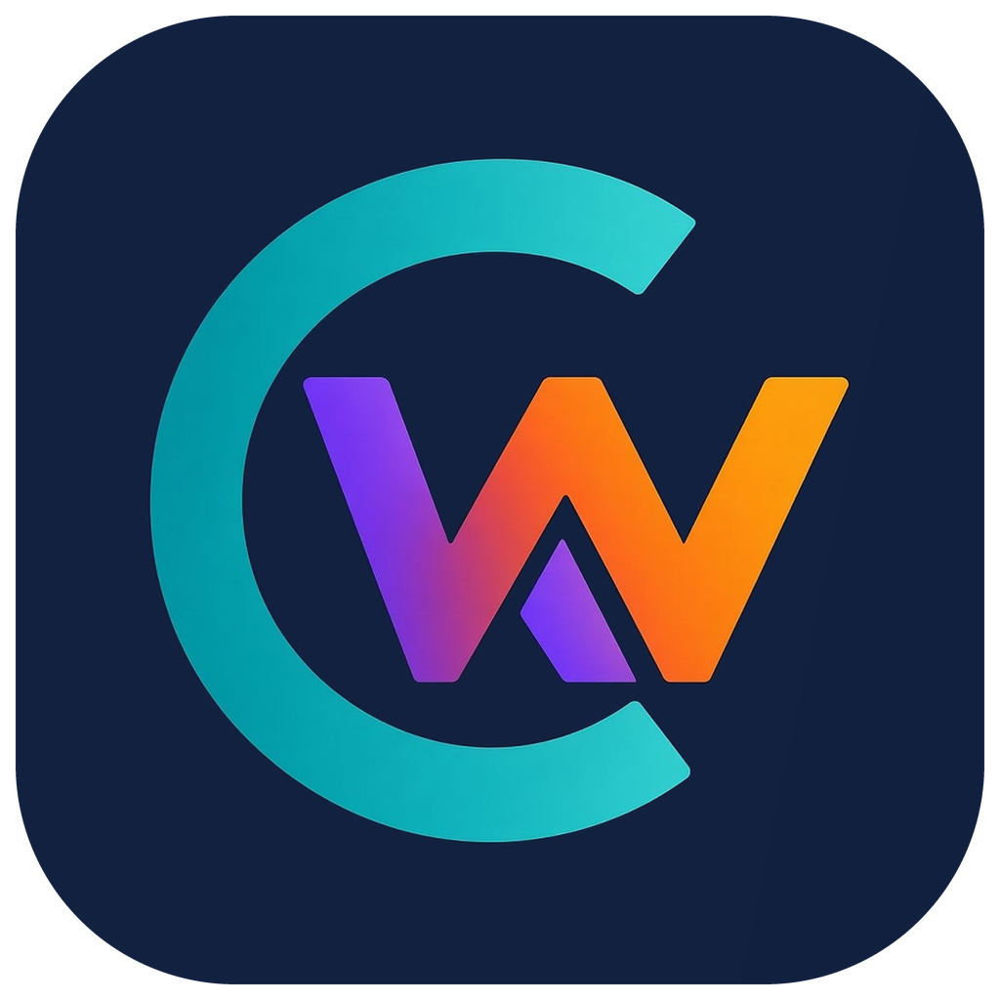

# Next CW Trainer



An Android app for learning and practising Morse code (CW): copy training
with the Koch method, sending practice with an Echo Trainer, a CW keyer, a CW
decoder through the microphone, CW over the internet, a QSO bot and games —
with an adaptive block flow that tracks your mistakes character by character.
Flutter UI, with all CW timing and audio in native Kotlin/C++.

By Christian Konecny, OE1CKO.

## What sets it apart

- **Realistic interference:** noise, QRM, QSB, pitch drift and timing jitter
  on the other station, with presets and optional constant background noise,
  so you practise for the band and not only for a clean signal.
- **Copy by typing:** besides paper, Listen takes your answer on an on-screen
  keyboard that offers only the characters of the current lesson, with a
  second attempt for wrong words.
- **Progress you can see:** statistics per character, weekly curves and a
  heatmap, weak characters that come back in the next block, and adaptive
  suggestions that you accept or reject.
- **Habit support:** a daily goal for active practice time, a streak with a
  free day per week, optional spreading over several sessions, a reminder
  that only fires if the goal is still open, and awards for single steps
  (a new character, a week with three new ones, spread-out practice, ...).
  All of it stays on the device.
- **Your own material and more games:** share any text from another app
  into Own texts and let the app play it, plus games from arcade to a CW
  text adventure.

## Origin and credits

Many ideas and much of the training logic come from the open-source firmware
of the [Morserino-32](https://github.com/oe1wkl/Morserino-32) by Willi Kraml,
OE1WKL. Its training concept — the Koch sequences, the Echo Trainer, the QSO
Bot and much more — is the result of years of careful work by Willi and his
team. Many thanks for that.

The logic was read out of the [firmware source](https://github.com/oe1wkl/Morserino-32)
and reimplemented from scratch in Dart/Kotlin; the app contains none of the
original C++ firmware code. Beyond that shared lineage, this is an independent
project, not affiliated with, endorsed by or sponsored by Willi Kraml, OE1WKL,
or the Morserino-32 project.

The port was built against **firmware version 9.0.0** (`VERSION_MAJOR`/
`_MINOR`/`_PATCH` in `morsedefs.h` at the time this app was started) — later
firmware changes aren't automatically reflected here.

## Download

Ready-to-install APKs are attached to the
[GitHub releases](https://github.com/ckonecny/next_cw_trainer/releases)
(sideload: allow "install unknown apps"). **Settings → Info** in the app
shows the version and the commit it was built from.

## User manual

A detailed user manual in German and English — every setting with its range
and default, and how the adaptive mode decides — is in [`manual/`](manual/):
[Handbuch (PDF)](manual/NextCWTrainer_Handbuch_v1.6.0.pdf) ·
[User Manual (PDF)](manual/NextCWTrainer_Manual_v1.6.0.pdf), also as HTML.

## What the app covers

The start page has three groups: **Practice** (Listen, Send), **Free**
(CW Keyer, CW Decoder, WiFi Trx, QSO Bot) and **Play** (games). All CW
timing and the sidetone run natively (Kotlin + C++/AAudio), so keying feels
as immediate as it does on the device.

### Practice: Listen (CW Generator / Koch Trainer)

- Generated CW with the firmware's own content pools and rules: random
  characters, Random Groups (incl. prosign groups `<AS>`, `<KA>`, `<KN>`,
  `<SK>`, `<VE>`, `<BK>`), common English words, abbreviations, call signs
  (weighted prefix table, region/common-only options), mixed content, and
  your own practice-character set.
- **Koch method as the character set**: M32, LCWO, CW Academy, LICW (incl.
  the LICW Carousel) or a custom sequence, with the firmware's weighting that
  plays the most recently learned characters a bit more often.
- **Block flow for copying on paper**: a block is played, then revealed; you
  mark what you missed, and the result page shows accuracy, weak characters,
  a trend across blocks and a "on the way to the next Koch character"
  progress card.
- **Adaptive suggestions** after each block (unlock the next Koch character,
  tighten/widen Farnsworth spacing, raise character speed), each one
  accept/reject/adjust — nothing changes behind your back. Weak characters
  can be boosted into the next block (Practice Set/Boost).
- Per-group choice via dit/dah key (repeat / next), session start/end markers,
  Output Case lower/UPPER.

### Practice: Send (Echo Trainer)

- The firmware's Echo Trainer: a word/group is played, you key it back, it
  is graded; a miss is repeated and revealed like on the device, including
  the error sign (`<err>` / "eeee") to clear your answer.
- Same content sources and Koch sequences as Listen, but a **fully separate
  profile**: own lesson, speed, group length, Practice Set, Boost and weak
  characters — sending weaknesses aren't listening weaknesses.
- Optional block flow with a result page, adaptive suggestions, trend,
  **confusion pairs** (which characters you mix up when sending), confirm
  tones and an attempt indicator. "Gebe-Tempo" caps the expected answer
  speed like the firmware's Echo Speed Max.

### Statistics

Per-character statistics, kept separately for listening and sending
(📊 in each training), with the lifetime accuracy that drives weak
characters, boosts and Koch unlocks.

### Free keying and on-air practice

- **CW Keyer** — Iambic A/B, Ultimatic, Non-Squeeze and Straight Key,
  CurtisB timing, AutoChar Spacing, live decode to text. Input from on-screen
  touch keyer or a real Morse key/straight key (see below).
- **CW Decoder** — decode CW through the phone's microphone: a port of the
  firmware's Goertzel detector and adaptive decoder, with level meter,
  automatic threshold, wide/narrow bandwidth, adjustable pitch, speed
  display and an optional monitor tone.
- **WiFi Trx** — CW over the internet using the Morserino's UDP protocol
  (MOPP), e.g. with `cq.morserino.info`: multiple saved services, receive
  with playback at the sender's speed, send via Morse key or typed text,
  persisted RX/TX log per service.
- **QSO Bot** — a simulated QSO partner (SOTA/POTA, Standard, Contest with
  CQ WW / WPX) that answers what you key, with three difficulty levels,
  realistic call signs incl. CQ zones, and agn/rpt/qrs/qrq handling.

### Play (games)

- **Morse Invaders** — arcade game: shoot falling characters by keying
  them, from your current Koch lesson.
- **Text adventure** — Infocom's **Zork I, II and III** (1980–82), played
  in CW: the game answers in Morse, you key your commands (touch or real
  Morse key, `<AR>` sends) or type them. The original story files, released by
  Microsoft under the MIT License in 2025, run on the app's own Z-machine
  interpreter. Replay by sentence, word or whole answer, pause, optional
  text display, a hand-drawn map per part (visited rooms, or the whole map
  with a spoiler warning), automatic and named saves, undo. Game text is
  English and uses the full alphabet, digits and punctuation. Zork is a
  trademark of its owners; this app is not affiliated with them.
- **Morsel** — Wordle-style word guessing: the word is played in CW, you
  key your guess back.
- **Memory Chain** — one new character per round, key the whole chain from
  memory (Koch characters or call signs), high scores per mode.
- **Trailblazer** and **Fox Hunt** — two maze games on a 12×4 grid with a
  hidden path: key the highlighted letter (Trailblazer) or hear a letter and
  key the direction to it (Fox Hunt); scored in characters per minute.
- **Fight the Pileup** — call signs queue up and play in CW; key each one
  back before its time runs out (single player, four difficulty levels).
- **Radio Cave** — a text adventure in an abandoned radio station: every
  command is keyed, clues arrive as CW, the game is saved after each command.
  Game text is English.

### Settings and Android integration

- Ported from the firmware's own preference definitions, not guessed at:
  WPM, tone pitch/softness/shift, inter-character/inter-word spacing (shown
  in dits *and* seconds), keyer options, Koch sequences, call sign options.
- Training-specific settings live in a ⚙ sheet in each screen; the global
  Settings page only holds what is really global.
- Where Android has a better native equivalent, the app uses it instead of
  imitating the device: the OS theme instead of a "Theme" preference,
  pinch-to-zoom text size instead of "Font Size", an in-app German/English
  switch (the device UI is English-only), on-device dit/dah key learning
  instead of fixed adapter presets, and audio output handling that follows
  USB/Bluetooth connect/disconnect (plus a manual Auto/Speaker/Wired/
  Bluetooth picker).

### What it deliberately does not reproduce

Hardware a phone doesn't have, or things Android already does itself:
rotary-encoder/button navigation, the OLED/TFT display hardware, LoRa,
ESP-NOW (and with it the multiplayer parts of the games), iCW/Ext Trx and
keying a real transceiver, firmware/OTA updates and the WiFi AP setup page.
The firmware's Practice Stats aren't ported either — the app has its own,
more detailed statistics.

## Using a real Morse key or straight key

Everything you key (CW Keyer, Send, WiFi Trx, QSO Bot, the games) can take
input from on-screen touch keyer or from a real Morse key or straight
key, the same way the Morserino-32 itself can act as a keying dongle for a
computer. A phone has no analog Morse key input, so you need a
small USB (or USB‑OTG) adapter that turns key contacts into keystrokes:

- **[vband](https://hamradio.solutions/vband/)** — a widely used, ready-made
  USB adapter built exactly for this (dit and dah as two distinct keys).
- **Something homemade** works just as well: any small USB‑HID device (for
  example, an Arduino/Pro Micro running a simple keyboard-emulation sketch)
  that reports the dit and dah key contacts as two separate keystrokes.
  A ready-to-build example is
  **[xiao-vband-adapter](https://github.com/ckonecny/xiao-vband-adapter)**:
  a Seeed XIAO SAMD21 plus a 3.5 mm jack, sending the same keys as the vband
  adapter; it connects to the phone with a USB‑C ↔ USB‑C cable.

Whichever adapter you use, open **Settings → Learn dit/dah keys** and press
each key once — the app learns whatever two keys your adapter happens to
send, so there's no fixed list of supported adapters to match against.

## Feature status

Ported against firmware v9.0.0 and tested on a real device unless noted.
Module-by-module details: `docs/PORTING-MAP.md`.

| Area | Status | Notes |
|---|---|---|
| CW Keyer (Iambic A/B, Ultimatic, Non‑Squeeze, Straight Key) | ✅ Supported | Live decode, CurtisB, AutoChar Spacing, touch or USB Morse key |
| Listen: CW Generator / Koch Trainer | ✅ Supported | All content modes, Koch sequences incl. LICW Carousel, block flow with adaptive suggestions |
| Send: Echo Trainer | ✅ Supported | Separate profile, block flow, adaptive suggestions, confusion pairs, error sign |
| Per-character statistics (listen / send separately) | ✅ Supported | App-specific, replaces the firmware's Practice Stats |
| CW Decoder (microphone → text) | ✅ Supported | Goertzel + firmware decoder port |
| WiFi Trx (MOPP over UDP, e.g. cq.morserino.info) | ✅ Supported | Foreground only; no background service yet |
| QSO Bot (SOTA/POTA, Standard, Contest) | ✅ Supported | |
| Games: Morse Invaders, Morsel, Memory Chain, Trailblazer, Fox Hunt, Fight the Pileup, Radio Cave | ✅ Supported | Single player |
| Text adventure: Zork I–III in CW | ✅ Supported | App-only (not in the firmware); own Z-machine v3 interpreter, maps, saves |
| Settings, audio output routing, theme, text zoom, DE/EN UI | ✅ Supported | Android-native equivalents of device-only prefs |
| File Player (own text as practice content) | 🔄 Reimplemented | Not a port: the app's own "Own texts" feature (texts from the clipboard, played with your speed, spacing and display options) instead of files on an SD card |
| Physical controls, display hardware, LoRa, ESP‑NOW/multiplayer, iCW/Ext Trx, OTA/WiFi AP | ❌ Not applicable | No such hardware on a phone / handled by Android |
| Practice Stats (`MorsePracticeStats.cpp`) | ❌ Not ported | Replaced by the app's own statistics |

## Credits

- Development: Christian Konecny, OE1CKO.
- Training design and algorithms: Willi Kraml, OE1WKL, and the Morserino-32
  team (see above).
- App icon: designed by Sia, OE1LMR. Sia also helps with testing and with
  brainstorming ideas.
- Default custom Koch sequence: the order of the YouTube Morse course by
  "Heinz – just me" ([playlist](https://www.youtube.com/watch?v=WhjCvgC0iHg&list=PLZjVloEmSdLgGGT_exNDoXzmnV-q0zmET)).
- Zork I–III: Marc Blank, Dave Lebling, Bruce Daniels and Tim Anderson
  (Infocom); story files from the
  [historicalsource](https://github.com/historicalsource) repositories, MIT
  License (see `android/assets/zork/`).

## License

Next CW Trainer is free software under the **GNU General Public License
v3.0 or later** (see [`LICENSE`](LICENSE)). It ports algorithms and data
tables (word lists, abbreviations, call sign prefixes, QSO texts) from the
Morserino-32 firmware, Copyright (C) 2018-2025 Willi Kraml, OE1WKL, which is
itself GPL-3.0; the app is therefore a derivative work under the same
licence.

Bundled third-party material keeps its own licence: Zork I–III story files
(MIT, `android/assets/zork/LICENSE`), the fonts Anonymous Pro and Space
Grotesk (SIL Open Font License 1.1, `android/assets/fonts/OFL-*.txt`), the
SoLoud audio engine inside `flutter_soloud` (zlib) and the Flutter packages
(MIT/BSD/Apache). All licence texts are shown in the app
under Settings → Info → Licences.

Zork is a trademark of its owners. This project is not affiliated with or
endorsed by them, nor by Infocom, Activision or Microsoft, nor by Willi
Kraml/OE1WKL or the Morserino-32 team.

## Development

Built with Flutter (UI, Dart) and native Kotlin/C++ on the Android side
(low-latency AAudio sidetone, iambic keyer and CW generator timing). The
Flutter project lives in `android/` (run `flutter` commands from there): see
`android/lib/` for the Flutter app and `android/android/app/src/main/kotlin`
and `android/android/app/src/main/cpp` for the native pieces. Microphone
input for the decoder uses Android's `AudioRecord`.

```bash
cd android && flutter build apk --debug
```

```bash
adb install -r android/build/app/outputs/flutter-apk/app-debug.apk
```

Unit tests (decoder, QSO Bot engine, adaptive engine, …): `flutter test`
from `android/`.

`reference/` is a read-only git submodule of the original firmware, pinned
at tag `V9.0` (the v9.0.0 baseline above) — the source of truth this port is
checked against. See `docs/PROJECT.md` for the full repo layout and
`docs/STATUS.md`/`docs/DECISIONS.md`/`docs/PORTING-MAP.md` for current state,
architecture rationale, and the module-by-module porting status.
