# Einleitung

**Next CW Trainer** ist eine Android-App zum Lernen und Üben von Morsetelegrafie
(CW): Hörtraining mit der Koch-Methode, Gebetraining mit dem Echo Trainer, ein
CW Keyer, ein CW-Decoder über das Mikrofon, CW übers Internet (WiFi Trx), ein
QSO Bot und einige Spiele. Ein **adaptiver Blockablauf** zählt deine Fehler
Zeichen für Zeichen mit und schlägt dir vor, wann ein neues Zeichen, mehr
Tempo oder kürzere Pausen dran sind.

## Woher die App kommt {-}

Next CW Trainer ist ein unabhängiges Hobbyprojekt von Christian Konecny,
OE1CKO. Viele Ideen und ein Großteil der Trainingslogik stammen aus der
Open-Source-Firmware des [Morserino-32](https://github.com/oe1wkl/Morserino-32)
von Willi Kraml, OE1WKL. Das Trainingskonzept – Koch-Reihenfolgen, Echo
Trainer, QSO Bot und vieles mehr – ist das Ergebnis jahrelanger Feinarbeit von
Willi und seinem Team. Herzlichen Dank dafür!

Die Logik wurde aus dem Quelltext der Firmware gelesen und für Android neu
geschrieben; die App enthält keinen Originalcode der Firmware. Darüber hinaus
besteht **keine Verbindung** zu Willi Kraml oder dem Morserino-32-Team, und die
App ist kein Produkt des Morserino-Projekts.

Grundlage war die Firmware-Version 9.0.0. Spätere Änderungen an der Firmware
fließen nicht automatisch in die App ein.

## Über dieses Handbuch {-}

Dieses Handbuch beschreibt die App-Version, die auf der Titelseite steht. Welche
Version du installiert hast, siehst du unter **Einstellungen → Info** (siehe
[Info: Version und Build](#info-version-und-build)).

Einstellungen, die es auch am Morserino gibt, heißen in der App deutsch
(z. B. **Zeichenabstand** statt „Interchar Spc“). Welcher Morserino-Menüpunkt
zu welcher Einstellung gehört, steht in der Tabelle
[Morserino-Begriffe](#morserino-begriffe).

# Erste Schritte

## Installation

Die App wird derzeit als APK-Datei weitergegeben, nicht über den Play Store.
Sie braucht Android 8.0 oder neuer und ein 64-Bit-Gerät (praktisch alle
Handys seit etwa 2017); auf reinen 32-Bit-Geräten lässt sie sich nicht
installieren.

1. Kopiere die APK-Datei auf dein Handy (z. B. per Messenger, E-Mail oder
   USB-Kabel).
2. Tippe die Datei im Dateimanager an. Android fragt beim ersten Mal, ob die
   App, aus der du installierst (Dateimanager, Browser …), **unbekannte Apps
   installieren** darf – erlaube das für diese App.
3. Bestätige die Installation.

Ein Update installierst du genauso: Die neue APK einfach über die alte
installieren, deine Einstellungen und Statistiken bleiben erhalten. Das
funktioniert nur, wenn beide APKs mit demselben Schlüssel signiert sind. Meldet
Android einen Konflikt, musst du die alte Version zuerst deinstallieren – dabei
gehen Einstellungen und Statistiken verloren.

## Die Startseite

Die Startseite hat drei Gruppen:

| Gruppe | Kachel | Wofür |
|---|---|---|
| **Üben** | **Hören** | Mitschreiben üben: CW Generator und Koch Trainer im Blockablauf |
| | **Geben** | Senden üben: Echo Trainer – ein Wort wird vorgespielt, du gibst es zurück |
| **Frei** | **CW Keyer** | Frei tasten, mit Mitschrift als Text |
| | **CW-Decoder** | CW über das Mikrofon mitlesen |
| | **WiFi Trx** | CW über das Internet mit anderen Morserinos und Apps |
| | **QSO Bot** | Ein simulierter QSO-Partner |
| **Spielen** | **Spiele** | Morse Invaders, Text-Adventure, Morsel, Memory Chain |

Unter **Hören** und **Geben** zeigt die Kachel deine aktuelle Koch-Lektion und
dein Tempo, bei **Geben** zusätzlich den Trend der letzten Blöcke (siehe
[Trend](#trend)).

Rechts oben öffnet das Zahnrad die **globalen Einstellungen** (Kapitel
[Einstellungen](#einstellungen)). Alles, was nur ein einzelnes Training
betrifft, stellst du dagegen direkt in diesem Training ein.

::: {.shots .one}
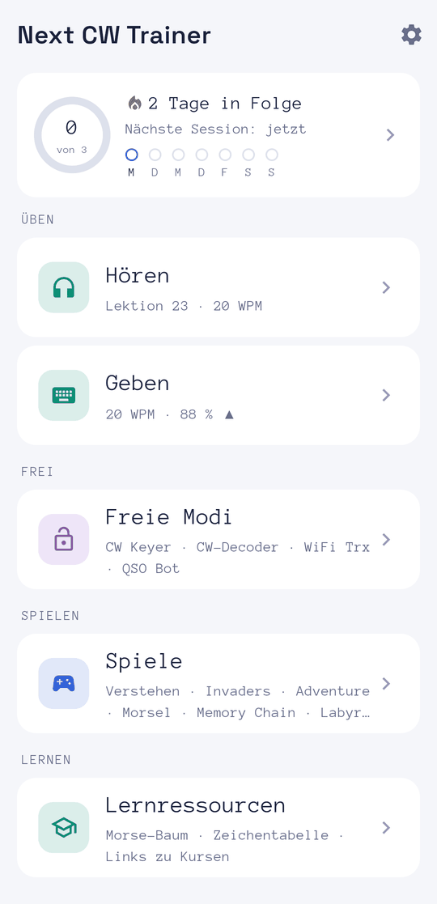
:::

## Bedienelemente in den Trainings

In jedem Training findest du oben rechts:

- **⚙ Einstellungen des Trainings** – ein Blatt, das von unten hereinfährt.
  Jede Änderung gilt sofort und wird gespeichert.
- **📊 Statistik** (nur bei **Hören** und **Geben**) – dein Übungsstand je
  Zeichen (siehe [Zeichenstatistik](#zeichenstatistik)).

Während ein Block läuft, sind diese Symbole und die Auswahl oben ausgeblendet,
damit der Bildschirm ruhig bleibt. Die **Zurück-Taste** beendet dann nur den
laufenden Block und bringt dich zur Startansicht des Trainings zurück; erst ein
zweites Zurück verlässt das Training.

Während du übst, bleibt der Bildschirm eingeschaltet.

**Textgröße:** Textfelder mit Mitschrift oder Ergebnissen (CW Keyer, Geben,
Ergebnisseite …) kannst du mit zwei Fingern **aufziehen oder zusammenschieben**.
Jedes Feld merkt sich seine eigene Größe.

## Hell, dunkel, Sprache

Unter **Einstellungen → Darstellung** wählst du das **Farbschema** (System / Hell /
Dunkel) und die **Sprache** der App (Deutsch / English). Beides wirkt sofort.

Die **Schriftgröße** übernimmt die App aus den Android-Einstellungen, aber
nur bis zum **1,3-Fachen** der Standardgröße (beim Pixel die 4. von 7
Stufen). Größere Stufen sehen in der App aus wie diese; sonst würden die
Trainings-Bildschirme nicht mehr passen. Die Bildschirmtastatur beim
Mitschreiben und die Koch-Zeichenleiste bleiben immer gleich groß. Die
Android-Einstellung **Anzeigegröße** („Alles vergrößern oder verkleinern“)
wirkt in der App gar nicht; sie wird immer in der Standardgröße des Geräts
angezeigt. Ist eine
Seite länger als der Bildschirm, zeigt eine Bildlaufleiste am Rand, dass es
weitergeht.

## Ton und Lautstärke

Die Lautstärke regelst du mit den Lauter/Leiser-Tasten des Handys. Die
**Tonhöhe** und die **Tonweichheit** stellst du in den Einstellungen ein. Wird
ein Kopfhörer, ein USB-Audiogerät oder ein Bluetooth-Gerät verbunden oder
getrennt, wechselt die App automatisch dorthin. Wenn du das nicht willst,
kannst du die Ausgabe auch fest wählen (siehe
[Audioausgabe](#audioausgabe)).

Bluetooth-Kopfhörer haben meist eine deutliche Verzögerung. Zum Hören ist das
egal, beim Geben stört es: Du hörst deinen Mithörton spürbar später, als du
tastest. Zum Geben sind ein Kabelkopfhörer oder der Lautsprecher besser.

# Grundlagen

## Tempo in WPM

Das Tempo wird in **WPM** (Wörter pro Minute) angegeben, bezogen auf das
Normwort „PARIS“. Ein Dit dauert bei *w* WPM genau 1200 / *w* Millisekunden –
bei 20 WPM also 60 ms.

## Abstände in Dits: Zeichenabstand und Wortabstand

Wie am Morserino werden die Pausen **in Dit-Längen** eingestellt:

- **Zeichenabstand** – die Pause zwischen zwei Zeichen eines Wortes. Normales
  Morse: 3 Dits. Einstellbar von 3 bis 45.
- **Wortabstand** – die Pause zwischen zwei Wörtern bzw. Gruppen. Normales
  Morse: 7 Dits. Einstellbar von 6 bis 105.

Die Pause zwischen den Elementen (Dits und Dahs) *innerhalb* eines Zeichens ist
immer 1 Dit. Die Zeichen selbst kommen also immer im eingestellten Tempo; nur
die Pausen dazwischen werden länger. Das ist die **Farnsworth-Methode**: Du
lernst den Klang eines Zeichens bei vollem Tempo und hast trotzdem Zeit zum
Nachdenken.

Neben jedem Abstands-Regler zeigt die App die Pause auch **in Sekunden** beim
aktuellen Tempo, z. B. „28 Dits · 1,68 s @ 20 WPM“.

Die Trainings **Hören** und **Geben** starten mit großzügigen Pausen von
**28 / 40 Dits**. Der CW Keyer, WiFi Trx und der QSO Bot verwenden die
normalen 7 Dits als Wortabstand.

## Effektives Tempo

Weil die Pausen länger werden, sinkt das Tempo, mit dem ganze Wörter
ankommen. Die App zeigt es als **eff.** (effektive WPM) an:

  eff. WPM = 50 × WPM / (31 + 4 × Zeichenabstand + Wortabstand)

Beispiel: 20 WPM mit 28/40 Dits ergibt 50 × 20 / (31 + 112 + 40) ≈ 5 WPM.
Die Zeichen klingen also nach 20 WPM, aber du hast Zeit wie bei 5 WPM. Mit
3/7 Dits sind beide Werte gleich.

## Die Koch-Methode

Bei der Koch-Methode fängst du mit **zwei Zeichen** an, im vollen Tempo. Sobald
du sie sicher erkennst, kommt das nächste Zeichen dazu, dann das nächste, bis
alle Zeichen gelernt sind. Jede Stufe heißt **Lektion**; die Lektionsnummer ist
die Zahl der aktiven Zeichen.

Die Reihenfolge der Zeichen legt die **Koch-Reihenfolge** fest (siehe
[Koch-Reihenfolge](#koch-reihenfolge)).

Beim Ziehen zufälliger Zeichen gewichtet die App wie der Morserino:
Bei zwei von drei Zeichen wird gleichmäßig aus **allen** aktiven Zeichen
gewählt, bei jedem dritten nur aus dem **letzten Drittel** – dort stehen die
zuletzt gelernten Zeichen. Neue Zeichen kommen dadurch öfter dran, ohne dass
die alten verschwinden.

## Prosigns

Prosigns (Betriebszeichen) werden als zusammengezogene Buchstaben gegeben und
in der App in spitzen Klammern geschrieben:

| Prosign | Bedeutung |
|---|---|
| `<ka>` | Spruchanfang |
| `<ar>` | Spruchende (+) |
| `<kn>` | Nur die gerufene Station soll antworten |
| `<sk>` | Verbindungsende |
| `<as>` | Warten |
| `<ve>` | Verstanden |
| `<bk>` | Break, Gegenstation ist dran |
| `<err>` | Fehler: acht Dits (`........`) |

Beim Hören (Blockablauf) werden Prosigns aus **Zeichen für Gruppen** wie zwei
einzelne Buchstaben angezeigt und bewertet (`<ka>` erscheint als „K A“).
Beim Mitschreiben mit der Bildschirmtastatur tippst du sie ebenso als zwei
Buchstaben.

# Hören – Mitschreiben üben

**Hören** ist der CW Generator und Koch Trainer der App. Die App spielt einen
**Block** von Gruppen oder Wörtern, und du schreibst mit – auf zwei Arten:

- **Papier** – du schreibst auf Papier mit. Während des Spielens zeigt der
  Bildschirm nichts an. Danach deckt die App den Text auf, du tippst an, was
  du falsch hattest.
- **Tippen** – für unterwegs: Die App spielt ein Wort nach dem anderen, und du
  tippst es auf einer eigenen Bildschirmtastatur mit (siehe
  [Mit der Bildschirmtastatur mitschreiben](#mit-der-bildschirmtastatur-mitschreiben)).

In beiden Fällen bekommst du am Ende dieselbe Auswertung mit Vorschlägen für
den nächsten Block, und beide zählen in dieselbe Hören-Statistik.

## Zeichenvorrat und Inhalt wählen

Oben auf der Startansicht wählst du zwei Dinge:

**Zeichenvorrat** – aus welchen Zeichen geübt wird:

| Zeichenvorrat | Bedeutung |
|---|---|
| **Koch-Lektion** | Nur die Zeichen bis zu deiner aktuellen Lektion |
| **Alle Zeichen** | Alle Buchstaben, Ziffern, Satzzeichen und Prosigns |
| **Übungsset** | Nur die Zeichen, die du selbst einträgst |

**Inhalt** – was gespielt wird:

| Inhalt | Bedeutung | Verfügbar bei |
|---|---|---|
| **Zufall** | Gruppen aus zufälligen Zeichen | allen |
| **Wörter** | Häufige englische Wörter | Koch, Alle |
| **Abkürzungen** | Übliche CW-Abkürzungen | Koch, Alle |
| **Rufzeichen** | Zufällige, realistische Rufzeichen | Alle |
| **Gemischt** | Wörter, Abkürzungen und Gruppen gemischt | Koch, Alle |

Bei der Koch-Lektion werden nur Wörter und Abkürzungen verwendet, die
**ausschließlich** aus bereits gelernten Zeichen bestehen. In den ersten
Lektionen gibt es deshalb nur sehr wenige davon.

::: {.shots .one}
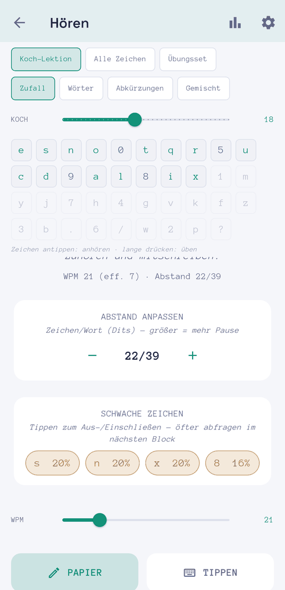
:::

### Koch-Lektion einstellen

Mit dem Regler **KOCH** stellst du die Lektion ein. Darunter siehst du alle
Zeichen der Koch-Reihenfolge. Die in dieser Lektion aktiven Zeichen sind
hervorgehoben; die Farbe zeigt die Art des Zeichens: Buchstaben, Ziffern und
Satzzeichen/Prosigns sind unterschiedlich eingefärbt. Die noch nicht
freigeschalteten Zeichen der späteren Lektionen sind abgeblendet.

So lernst du ein Zeichen kennen – das geht auch mit den abgeblendeten, du
kannst also schon in spätere Lektionen hineinhören:

- **Antippen** – das Zeichen wird dreimal im aktuellen Tempo gespielt. Dabei
  erscheint in der Bildschirmmitte eine Kachel mit dem Zeichen und seinem
  Morsecode; der Rest des Bildschirms wird abgedunkelt. Die Punkte und
  Striche sind zunächst grau und leuchten genau dann auf, wenn sie erklingen.
  Jede Wiederholung beginnt wieder grau. Nach der dritten Wiederholung
  verschwindet die Kachel von selbst. Ein Tipp irgendwo auf den Bildschirm
  (oder die Zurück-Taste) bricht die Wiedergabe sofort ab.
- **Lange drücken** – öffnet die Übungsseite für dieses Zeichen: anhören und,
  wenn du willst, mit der Taste nachgeben (siehe
  [Einzelzeichen üben](#einzelzeichen-üben)).

::: {.shots .one}
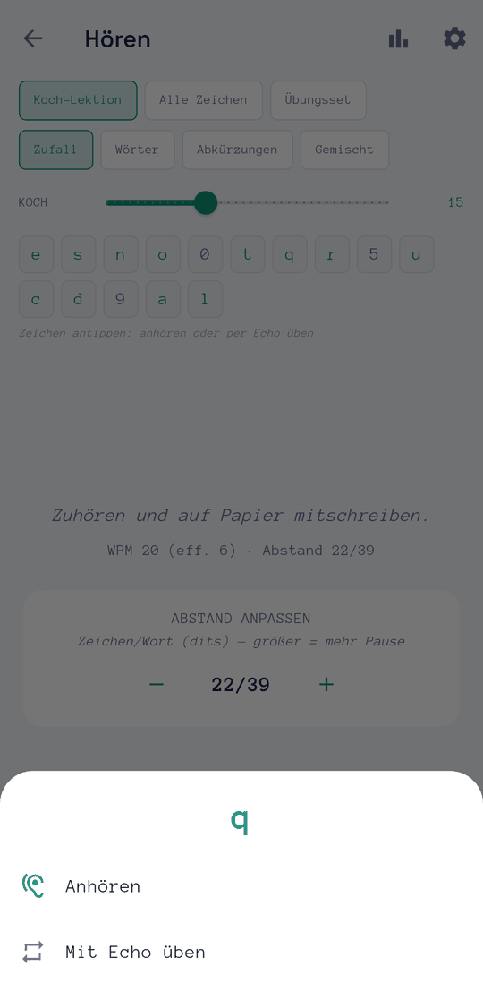
:::

Normalerweise musst du die Lektion nicht von Hand erhöhen: Der Blockablauf
schlägt dir das nächste Zeichen vor, sobald du bereit bist (siehe
[Wann das nächste Koch-Zeichen kommt](#wann-das-nächste-koch-zeichen-kommt)).

### Übungsset

Beim Zeichenvorrat **Übungsset** erscheint direkt auf der Startansicht ein
Eingabefeld. Trage die Zeichen ein, die du üben willst, z. B. `QXZJ`.
Groß-/Kleinschreibung und Leerzeichen spielen keine Rolle, doppelte Zeichen
werden ignoriert. Die App zeigt an, wie viele verschiedene Zeichen erkannt
wurden. Beim Übungsset gibt es nur den Inhalt **Zufall**.

## Tempo

Der Regler **WPM** unter der Übungsfläche stellt das Zeichentempo ein (10 bis 60
WPM). Die Pausen stellst du im ⚙-Blatt unter **Abstände** ein oder direkt auf
der Start- und Ergebnisseite mit **Abstand anpassen**.

## Ein Block im Ablauf

Unten auf der Startansicht liegen zwei Start-Schaltflächen: **Papier** und
**Tippen**. Die zuletzt benutzte ist hervorgehoben. Dieser Abschnitt beschreibt
**Papier**; **Tippen** folgt weiter unten.

1. **Papier** drücken. Nach einer Sekunde „Bereit machen …“ beginnt der Block.
2. Die App spielt die Gruppen nacheinander, mit dem eingestellten Wortabstand
   dazwischen. Angezeigt werden nur „Gruppe *n* von *N*“ (bei Wörtern
   „Wort *n* von *N*“) und das Tempo – nicht der Text. Schreib auf Papier mit.
   - **Pause** hält nach der aktuellen Gruppe an, **Weiter** setzt fort.
   - **Aufdecken** bricht den Block ab und zeigt nur die Gruppen, die schon
     gespielt wurden.
3. Nach der letzten Gruppe erscheint **Gesendet**: jede Gruppe als eigene
   Kachel. Vergleiche mit deiner Mitschrift.
4. **Fehler markieren:** Tippe eine Gruppe an, in der du einen Fehler hattest.
   Sie öffnet sich groß, Zeichen für Zeichen. Tippe jedes Zeichen an, das du
   falsch oder gar nicht hattest (noch einmal tippen hebt die Markierung auf),
   dann **Zurück**. Die markierten Zeichen erscheinen in der Übersicht rot.
5. **Fertig · *n* Fehler** schließt die Auswertung ab. Jetzt werden die
   Ergebnisse gespeichert und die Ergebnisseite erscheint.

::: {.shots .three}
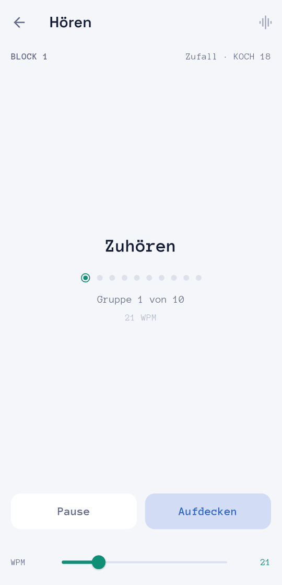

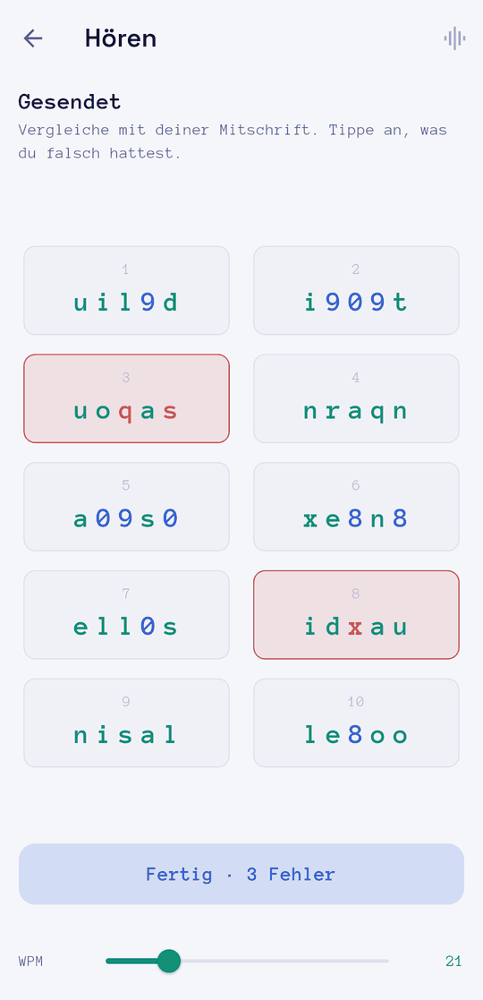

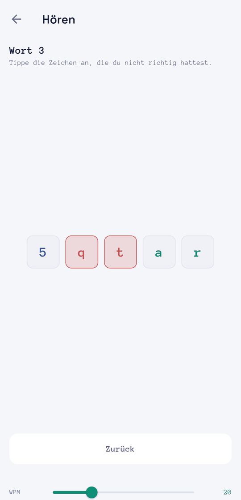
:::

Wie viele Gruppen ein Block hat, stellst du im ⚙-Blatt unter **Wortauswahl →
Gruppen pro Block** ein (bei Wörtern heißt die Einstellung **Wörter pro
Block**). Die Anzeige während des Blocks und die Ergebnisseite sprechen bei
Zufall von **Gruppen**, bei allen anderen Inhalten von **Wörtern**.

### Nach jeder Gruppe anhalten

Mit **Ablauf → Nach jeder Gruppe anhalten** (im ⚙-Blatt; bei Wörtern heißt es
**Nach jedem Wort anhalten**) wartet die App nach jeder Gruppe bzw. jedem Wort:

- **Dit** (linkes Paddle) oder die Schaltfläche **WIEDERHOLEN** spielt
  dieselbe Gruppe noch einmal.
- **Dah** (rechtes Paddle) oder **WEITER** spielt die nächste Gruppe.

Das entspricht „Stop&lt;Next&gt;Rep“ am Morserino und eignet sich gut für den
Anfang, wenn du eine Gruppe mehrmals hören willst. Die Einstellung gilt nur
für **Papier**; beim Tippen wartet die App ohnehin nach jedem Wort.

## Mit der Bildschirmtastatur mitschreiben

Mit **Tippen** schreibst du auf einer eigenen Tastatur im Display mit, ohne
Papier – gedacht für unterwegs. Es ist nicht die Systemtastatur des Telefons.

**Die Tastatur** ist eine QWERTY-Tastatur mit Ziffernreihe darüber. Alle
Tasten stehen immer an derselben Stelle. Aktiv (hell, antippbar) sind nur die
Zeichen, die im gewählten Zeichenvorrat vorkommen können; die anderen sind nur
umrandet und tun nichts. Enthält der Zeichenvorrat Satzzeichen
(`. , : - / = ? @ +`), erscheint dafür eine eigene Reihe. Beim Drücken zeigt
eine Blase über der Taste das Zeichen groß an. Die Taste **⌫** löscht das
letzte Zeichen. Unten links liegt **Passen**, unten rechts **⏎ Prüfen**.
Während der Block läuft, ist der WPM-Regler ausgeblendet, damit die Tastatur
Platz hat.

**Ein Wort im Ablauf:**

1. **Tippen** drücken. Nach einer Sekunde „Bereit machen …“ spielt die App die
   erste Gruppe (bzw. das erste Wort). Darunter steht „spielt …“.
2. Du kannst schon während des Spielens mittippen oder erst danach – beides
   geht. Es gibt keine Zeitgrenze.
3. **Prüfen:** Sobald du so viele Zeichen getippt hast, wie das Wort hat, prüft
   die App automatisch (nach dem Ende des Wortes und einer kurzen Pause von
   0,4 s, in der du mit ⌫ noch korrigieren kannst). Mit **⏎ Prüfen** gibst du
   früher ab, etwa wenn du ein Zeichen verpasst hast. Drückst du ⏎, während
   das Wort noch spielt, prüft die App gleich nach dem Wortende.
4. **✓ Richtig** – nach etwa einer Sekunde kommt das nächste Wort. Was du in
   dieser Sekunde schon tippst, zählt für das nächste Wort.
5. **✗ Falsch** – das Wort wird sofort noch einmal gespielt, das Feld ist leer.
   Dein voriger Versuch steht klein und durchgestrichen darüber, ohne Hinweis,
   wo der Fehler war. „Versuch *n* von *max*“ zeigt, der wievielte Versuch das
   ist.
6. **Passen** – jederzeit, auch während das Wort spielt. Nach dem letzten
   falschen Versuch oder nach Passen zeigt die App 2 Sekunden lang die Lösung
   (die im ersten Versuch falschen Zeichen rot) und darunter deine Versuche,
   dann geht es weiter.

::: {.shots}
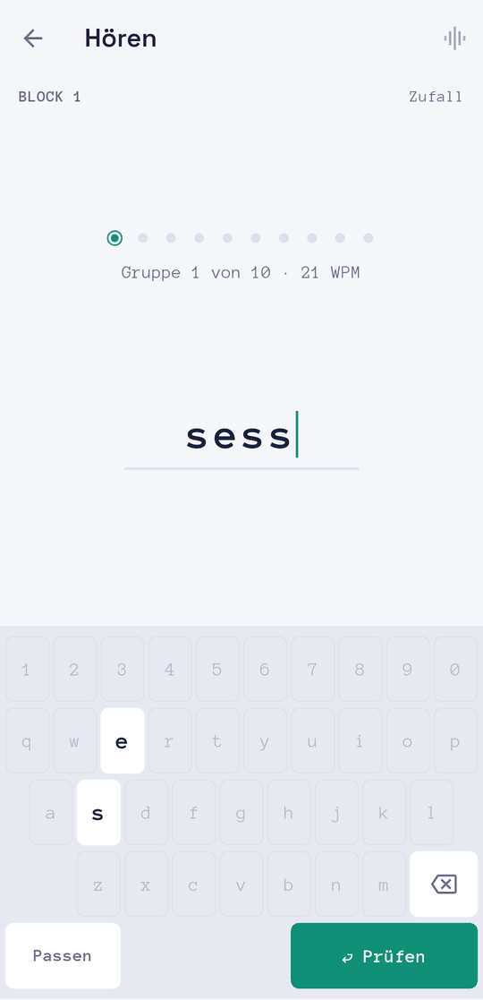

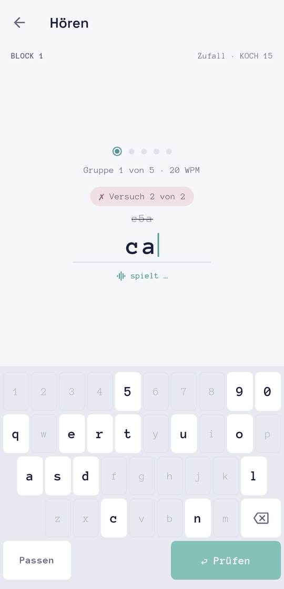
:::

Ob nach dem Prüfen ein kurzer Ton kommt (hoch = richtig, tief = falsch),
stellst du im ⚙-Blatt von **Geben** unter **Bestätigungston** ein. Wie viele Versuche
du pro Wort hast und ob die Tasten vibrieren, stellst du im ⚙-Blatt unter
**Ablauf** ein (siehe [unten](#ablauf)).

**Nach dem Block** erscheint wie bei Papier **Gesendet**. Die Fehler aus deinem
**ersten** Versuch sind dort schon rot markiert, und unter jeder Gruppe steht,
was du getippt hast (bei Passen „— gepasst“). Du kannst eine Gruppe antippen
und Markierungen ändern, etwa wenn du dich nur vertippt hast. **Fertig ·
*n* Fehler** speichert und zeigt die gewohnte Ergebnisseite.

::: {.shots .one}
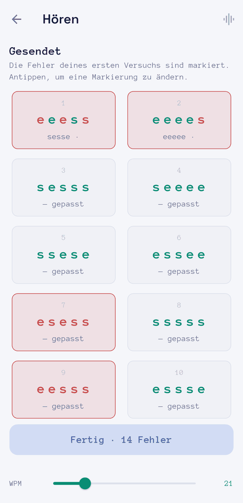
:::

**So wird gezählt:**

- Es zählt nur der **erste** Versuch jedes Wortes – der zweite ist leichter,
  weil du das Wort ein zweites Mal hörst.
- Die App vergleicht Zeichen für Zeichen, aber nicht stur Stelle für Stelle:
  Hast du ein Zeichen ausgelassen, ist nur dieses Zeichen falsch, nicht alle
  danach. Beispiel: gespielt `tqr5u`, getippt `tq5u` → nur `r` falsch.
  Ein falsch gehörtes Zeichen ist falsch (`cd9al` als `cb9al` → `d` falsch).
  Ein zusätzlich getipptes Zeichen macht kein gespieltes Zeichen falsch.
- **Passen** im ersten Versuch heißt: alle Zeichen dieses Wortes falsch, wie
  eine leere Stelle auf dem Papier.
- Beim Tippen spielen die Pausen zwischen den Wörtern keine Rolle. Die App
  schlägt deshalb nur Änderungen am **Zeichenabstand** vor (siehe
  [Pausen und Tempo](#pausen-und-tempo)).

Mit dem Pfeil oben links brichst du den Block ab; dann wird nichts gespeichert.
Die Tastatur gibt es vorerst nur im Hochformat.

## Die Ergebnisseite

Die Ergebnisseite zeigt von oben nach unten:

- **Trefferquote** in Prozent (Anteil richtig mitgeschriebener Zeichen) –
  grün ab 90 %, gelb ab 70 %, darunter rot – und „*x* von *y* richtig“.
- Die **Statuszeile**: Tempo, effektives Tempo, Abstände und, ab dem sechsten
  Block, der [Trend](#trend). Die Werte gelten bereits für den **nächsten**
  Block, also inklusive der angehakten Vorschläge.
- **Abstand anpassen** – mit − und + änderst du Zeichenabstand und Wortabstand
  gemeinsam um je 1 Dit. Das gilt sofort und unabhängig von den
  Vorschlägen.
- **Schwache Zeichen** – die Zeichen, die dir auf Dauer die meisten Fehler
  machen, mit ihrer Fehlerquote (siehe
  [Schwache Zeichen](#schwache-zeichen)).
- **Auf dem Weg zu „X“** – nur bei der Koch-Lektion: Was dir noch bis zum
  nächsten Zeichen fehlt (siehe
  [Fortschrittsanzeige](#fortschrittsanzeige-auf-dem-weg-zu-x)).
- **Vorschläge** – was die App für den nächsten Block empfiehlt (siehe
  [Vorschläge annehmen, ablehnen, anpassen](#vorschläge-annehmen-ablehnen-anpassen)).

Unten stehen zwei Schaltflächen:

- **Nächster Block** übernimmt die angehakten Vorschläge und startet sofort den
  nächsten Block.
- **Beenden** übernimmt die angehakten Vorschläge ebenfalls, startet aber
  keinen neuen Block.

::: {.shots}
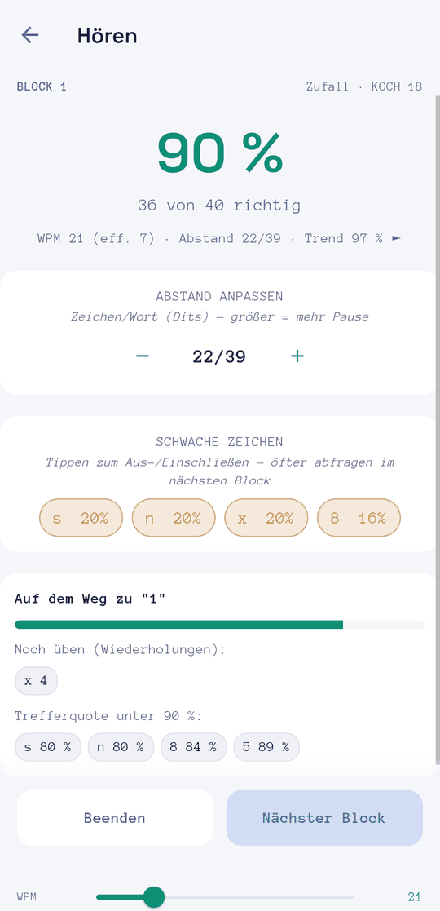

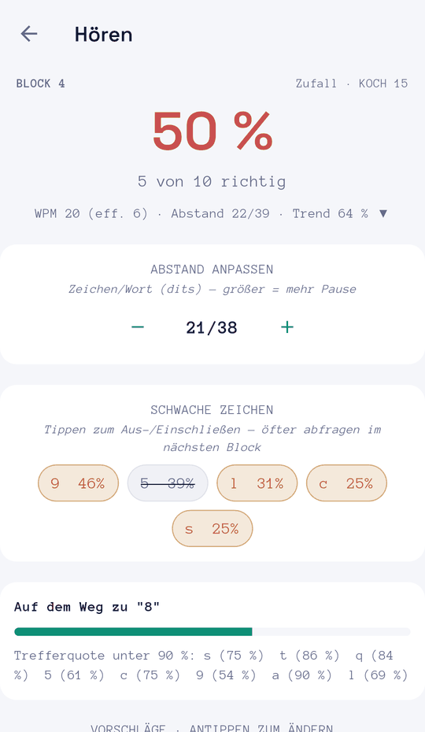
:::

Wie die App zu ihren Vorschlägen kommt, beschreibt das Kapitel
[Der adaptive Modus](#der-adaptive-modus).

## Einstellungen im ⚙-Blatt (Hören) {#einstellungen-hoeren}

Das ⚙-Blatt von **Hören** enthält folgende Abschnitte. Werte in **fett** sind
die Voreinstellungen.

::: {.shots}
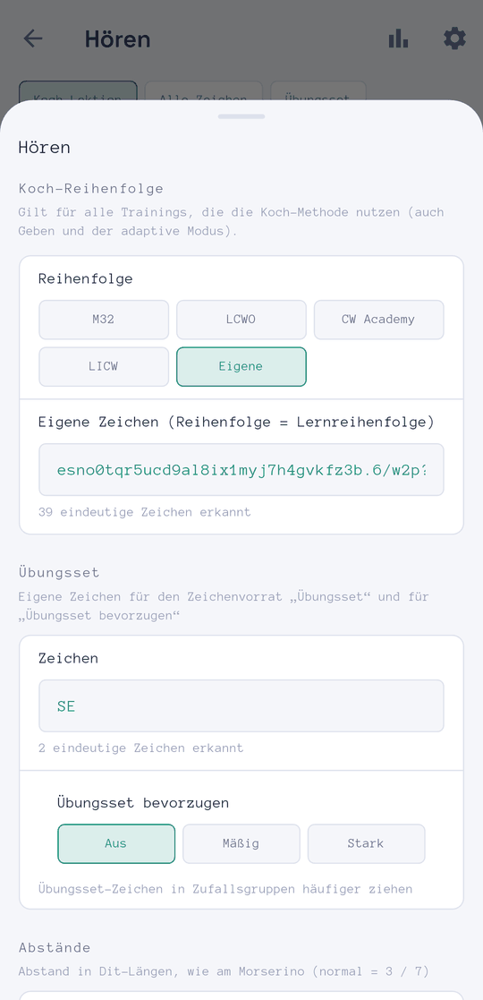

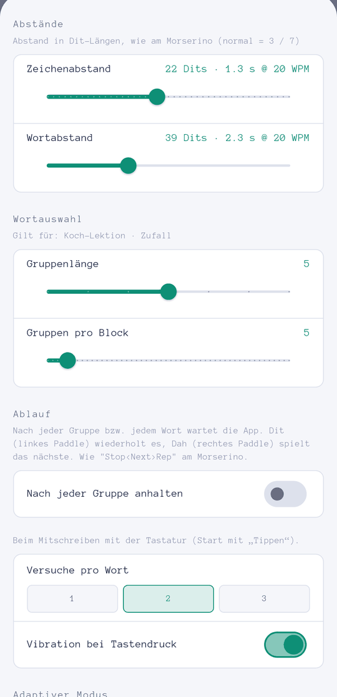
:::

### Koch-Reihenfolge {#koch-reihenfolge-blatt}

Nur sichtbar, wenn der Zeichenvorrat **Koch-Lektion** gewählt ist. Diese
Einstellung gilt für **alle** Trainings und Spiele, die die Koch-Methode
verwenden. Beschreibung siehe [Koch-Reihenfolge](#koch-reihenfolge).

### Übungsset {#uebungsset-einstellungen}

| Einstellung | Bedeutung | Werte |
|---|---|---|
| Zeichen | Die Zeichen des Übungssets (dasselbe Feld wie auf der Startansicht beim Zeichenvorrat **Übungsset**) | beliebige Zeichen |
| Übungsset bevorzugen | Zieht die Übungsset-Zeichen bei Zufallsgruppen häufiger (siehe unten) | **Aus** / Mäßig / Stark |

So funktioniert **Übungsset bevorzugen**: Für jedes Zeichen einer Zufallsgruppe
würfelt die App bis zu 3-mal (Mäßig) bzw. 8-mal (Stark), bis ein Zeichen
aus dem Übungsset herauskommt. Klappt es nicht, bleibt das letzte gewürfelte
Zeichen. Die Übungsset-Zeichen werden also häufiger, die anderen verschwinden
aber nicht.

**Übungsset bevorzugen** wirkt in **Hören** (Koch-Lektion oder Alle Zeichen ·
Zufall) und in **Geben** (Alle Zeichen · Zufall). In **Hören** wird das
Übungsset mit den [schwachen Zeichen](#schwache-zeichen) zusammengelegt:
Verstärkt werden die Zeichen aus beiden Listen, und zwar mit der höheren der
beiden Stufen. Je mehr Zeichen zusammenkommen, desto weniger fällt das
einzelne auf.

### Abstände

| Einstellung | Bedeutung | Werte |
|---|---|---|
| Zeichenabstand | Pause zwischen den Zeichen, in Dits | 3–45 (**28**) |
| Wortabstand | Pause zwischen den Gruppen/Wörtern, in Dits | 6–105 (**40**) |

Der Wortabstand kann nie kleiner sein als der Zeichenabstand: Schiebst du den
Zeichenabstand darüber hinaus, wird der Wortabstand mitgezogen.

### Wortauswahl

Es erscheinen nur die Einstellungen, die zum gewählten Inhalt passen. Die
Zeile „Gilt für: …“ zeigt, für welche Kombination du gerade einstellst.

| Einstellung | Bedeutung | Werte |
|---|---|---|
| Zeichen für Gruppen | Nur bei **Alle Zeichen · Zufall**: aus welchen Zeichenklassen gezogen wird | **Alle** / Buchstaben / Ziffern / Satzzeichen / Prosigns / Buchst.+Ziff. / Ziff.+Satzz. / Satzz.+Prosigns / Buchst.+Ziff.+Satzz. / Ziff.+Satzz.+Prosigns |
| Gruppenlänge | Zeichen pro Zufallsgruppe (nur bei **Zufall**) | 2–8 (**5**) |
| Max. Wortlänge | Nur Wörter bis zu dieser Länge (bei **Wörter** und **Gemischt**) | **alle**, 1–8 |
| Max. Abkürzungslänge | Nur Abkürzungen bis zu dieser Länge (bei **Abkürzungen** und **Gemischt**) | **alle**, 2–6 |
| Gruppen pro Block / Wörter pro Block | Anzahl der Gruppen (bei **Zufall**) bzw. Wörter in einem Block | 1–50 (**10**) |

### Ablauf

| Einstellung | Bedeutung | Werte |
|---|---|---|
| Nach jeder Gruppe anhalten / Nach jedem Wort anhalten | Nur bei **Papier**: danach warten, Dit = wiederholen, Dah = weiter | **Aus** / Ein |
| Versuche pro Wort | Nur bei **Tippen**: wie oft du ein Wort versuchen darfst; 1 = kein zweiter Versuch | 1 / **2** / 3 |
| Vibration bei Tastendruck | Nur bei **Tippen**: kurze Vibration bei jeder aktiven Taste | Aus / **Ein** |

### Adaptiver Modus

Die Schwellenwerte, nach denen die App ihre Vorschläge macht. Sie gelten für
**Hören und Geben** gemeinsam und sind ausführlich im Kapitel
[Einstellungen des adaptiven Modus](#einstellungen-des-adaptiven-modus)
beschrieben.

::: {.shots .one}
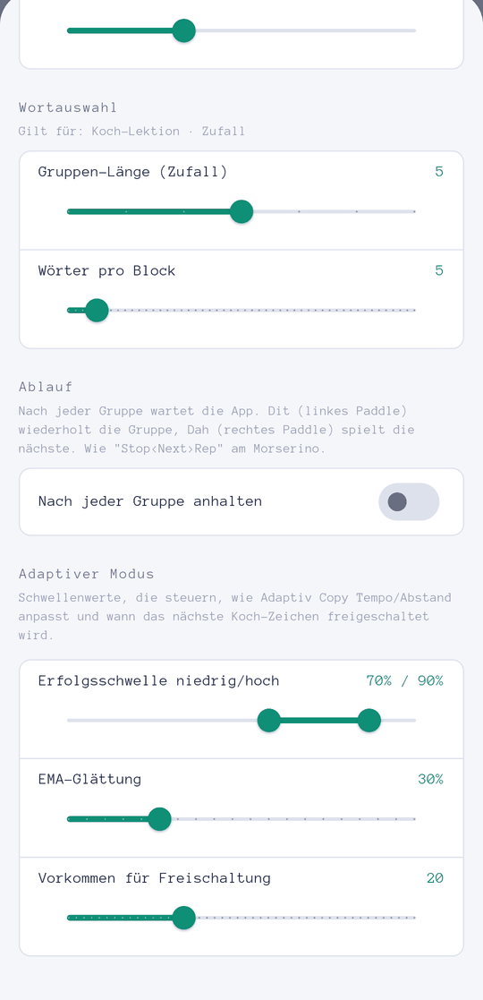
:::

# Geben – Echo Trainer

**Geben** ist der Echo Trainer: Die App spielt ein Wort oder eine Gruppe, du
gibst es mit dem Paddle (Touch oder echtes Paddle, siehe
[Paddle und Morsetaste](#paddle-und-morsetaste)) zurück. Stimmt es, kommt das
nächste Wort. Stimmt es nicht, wird es wiederholt.

Geben hat ein **eigenes Profil**, unabhängig von Hören: eigene Koch-Lektion,
eigenes Tempo, eigene Abstände, eigenes Übungsset und eine eigene
Zeichenstatistik. Was du beim Hören verwechselst, ist nicht unbedingt das,
was du beim Geben falsch machst.

## Startansicht

Oben wählst du wie bei Hören **Zeichenvorrat** und **Inhalt** (siehe
[Zeichenvorrat und Inhalt wählen](#zeichenvorrat-und-inhalt-wählen)) und bei
der Koch-Lektion die Lektion. Das Antippen eines Zeichens funktioniert
ebenfalls wie bei Hören.

Darunter stellst du mit zwei Reglern die Tempi ein:

- **Hören** – das Tempo, in dem dir das Wort vorgespielt wird (10 bis 60 WPM).
- **Geben** – das höchste Tempo, in dem deine Antwort erwartet wird (siehe
  [Gebetempo](#gebetempo)). „wie Hören“ heißt: dasselbe Tempo.

Unten liegen die Paddles bzw. die Taste und **Start**.

::: {.shots}
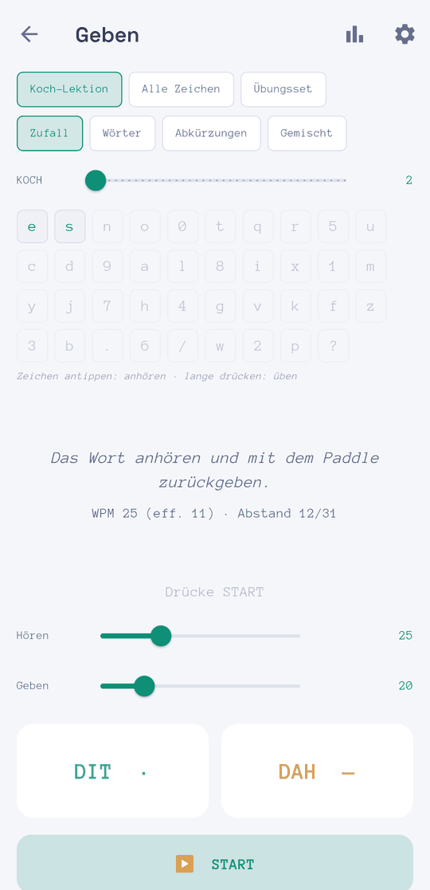

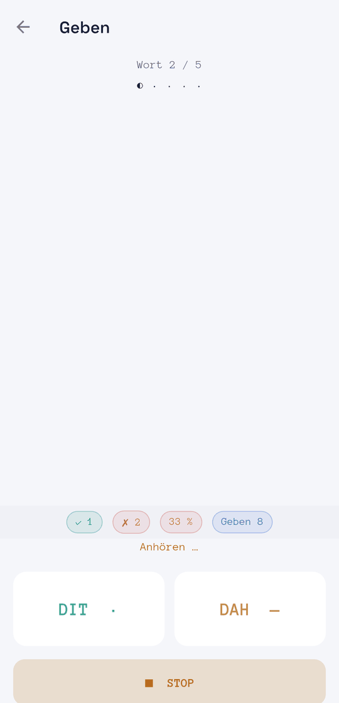
:::

## Ein Wort im Ablauf

1. Nach **Start** wartet die App 2 Sekunden, dann spielt sie das erste Wort.
2. **Deine Antwort:** Gib das Wort zurück. Dein Mithörton ist um einen
   Halbton versetzt (einstellbar, **Tonversatz**), damit du Vorgabe und
   Antwort unterscheiden kannst.
3. **Wann du anfangen musst:** Du hast ab dem Ende der Vorgabe etwa
   1,4 Sekunden plus eine Zeichenpause plus ein Drittel der Wortpause plus die
   **Denkzeit** (Voreinstellung 8 s) Zeit, um mit der Antwort **zu beginnen**.
   Kommt bis dahin nichts, gilt das Wort als falsch.
4. **Wann die Antwort endet:** Sobald du angefangen hast, gilt die Denkzeit
   nicht mehr. Die Antwort ist abgeschlossen, sobald du eine Wortpause von
   7 Dits machst (im Antwort-Tempo).
5. **Korrigieren:** Gibst du `<err>` (acht Dits) oder viermal hintereinander
   `e`, wird deine bisherige Antwort gelöscht und du fängst neu an. Ausnahme:
   Wenn das Wort selbst an dieser Stelle mit einem weiteren `e` weitergeht,
   zählt das `e` als normales Zeichen.
6. **Bewertung:**
   - **✓ Richtig** – optional mit Bestätigungston. Nach gut einer Sekunde
     kommt das nächste Wort.
   - **✗ Falsch** – das Wort wird noch einmal gespielt. Die Anzeige „Versuch
     *n* von *max*“ zeigt, der wievielte Versuch das ist. Sind alle
     **Wiederholungen** aufgebraucht, zeigt die App das richtige Wort zwei
     Sekunden lang an und geht weiter.

Ob die Vorgabe gespielt, angezeigt oder beides wird, stellst du mit **Vorgabe**
ein (siehe unten).

## Gebetempo

Beim Morserino heißt diese Einstellung „Echo Speed Max“. Sie begrenzt das
Tempo, in dem **deine Antwort** erwartet wird. Die Vorgabe spielt weiter im
Hörtempo.

Beispiel: Hören 25 WPM, Geben 18 WPM – du hörst schnell, darfst aber
langsamer antworten. Das Gebetempo bestimmt, wie schnell der Keyer
deine Dits und Dahs erzeugt und wie lang eine Wortpause sein muss. Ganz links
(„wie Hören“) gilt das Hörtempo auch für die Antwort. Das niedrigste
Gebetempo ist 10 WPM.

## Die Ergebnisseite

Nach dem letzten Wort eines Blocks erscheint die Ergebnisseite:

- **Trefferquote** – Anteil der Wörter, die beim **ersten Versuch** richtig
  waren (Farben wie bei Hören).
- Daneben die Aufteilung:
  - **● richtig** – beim ersten Versuch richtig,
  - **◐ nach Wiederholung** – erst nach einer Wiederholung richtig,
  - **○ falsch** – auch nach allen Wiederholungen nicht geschafft.
- Die **Statuszeile**: Hörtempo, Gebetempo (falls begrenzt), Lektion und der
  [Trend](#trend).
- **Verwechslungen** – welche Zeichen du in diesem Block verwechselt hast, als
  „Soll → Gegeben“, z. B. `p → w`. Ein `–` heißt, dass an dieser Stelle nichts
  kam.
- Die Tempo-Regler **Hören** und **Geben** – eine Änderung hier ersetzt den
  passenden Vorschlag.
- **Vorschläge** und **Schwache Zeichen** (siehe
  [Der adaptive Modus](#der-adaptive-modus)).
- Die Liste aller Wörter des Blocks: das Soll-Wort fett, darunter dein
  **erster** Versuch, das erste falsche Zeichen rot hervorgehoben (ein `_`
  heißt, dass an dieser Stelle nichts kam).

**Nächster Block** übernimmt die angehakten Vorschläge, verstärkt die
angehakten schwachen Zeichen im nächsten Block und startet ihn. **Beenden**
übernimmt die angehakten Vorschläge ohne Verstärkung und kehrt zur
Startansicht zurück.

::: {.shots}
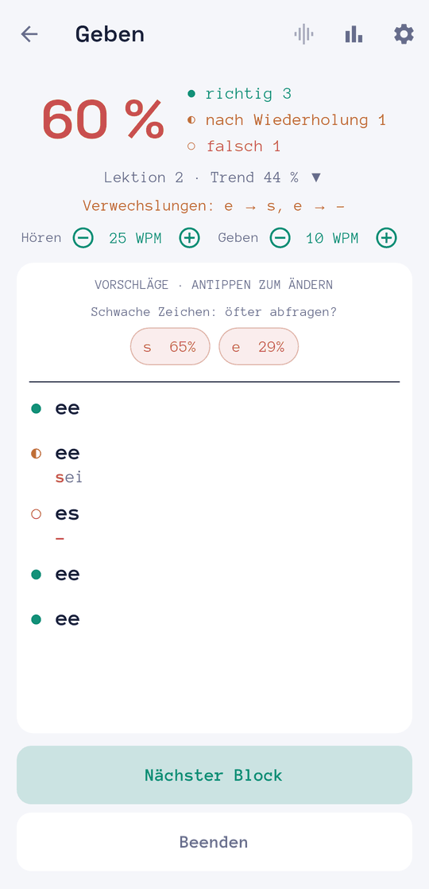

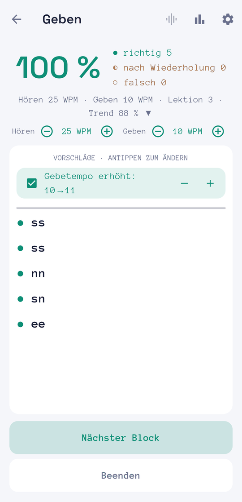
:::

## Einstellungen im ⚙-Blatt (Geben) {#einstellungen-geben}

Die Abschnitte **Koch-Reihenfolge**, **Übungsset**, **Abstände** und
**Wortauswahl** entsprechen denen von Hören (siehe
[Einstellungen im ⚙-Blatt (Hören)](#einstellungen-hoeren)), gelten
aber für das Profil von Geben. Zwei Unterschiede:

- **Abstände** gelten für das vorgespielte Wort **und für deine Antwort**, wie
  am Morserino. Deine Antwort gilt als beendet, wenn du nach einem Zeichen
  so lange pausierst:

  ```
  2 × Zeichenabstand + 1 + Wortabstand / 8   (Dits im Gebetempo)
  ```

  Mit der Handtaste sind es Wortabstand + 1 Dits. Beispiel: Zeichenabstand
  28, Wortabstand 40, Gebetempo 18 WPM ergibt 62 Dits, also rund 4 s. So
  lange darfst du auch zwischen den Zeichen einer Gruppe überlegen, und so
  lange wartet die App nach dem letzten Zeichen, bevor sie bewertet. Ist dir
  das zu großzügig oder zu träge, stell den Zeichenabstand kleiner; der
  Normalabstand 3 / 7 ergibt 8 Dits. Verkürzt die Adaptiv-Funktion die
  Abstände, wird auch die Antwort strenger. Längere Abstände verlängern
  außerdem die Zeit, in der du mit der Antwort beginnen darfst.
- Bei **Wortauswahl** gelten zusätzlich die Rufzeichen-Einstellungen aus den
  globalen Einstellungen (siehe [Rufzeichen](#rufzeichen)).

Dazu kommt der Abschnitt **Echo Trainer**:

| Einstellung | Bedeutung | Werte |
|---|---|---|
| Denkzeit | Zusätzliche Zeit, um mit der Antwort zu **beginnen** | 1–20 s (**8 s**) |
| Wiederholungen | Wie oft ein falsch beantwortetes Wort erneut gespielt wird, bevor die App es auflöst. „Endlos“ wiederholt, bis es stimmt | 0–6 (**3**), Endlos |
| Vorgabe | Wie die Vorgabe kommt: **Ton** = nur hören; **Anzeige** = nur lesen, ohne Ton; **Beides** = hören und nach dem Abspielen lesen | **Ton** / Anzeige / Beides |
| Gebetempo (max.) | Höchstes Antwort-Tempo, siehe [Gebetempo](#gebetempo) | **wie Hören**, 10–50 WPM |
| Tonversatz | Dein Mithörton beim Antworten liegt einen Halbton höher oder tiefer als die Vorgabe | Kein Versatz / **Hoch ½** / Runter ½ |
| Bestätigungston | Kurzer Ton nach der Bewertung: hoch für richtig, tief für falsch | Aus / **Ein** |

**Vorgabe = Anzeige** ist eine gute Übung, um vom geschriebenen Text zum
Geben zu kommen, etwa zum Einschleifen neuer Zeichen.

::: {.shots .one}
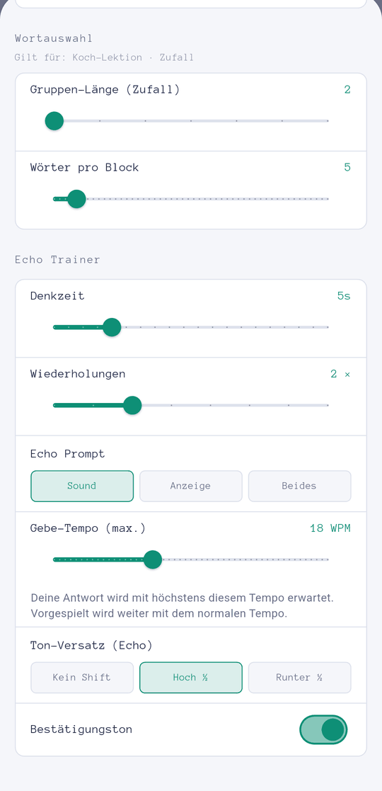
:::

## Einzelzeichen üben

Drückst du in Hören oder Geben lange auf ein Koch-Zeichen (auch auf ein noch
nicht freigeschaltetes), öffnet sich **Üben: X**. In der Mitte steht dieselbe
Kachel wie beim Antippen: das Zeichen und sein Morsecode, dessen Punkte und
Striche beim Abspielen aufleuchten. Das Zeichen wird immer wieder gespielt.

Nach jedem Abspielen **kannst** du das Zeichen mit der Taste nachgeben – mit
dem Touch-Paddle unten oder einer angeschlossenen Taste –, musst aber nicht.
Unter dem Strich in der Kachel erscheinen deine Punkte und Striche, sobald du
sie gibst. Ist das Zeichen fertig, färben sie sich grün (**✓ Richtig**) oder
rot (**✗ Gegeben:** mit dem Zeichen, das du gegeben hast), und kurz danach
kommt das Zeichen erneut. Gibst du nichts, wird es nach einer Pause
wiederholt. Das ist kein Fehler, und nichts wird gezählt oder in eine
Statistik übernommen. Mit **Zurück** verlässt du die Seite.

::: {.shots .one}
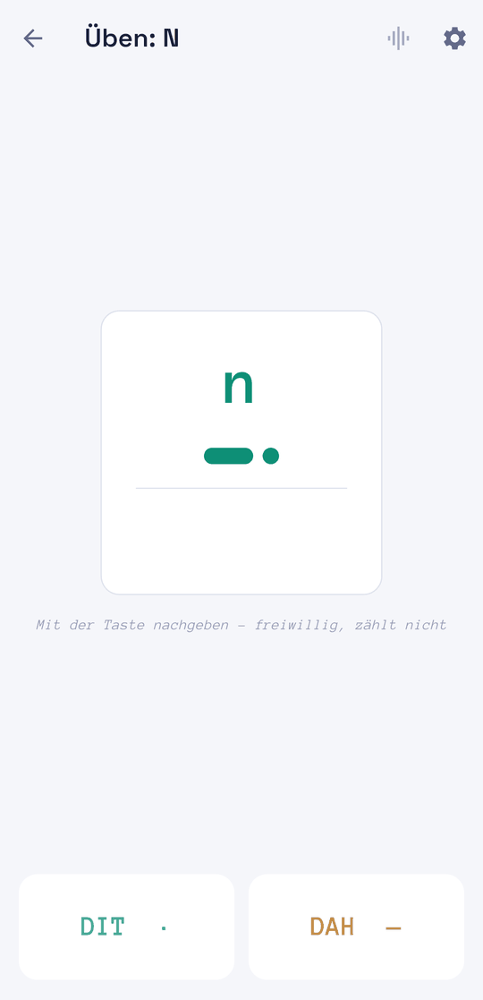
:::

Die Länge der Pause stellst du über das **Zahnrad** oben rechts ein:
**Pause bis zur Wiederholung**, 1–20 s (Voreinstellung **4 s**). Sie gilt nur
für diese Übungsseite, nicht für Geben.

Das entspricht „Learn New Chr“ bzw. „Preview Char“ am Morserino.

# Der adaptive Modus

Hören und Geben laufen immer in **Blöcken**. Nach jedem Block wertet die App
aus, wie es gelaufen ist, und macht dir **Vorschläge**: das nächste
Koch-Zeichen freischalten, die Pausen verkürzen oder verlängern, das Tempo
erhöhen. **Nichts davon passiert heimlich.** Jeder Vorschlag erscheint auf der
Ergebnisseite, und du entscheidest, ob du ihn annimmst.

Dieses Kapitel erklärt genau, wie die App rechnet. Du brauchst das nicht, um zu
üben. Es hilft aber, die Vorschläge zu verstehen und die Schwellenwerte bewusst
einzustellen.

## Was die App mitzählt

### Pro Zeichen

Für jedes Zeichen führt die App eine Statistik, getrennt für **Hören** und
**Geben**:

- **Versuche** – wie oft das Zeichen bewertet wurde,
- **Fehler** – wie oft davon falsch,
- **gleitende Fehlerquote** – die Grundlage für alle Entscheidungen.

Die **gleitende Fehlerquote** ist ein exponentiell gleitender Mittelwert
(EMA). Bei jedem Versuch gilt:

  neue Quote = 0,2 × (1 bei Fehler, sonst 0) + 0,8 × alte Quote

Jeder neue Versuch zählt also 20 %, die Vergangenheit 80 %. Frische Ergebnisse
wiegen schwerer als alte, aber ein einzelner Ausrutscher wirft nicht alles um.
Beispiel: Ein Zeichen mit 0 % Fehlerquote bekommt einen Fehler und steht dann
bei 20 %. Danach braucht es 3 richtige Versuche, um wieder unter 12 % zu
fallen, und 8 richtige, um unter 5 % zu kommen.

Die **Trefferquote** eines Zeichens ist 100 % minus seine gleitende
Fehlerquote.

**Was zählt als Versuch?**

- **Hören:** Jedes gespielte Zeichen eines Blocks. Richtig, wenn du es nicht
  als Fehler markiert hast. Beim Mitschreiben mit der Bildschirmtastatur
  markiert die App die Fehler aus dem **ersten** Versuch jedes Wortes selbst
  (siehe [Mit der Bildschirmtastatur mitschreiben](#mit-der-bildschirmtastatur-mitschreiben)).
- **Geben:** Nur der **erste** Versuch jedes Wortes. Die Zeichen vor dem
  ersten Fehler zählen als richtig, das erste falsche Zeichen als Fehler. Die
  Zeichen danach werden nicht gezählt, weil unklar ist, ob du sie richtig
  gehört hast. Wiederholungen desselben Wortes zählen nicht.

### Pro Block

Jeder Block hat eine **Blockquote**:

- **Hören:** richtig mitgeschriebene Zeichen / alle Zeichen,
- **Geben:** beim ersten Versuch richtige Wörter / alle Wörter.

Aus den Blockquoten bildet die App wieder einen gleitenden Mittelwert, die
**Block-EMA**:

  Block-EMA = α × Blockquote + (1 − α) × bisherige Block-EMA

α ist die Einstellung **EMA-Glättung** (Voreinstellung 30 %). Die Block-EMA
beginnt bei 100 % und wird über alle Sitzungen hinweg gespeichert, getrennt für
Hören und Geben.

## Die zwei Schwellen

Mit **Erfolgsschwelle niedrig/hoch** (Voreinstellung **70 % / 90 %**) teilt die
App die Block-EMA in drei Bereiche:

| Block-EMA | Bedeutung | Vorschlag |
|---|---|---|
| **ab 90 %** (hoch) | Läuft gut | Nach **2 Blöcken in Folge** in diesem Bereich: Pausen verkürzen – bzw. Tempo erhöhen, wenn die Pausen schon normal sind |
| **70 % bis unter 90 %** | Passt | Nichts ändern |
| **unter 70 %** (niedrig) | Zu schwer | Sofort: Pausen verlängern |

Die obere Schwelle ist zugleich die Trefferquote, die jedes Zeichen für die
Freischaltung des nächsten Koch-Zeichens erreichen muss.

## Wann das nächste Koch-Zeichen kommt

Das nächste Koch-Zeichen wird vorgeschlagen, wenn **alle** Zeichen der
aktuellen Lektion – nicht nur das zuletzt gelernte – zwei Bedingungen
erfüllen:

1. mindestens **20 Versuche** (Einstellung **Vorkommen für Freischaltung**), und
2. eine **Trefferquote von mindestens 90 %** (die obere Erfolgsschwelle).

Zwei Dinge sind dabei wichtig:

- Die Bedingung gilt für jedes einzelne Zeichen. Ein einziges schwaches oder
  zu selten geübtes Zeichen hält die Freischaltung auf. Welches das ist, zeigt
  dir die [Fortschrittsanzeige](#fortschrittsanzeige-auf-dem-weg-zu-x) und
  die [Zeichenstatistik](#zeichenstatistik).
- Weil die Trefferquote gleitend ist, reicht es nicht, ein Zeichen irgendwann
  einmal 20-mal richtig gehabt zu haben. Die **letzten** Versuche müssen gut
  sein.

Die Freischaltung erscheint als hervorgehobener Vorschlag mit Stern:
**Neues Zeichen freigeschaltet: „X“**. Über das 🔊-Symbol daneben hörst du
das neue Zeichen dreimal, ohne die Ergebnisseite zu verlassen. Dabei
erscheint dieselbe Kachel wie beim Antippen eines Koch-Zeichens: das Zeichen
und darunter sein Code, dessen Elemente mitleuchten. Tippen schließt sie
vorzeitig. Wenn du den
Haken entfernst, bleibst du in der aktuellen Lektion.

## Pausen und Tempo

Die App verändert immer zuerst die **Pausen**, erst dann das Tempo:

- **Verkürzen:** Zeichenabstand und Wortabstand werden je um 1 Dit kürzer,
  bis hinunter zu den normalen 3 / 7 Dits.
- **Tempo erhöhen:** Erst wenn die Pausen bereits bei 3 / 7 Dits angekommen
  sind, schlägt die App **+1 WPM** vor.
- **Verlängern:** Zeichenabstand und Wortabstand werden je um 1 Dit länger –
  aber nie länger als zu Beginn der Sitzung (bei Hören: als du das Training
  geöffnet hast; bei Geben: der Wert aus dem ⚙-Blatt).

Beim Mitschreiben mit der **Bildschirmtastatur** ändert die App nur den
**Zeichenabstand**; der Wortabstand bleibt, weil die App dort ohnehin nach jedem
Wort auf dich wartet. Die Pausen gelten dann als normal, sobald der
Zeichenabstand bei 3 Dits ist.

**Solange du die Koch-Reihenfolge noch durcharbeitest, verkürzt die App die
Pausen nicht und erhöht auch das Tempo nicht.** Du sollst dich auf neue Zeichen
konzentrieren können, ohne dass gleichzeitig alles schneller wird. Verlängern
ist dagegen immer möglich. Verkürzen und Tempo erhöhen kommen erst, wenn

- alle Zeichen der Koch-Reihenfolge freigeschaltet sind, oder
- du mit **Alle Zeichen** oder einem **Übungsset** übst.

Auch in dem Block, in dem ein neues Zeichen dazukommt, gibt es kein
Verkürzen und keine Tempoerhöhung.

Mit **Abstand anpassen** (Hören) bzw. den Tempo-Reglern (Geben) kannst du
jederzeit selbst eingreifen, unabhängig von diesen Regeln.

### Gebetempo bei Geben

Bei Geben gibt es einen zusätzlichen Vorschlag: **Gebetempo erhöht**
(+1 WPM). Er erscheint nur, wenn du ein Gebetempo **unterhalb** des Hörtempos
eingestellt hast und der Block mindestens die obere Schwelle erreicht hat. Er
ist anfangs **nicht angehakt**, weil das Gebetempo eine bewusste Entscheidung
ist.

## Vorschläge annehmen, ablehnen, anpassen

Jeder Vorschlag ist eine Zeile auf der Ergebnisseite:

- Das **Kästchen** links nimmt den Vorschlag an oder lehnt ihn ab. Die meisten
  Vorschläge sind anfangs angehakt.
- Mit **−** und **+** passt du die Größe an: das Tempo bis höchstens 5 WPM
  über dem aktuellen, die Pausen zwischen 3 / 7 Dits und dem Wert vom Beginn
  der Sitzung.
- Die Statuszeile zeigt sofort die Werte, die im nächsten Block gelten.

Übernommen wird erst beim Verlassen der Ergebnisseite, mit **Nächster Block**
oder **Beenden**.

## Schwache Zeichen

Als **schwach** gilt ein Zeichen, das

- mindestens **8 Versuche** hat und
- eine gleitende Fehlerquote von mindestens **12 %** hat.

Angezeigt werden höchstens die **5** schwächsten, das schlechteste zuerst, mit
ihrer Fehlerquote. Weil die Quote auf Dauer mitgezählt wird, bleibt ein Zeichen
so lange schwach, bis du es wieder zuverlässig richtig hast, auch über
mehrere Blöcke und Sitzungen.

**Tippe ein schwaches Zeichen an**, um es von der Verstärkung auszunehmen
(durchgestrichen) oder wieder aufzunehmen.

- **Hören:** Die schwachen Zeichen erscheinen schon auf der Startansicht und auf
  jeder Ergebnisseite. Im nächsten Block werden sie mit der Stufe *Mäßig*
  verstärkt (bis zu 3 Würfe pro Zeichen, siehe
  [Übungsset](#uebungsset-einstellungen)). Das gilt nur für Zufallsgruppen (Koch-Lektion
  oder Alle Zeichen · Zufall), nicht für Wörter. Hast du im Übungsset
  eigene Zeichen und **Übungsset bevorzugen** eingestellt, kommen diese dazu; es gilt
  dann die höhere Stufe (Stark also für alle, wenn du Stark gewählt hast).
- **Geben:** Die schwachen Zeichen erscheinen auf der Ergebnisseite, wenn du
  **Koch-Lektion · Zufall** übst. Mit **Nächster Block** kommen die
  angehakten Zeichen im nächsten Block doppelt so oft. Die Verstärkung gilt
  genau einen Block.

### Gewichtung bei Geben

Bei **Geben · Koch-Lektion · Zufall** zieht die App die Zeichen zusätzlich
gewichtet. Beim Morserino heißt das „Adaptive Random“. Jedes Zeichen hat ein
Gewicht zwischen 1 und 20; je höher, desto öfter kommt es dran. Nach dem ersten
Versuch jedes Wortes:

- **Wort ganz richtig:** jedes Zeichen des Wortes −1,
- **Fehler:** das erste falsche Zeichen +4, seine Nachbarn im Wort je +2
  (wenn es andere Zeichen sind).

Zeichen, die du falsch gibst, kommen also schnell häufiger, und sie werden
erst wieder seltener, wenn du sie mehrfach richtig gibst. Das ist nicht immer
angenehm, aber sehr wirksam.

## Fortschrittsanzeige „Auf dem Weg zu X“

Auf der Ergebnisseite von **Hören** mit der Koch-Lektion zeigt eine Karte, was
bis zum nächsten Zeichen noch fehlt:

- Der **Balken** zeigt, wie viele der nötigen Versuche schon gemacht sind,
  zusammengezählt über alle Zeichen, denen noch Versuche fehlen. Fehlen keine
  Versuche mehr, sondern nur noch Treffsicherheit, zeigt er die Trefferquote
  des schwächsten Zeichens im Verhältnis zur Schwelle.
- **Noch üben (Wiederholungen):** Zeichen, denen noch Versuche fehlen, je
  als kleines Kästchen mit der Zahl der fehlenden Versuche, z. B. `q 7`. Die
  mit den meisten fehlenden Versuchen stehen vorne.
- **Trefferquote unter 90 %:** Zeichen mit genug Versuchen, aber zu niedriger
  Trefferquote, z. B. `y 84 %`. Die schwächsten stehen vorne.

Pro Liste werden höchstens 10 Zeichen gezeigt, der Rest als „+N weitere“.

## Trend

Ab dem **sechsten** Block zeigt die Statuszeile einen Trend, z. B.
„Trend 87 % ▲“:

- Die Zahl ist der Durchschnitt der Blockquoten der **letzten 5 Blöcke**.
- Der Pfeil vergleicht sie mit dem Durchschnitt der 5 Blöcke davor:
  **▲** mindestens 3 Prozentpunkte besser, **▼** mindestens 3 Punkte
  schlechter, **►** gleich.

Der Trend wird über alle Sitzungen hinweg geführt, getrennt für Hören und
Geben. Die App speichert dafür die letzten 20 Blöcke.

## Einstellungen des adaptiven Modus

Im ⚙-Blatt von **Hören** unter **Adaptiver Modus**. Sie gelten für Hören und
Geben gemeinsam.

| Einstellung | Bedeutung | Werte |
|---|---|---|
| Erfolgsschwelle niedrig/hoch | Unter *niedrig* werden die Pausen verlängert. Ab *hoch* (2 Blöcke in Folge) werden sie verkürzt bzw. das Tempo erhöht. *Hoch* ist außerdem die Trefferquote, die jedes Zeichen für die Koch-Freischaltung braucht | 30–99 %, mindestens 5 Punkte Abstand (**70 % / 90 %**) |
| EMA-Glättung | Wie stark der letzte Block in die Block-EMA eingeht. Höher = reagiert schneller, aber auch nervöser | 5–100 % (**30 %**) |
| Vorkommen für Freischaltung | Mindestzahl an Versuchen je Zeichen, bevor das nächste Koch-Zeichen kommen kann | 5–50 (**20**) |

Einige Hinweise:

- Die hohe Schwelle kann nicht auf 100 % gestellt werden. Die gleitende
  Fehlerquote eines Zeichens, das je einen Fehler hatte, erreicht nie ganz
  wieder 0. Mit 100 % würde dieses Zeichen die Freischaltung für immer
  blockieren.
- **EMA-Glättung 100 %** heißt: Nur der letzte Block zählt.
- Wenn dir die Freischaltung zu schnell geht, erhöhe **Vorkommen für
  Freischaltung** oder die hohe Schwelle. Geht sie dir zu langsam, senke die
  Werte.

# Zeichenstatistik

Das **📊-Symbol** in Hören und Geben öffnet die Statistik dieses Trainings.
Hören und Geben haben getrennte Statistiken.

- **Hören** zeigt jedes aktive Koch-Zeichen mit seinen Versuchen (z. B.
  „14/20 Versuche“) und seiner Trefferquote. Ein Häkchen markiert Zeichen, die
  die Freischaltbedingung erfüllen, eine Sanduhr solche, die noch nicht so
  weit sind. Oben steht „*x* von *y* Zeichen bereit“. Die noch nicht bereiten
  Zeichen stehen zuerst, das hilft, wenn die Freischaltung scheinbar hängt.
- **Geben** zeigt die Zeichen nach Fehlern sortiert, das unsicherste oben.
  Darunter stehen die **häufigen Verwechslungen** über alle Blöcke (Soll →
  Gegeben, mit Anzahl).

Mit dem Symbol **Zurücksetzen** löschst du nach einer Sicherheitsabfrage die
gesamte Statistik dieses Trainings – Fehlerquoten, Gewichte und
Verwechslungen. Die Statistik des anderen Trainings bleibt erhalten. Das lässt
sich nicht rückgängig machen.

::: {.shots}
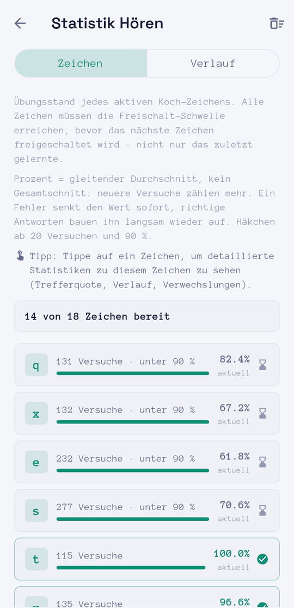

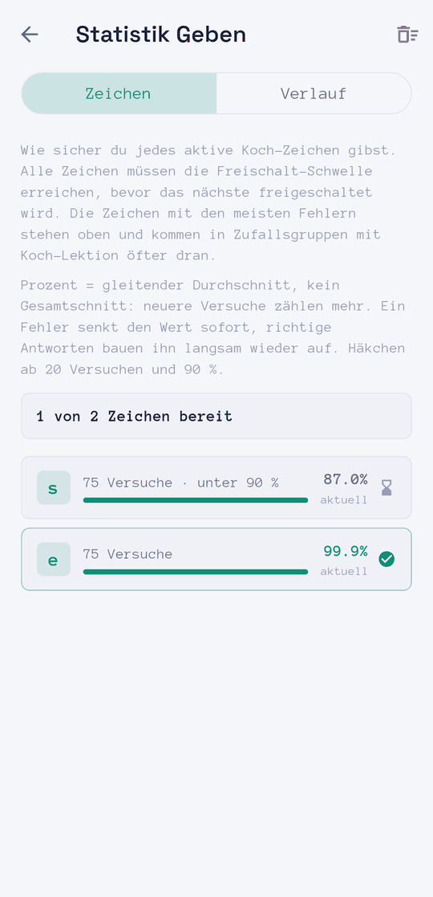
:::

# CW Keyer

Zum freien Tasten: Was du gibst, wird hörbar und als Text dekodiert
angezeigt.

- Die **Paddles** unten (DIT links, DAH rechts) oder ein echtes Paddle über
  einen Adapter (siehe [Paddle und Morsetaste](#paddle-und-morsetaste)). Im
  Modus **Straight** erscheint stattdessen eine einzelne Taste **TASTE**.
- **WPM** – Tempo des Keyers, 5 bis 60 WPM.
- Der Text läuft von unten nach oben. Ältere Zeilen kannst du zurückscrollen,
  die Textgröße änderst du mit zwei Fingern.
- Das ⚙-Blatt oben rechts enthält den **Wortabstand**
  (Wortabstand, Voreinstellung 7 Dits). Er legt fest, nach welcher Pause ein
  Leerzeichen gesetzt wird. Der Zeichenabstand hat beim Tasten keine Wirkung, wie
  am Morserino.

Den Keyer-Modus und seine Feinheiten stellst du in den globalen Einstellungen
unter **Keyer** ein (siehe [Keyer](#keyer)). Sie gelten überall, wo du
tastest: CW Keyer, Geben, WiFi Trx, QSO Bot und Spiele.

::: {.shots .one}

:::

# CW-Decoder

Der CW-Decoder hört über das **Mikrofon** zu und schreibt mit, was er als
Morsezeichen erkennt, z. B. von einem Funkgerät, einem Übungsprogramm oder
einem anderen Morserino.

Beim ersten Start fragt Android nach der Erlaubnis für das Mikrofon. Ohne sie
kann der Decoder nicht arbeiten. Hast du abgelehnt, erlaube das Mikrofon in den
Android-Einstellungen unter **Apps → Next CW Trainer → Berechtigungen**.

## Bedienung

- **Start / Stopp** schaltet das Mitlesen ein und aus.
- Die **Statuszeile** zeigt die eingestellte Tonhöhe, die Bandbreite und das
  erkannte Tempo in WPM.
- Die **Pegelanzeige** zeigt die Lautstärke des Tons bei der eingestellten
  Tonhöhe. Eine graue Marke zeigt den Rauschpegel in den Pausen.
- Oben rechts löschst du den Text; das Symbol mit den Schiebereglern öffnet
  die Einstellungen des Decoders.

Der Decoder passt sich automatisch an das Tempo an, du musst nichts
einstellen. Er stammt aus der Firmware: Ein Goertzel-Filter erkennt den Ton,
eine Zeitlogik unterscheidet Dits, Dahs und Pausen und lernt laufend die
aktuelle Dit- und Dah-Länge.

::: {.shots}
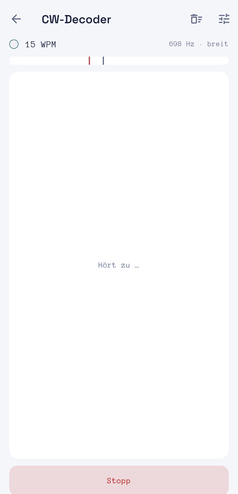

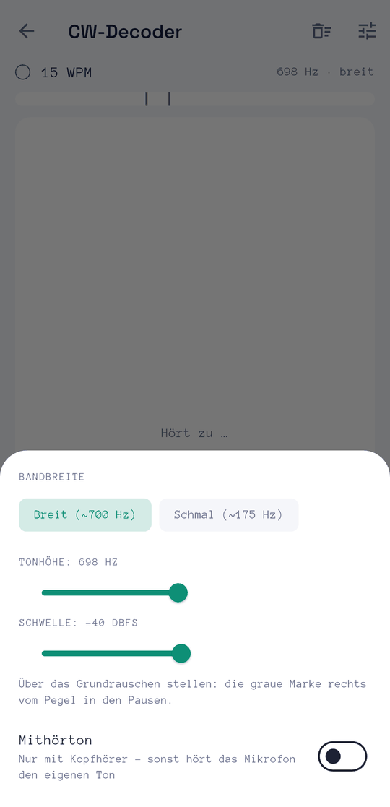
:::

## Einstellungen des Decoders

| Einstellung | Bedeutung | Werte |
|---|---|---|
| Bandbreite | **Breit** ist toleranter gegenüber einer nicht ganz passenden Tonhöhe. **Schmal** filtert Störungen besser, die Tonhöhe muss aber genau stimmen | **Breit (~700 Hz)** / Schmal (~175 Hz) |
| Tonhöhe | Die Frequenz des CW-Tons, auf den der Decoder hört | 300–1200 Hz (**698 Hz**) |
| Schwelle | Mindestlautstärke, ab der ein Ton zählt. Stelle sie knapp **über** die graue Rauschmarke | −65 bis −10 dBFS (**−40 dBFS**) |
| Mithörton | Spielt den erkannten Ton sauber in der eingestellten Tonhöhe nach | **Aus** / Ein |

**Tipps**

- Ist die Tonhöhe des Signals unbekannt, beginne mit **Breit** und dreh die
  Tonhöhe, bis der Pegel bei den Zeichen deutlich ausschlägt. Wechsle dann auf
  **Schmal**.
- Erscheinen in den Pausen zufällige `e` und `t`, ist die **Schwelle** zu
  niedrig.
- Den **Mithörton** nur mit Kopfhörer verwenden. Sonst hört das Mikrofon den
  eigenen Ton und der Decoder gerät durcheinander.

# WiFi Trx

Mit WiFi Trx morst du über das Internet oder das lokale Netz mit anderen
Morserinos, Apps und Servern. Die App verwendet dasselbe Protokoll wie der
Morserino („Morse over Packet“, MOPP, UDP-Port 7373), zum Beispiel mit dem
Chat-Server **cq.morserino.info**.

Die App nutzt die bestehende WLAN- oder Mobilfunkverbindung des Handys. Du
musst also keine WLAN-Zugangsdaten eintragen.

## Dienste

Oben wählst du den **Dienst**, mit dem du dich verbinden willst.
Voreingestellt ist `cq.morserino.info`.

- **+** legt einen neuen Dienst an, der **Stift** bearbeitet oder löscht den
  gewählten. Jeder Dienst hat einen **Namen** und einen **Server** (Hostname
  oder IP-Adresse).
- **Leerer Server** heißt: Broadcast ins lokale Netz. So kannst du mit
  Morserinos im selben WLAN morsen.
- Das geht nur, solange keine Verbindung besteht.

**Connect** verbindet, **Disconnect** trennt. Die Zeile darunter zeigt den
Zustand. Beendet der Server die Verbindung (`:bye`), trennt die App ebenfalls.

## Senden und Empfangen

- **Senden** mit den Paddles bzw. dem Adapter: Jedes Wort wird nach der
  Wortpause als Paket verschickt. Alternativ tippst du Text in das Feld
  **Send text…** und schickst ihn ab. Er wird im eingestellten Tempo gesendet.
- **WPM** – dein Sendetempo.
- **Empfangen:** Empfangene Wörter werden nacheinander im Tempo **des
  Absenders** gespielt und im Log angezeigt.
- Das **Log** unterscheidet Empfangenes (RX) und Gesendetes (TX) und wird je
  Dienst gespeichert. **Lange auf das Log drücken** leert es nach einer
  Rückfrage.
- Im ⚙-Blatt stellst du den **Wortabstand** ein (wie beim CW Keyer), also
  nach welcher Pause dein Wort abgeschickt wird.

WiFi Trx funktioniert nur, solange die App im Vordergrund ist.

::: {.shots .one}
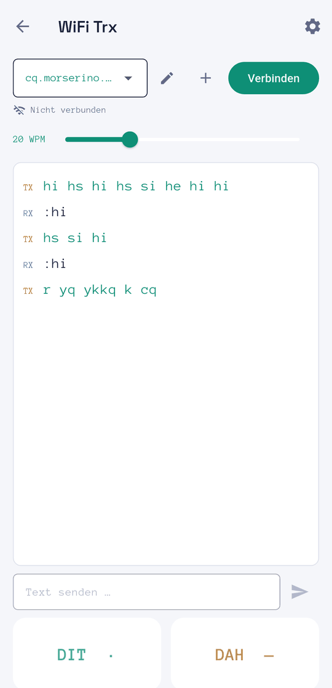
:::

Liegt dein Partner hinter einem anderen Router, müssen UDP-Pakete auf Port
7373 durchkommen. Mit einem öffentlichen Server wie cq.morserino.info ist das
normalerweise kein Problem.

# QSO Bot

Der QSO Bot ist ein simulierter Gesprächspartner für komplette,
realistische Funkverbindungen – ohne auf Sendung zu gehen. Der Bot sendet in
CW, versteht, was du ihm gibst, und reagiert darauf. Er sendet nur über den
Lautsprecher der App, niemals ins Netz.

## Start

1. Wähle die **QSO-Art**: **SOTA/POTA**, **Standard** oder **Contest**.
2. Drücke **Start**. Der Bot hört 5 Sekunden lang zu:
   - **Rufst du CQ** (z. B. `cq cq de oe1abc k`), antwortet er dir.
   - **Bleibst du still**, ruft er selbst CQ und du antwortest.

Jede Verbindung läuft mit einem neuen, realistischen Rufzeichen des Bots.

::: {.shots .one}
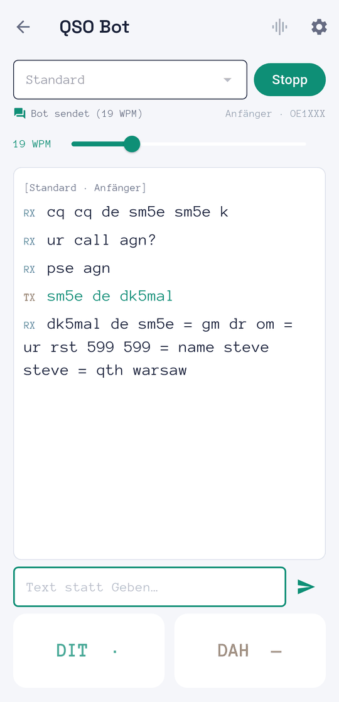
:::

## Die QSO-Arten

- **SOTA/POTA** – Gipfel- oder Park-Aktivierung mit Rapport und Referenz.
  Ruft der Bot CQ, ist er der Aktivierer und du der Jäger; rufst du CQ, ist es
  umgekehrt. Eine Sitzung ist eine einzelne Verbindung.
- **Standard** – das klassische QSO in drei Runden: Rapport, Name und QTH;
  dann Stationsangaben (rig, ant, wx, age); dann die Verabschiedung. Der Bot
  erkennt deine Angaben an den Schlüsselwörtern `name`, `qth`, `rig`, `ant`,
  `wx`, `age` und merkt sich deinen Namen.
- **Contest** – viele sehr kurze Verbindungen hintereinander. Der Austausch
  hängt von der **Contest-Art** ab: **CQ WW** (Rapport + CQ-Zone) oder
  **WPX** (Rapport + laufende Nummer). Die Sitzung endet nach längerer Stille
  von selbst.

## Mit dem Bot sprechen

- **Beende jeden Durchgang** mit `k`, `bk`, `<ar>`, `<sk>` oder `73` – oder
  mach einfach eine Pause. Der Bot fällt dir nicht ins Wort.
- **Wiederholung:** `agn`, `rpt` oder `?` wiederholt seinen letzten
  Durchgang. `rpt rst`, `rpt call`, `rpt qth` oder `rpt name` wiederholt nur
  diese Angabe.
- **Tempo des Bots:** `qrs` = langsamer, `qrq` = schneller. Dein eigenes
  Tempo ändert sich dabei nicht.
- **Korrigieren:** `<err>` (acht Dits) oder `eeee` verwirft dein letztes Wort.
- Rapporte darfst du auch abgekürzt geben: `5nn` für 599, `t` für 0, `a` für
  1, `n` für 9.
- Füllwörter wie `de`, `r`, `ur` stören nicht; der Bot pickt die
  Informationen heraus.
- Statt zu tasten, kannst du auch Text in das Eingabefeld tippen. Er wird wie
  gegeben behandelt, aber nicht hörbar gespielt.

## Einstellungen des QSO Bots

Über das ⚙-Symbol im QSO Bot:

| Einstellung | Bedeutung | Werte |
|---|---|---|
| Eigenes Rufzeichen | Dein Rufzeichen für den Bot. Rufst du selbst CQ, gilt das gegebene Rufzeichen | leer = OE1XXX |
| Schwierigkeit | **Anfänger**: mehr Geduld, 599 statt 5nn, der Bot sendet in deinem Tempo. **Mittel**/**Fortgeschritten**: Der Bot ruft manchmal in einem etwas anderen Tempo (Übung für qrs/qrq), Fortgeschritten ist knapper und schneller im Rhythmus | Anfänger / **Mittel** / Fortgeschritten |
| Contest-Art | Austausch im Contest | **CQ WW** / WPX |
| Wortabstand | Nach welcher Pause dein Wort als beendet gilt; gemeinsam mit dem CW Keyer | 6–105 Dits (**7**) |

Mit **WPM** stellst du dein Tempo ein. **Lange auf das Log drücken** leert
es nach einer Rückfrage.

::: {.shots .one}
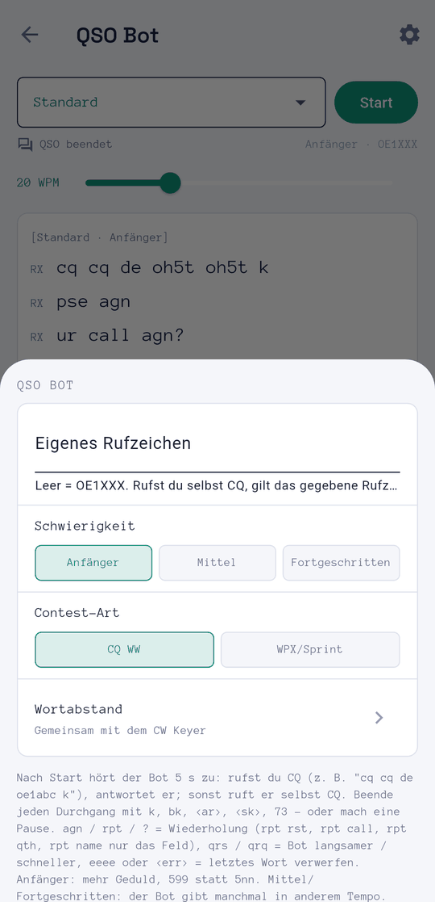
:::

# Spiele

Unter **Spielen → Spiele** findest du vier Spiele. Morsel, Morse Invaders
und Memory Chain spielst du mit den Paddles bzw. dem Adapter. Sie verwenden
die Keyer-Einstellungen. Die Koch-Lektion übernehmen sie aus **Geben**;
Morsel und Memory Chain lassen sie dich zusätzlich nur für das Spiel ändern.
Jedes dieser drei Spiele zeigt vor dem Start eine kurze Spielanleitung. Das
[Text-Adventure](#text-adventure) hat eigene Einstellungen für Tempo und
Eingabe; den Keyer-Modus nimmt es ebenfalls aus den Keyer-Einstellungen.

::: {.shots .one}
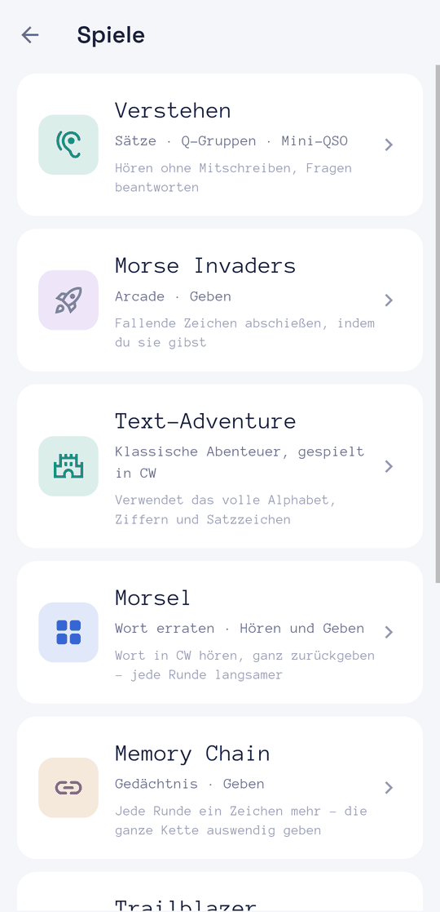
:::

## Morsel

Ein Worträtsel wie Wordle, nur in CW.

- Ein Spiel hat **zehn Wörter**. Ein Buchstabe ist aufgedeckt, das Wort wird
  einmal in CW gespielt.
- Gib das **ganze Wort** zurück. Eine Wortpause schickt es ab. `<err>` (acht
  Dits) löscht das letzte Zeichen.
- Farben: **grün** = richtig, **rot** = falsch, **grau** = der aufgedeckte
  Buchstabe wurde falsch gegeben.
- Nach jedem Fehlversuch wird das Wort **5 WPM langsamer** wiederholt, bis
  hinunter auf 18 WPM. Nach 12 Sekunden ohne Eingabe wird es noch einmal
  gespielt. Mit **Überspringen** gibst du ein Wort auf.
- **Wertung:** deine Zeit + 5 Sekunden pro Versuch; ein übersprungenes Wort
  kostet 60 Sekunden. Weniger ist besser.

| Einstellung | Bedeutung | Werte |
|---|---|---|
| Koch-Lektion | Nur für dieses Spiel; startet bei deiner Geben-Lektion | 2 bis Ende der Reihenfolge |
| Wortlänge | Genau 3/4/5/6 Buchstaben oder höchstens 4/5/6 | 3, 4, max 4, 5, max 5, 6, max 6 |
| Start-Tempo des Wortes | Tempo beim ersten Abspielen | 10–48 WPM (**48**, wie am Morserino) |

Längere Wörter brauchen eine höhere Koch-Lektion. Sind zu wenige Wörter
verfügbar, sagt dir die App, welche Lektion nötig ist.

::: {.shots .one}
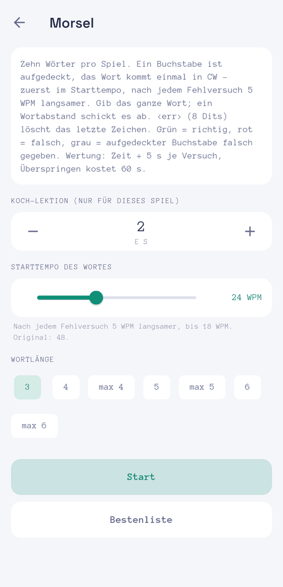
:::

## Morse Invaders

Ein Arcade-Spiel: Zeichen deiner Koch-Lektion fallen in vier Spuren herunter.
**Gib ein Zeichen**, um das unterste Feld mit diesem Zeichen abzuschießen.

- Erreicht ein Zeichen den Boden, kostet das ein **Leben**. Du beginnst mit
  3 Leben, hast höchstens 5 und bekommst alle 1000 Punkte eines dazu.
- Nach **zehn Treffern** kommt das nächste Level; jedes Level ist schneller und
  voller.
- **Punkte:** 10 × WPM/10 pro Treffer, doppelt im unteren Drittel. Serien
  bringen einen Multiplikator: ×1,5 ab 5, ×2 ab 10 und ×3 ab 20 Treffern in
  Folge.
- **Pause** (Symbol oben rechts) hält das Spiel an; von dort geht es weiter
  oder zurück ins Menü. Das Tempo änderst du auch während des Spiels mit −
  und +.

| Einstellung | Bedeutung |
|---|---|
| Koch-Lektion | Die Lektion aus **Geben** (dort änderbar) |
| Start-Level | Mit welchem Level du beginnst |
| Gebetempo | Tempo des Keyers; es zählt in die Punkte |

Die Ergebnisse kommen in eine Bestenliste.

::: {.shots}
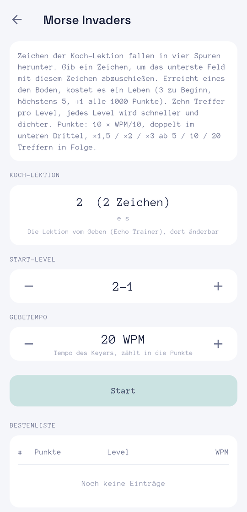

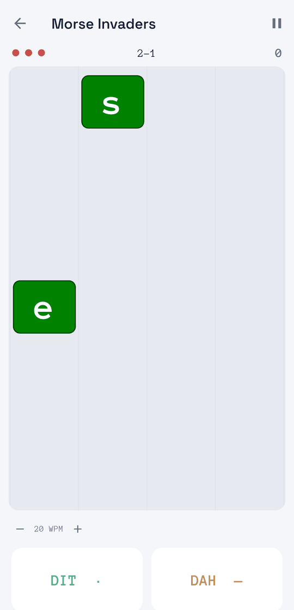
:::

## Memory Chain

Ein Gedächtnisspiel: Jede Runde kommt **ein Zeichen** dazu, und du gibst die
**ganze Kette** von Anfang an aus dem Gedächtnis. Es gibt kein Zeitlimit.

- **Modus Zeichen:** Zufällige Zeichen deiner Koch-Lektion. Ein Fehler pro
  Runde ist erlaubt, der zweite beendet das Spiel.
- **Modus Rufzeichen:** Ein Rufzeichen wird Buchstabe für Buchstabe aufgebaut,
  dann das nächste. Jeder Fehler beendet das Spiel.
- **Vorgabe:** Das neue Zeichen wird **angezeigt** oder in CW **vorgespielt**
  (Sound).
- Farben: **grün** = richtig, **gelber Rahmen** = nächstes Zeichen, **rot** =
  Fehler (mit dem richtigen Zeichen).
- Die **Koch-Lektion** stellst du vor dem Start nur für dieses Spiel ein; sie
  beginnt bei deiner Geben-Lektion. Das Tempo änderst du auch während des
  Spiels mit − und +.

Die Bestenliste wird je Modus geführt.

::: {.shots .one}
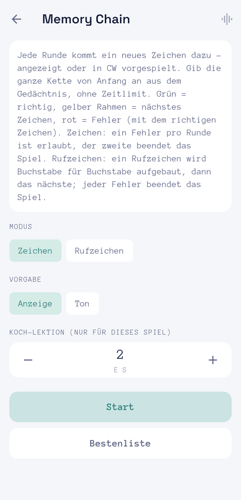
:::

## Text-Adventure {#text-adventure}

Die drei klassischen Infocom-Abenteuer **Zork I, II und III** (1980–82),
gespielt in CW: Das Spiel antwortet in Morse, du gibst deine Befehle ein.
Microsoft hat den Quellcode 2025 unter der MIT-Lizenz freigegeben; die App
spielt die Original-Spieldateien mit einem eigenen Interpreter. Der Spieltext
ist nur auf **Englisch**, und er verwendet das **volle Alphabet, Ziffern und
Satzzeichen** – unabhängig von deiner Koch-Lektion. Zork ist eine Marke ihrer
Inhaber; die App ist mit ihnen nicht verbunden.

**Auswahl.** Jeder Teil zeigt Punkte, Züge und den letzten Raum. **Starten**
bzw. **Weiter** macht dort weiter, wo du aufgehört hast. **Spielstände** öffnet
deine gespeicherten Stände. **Neu** beginnt von vorn (nach Nachfrage; deine
eigenen Spielstände bleiben erhalten).

::: {.shots .one}
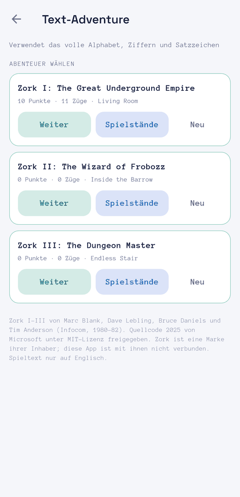
:::

**Der Spielbildschirm.** Oben die Statuszeile mit Raum, Punkten (Score) und
Zügen (Moves), darunter der Verlauf. Die neueste Antwort wird in CW gespielt;
das Wort, das gerade klingt, ist markiert. Darunter:

| Bedienelement | Wirkung |
|---|---|
| Tempo-Leiste | Hör- und Gebetempo, Zeichen- und Wortabstand; Tippen öffnet **Tempo & Abstand** |
| **↻ Nochmal** | Den Satz, der gerade läuft (in der Pause gleich nach einem Wort: dessen Satz; nach dem Ende: den letzten), dann Pause |
| **↻ Nochmal** lang drücken | Die ganze Antwort von vorn (wie `?` abschicken) |
| Wort antippen | Nur dieses Wort, dann Pause |
| **Pause** / **Weiter** | Hält das Abspielen an; **Weiter** spielt ab dem Wort weiter, bei dem angehalten wurde – nach **↻ Nochmal** ab dem folgenden Wort |
| **Text** (Auge) | Zeigt die ganze Antwort sofort; nochmal tippen verdeckt sie wieder, die Wörter erscheinen dann wieder beim Abspielen (z. B. mit **Nochmal**) |
| **↶ Zug** | Nimmt den letzten Befehl zurück (bis zu 20) |

::: {.shots .one}
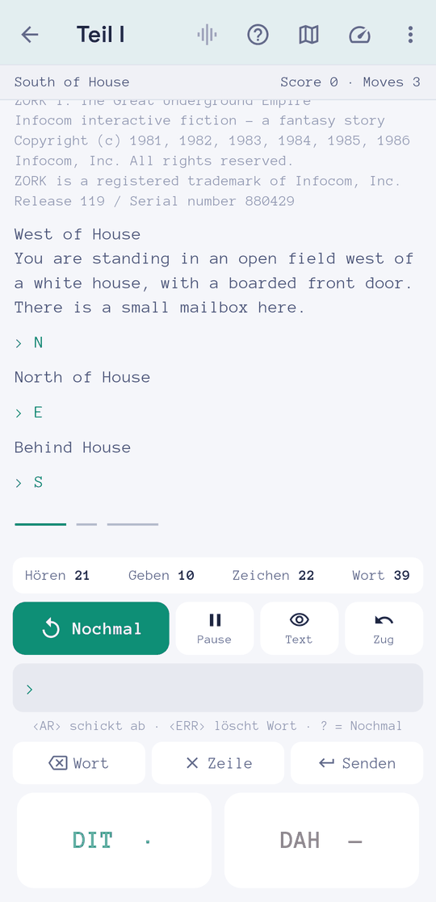
:::

**Befehle geben.** Mit den Touch-Paddles unten (bei Keyer-Modus Straight:
die Taste) oder einem angeschlossenen Paddle (siehe
[Paddle und Morsetaste](#paddle-und-morsetaste)). Der Decoder schreibt in der
Eingabezeile mit; das Zeichen, das gerade entsteht, steht orange als · und —
dahinter. Sobald du zu geben beginnst, stoppt die CW-Ausgabe.

- **Wortende:** Eine Pause trennt die Wörter. Wie im Geben-Lernmodus gilt ein
  Wort nach 2 × Zeichenabstand + 1 + Wortabstand / 8 Dits Pause im Gebetempo
  als fertig (Handtaste: Wortabstand + 1 Dits nach dem Loslassen).
- **Abschicken:** **`<AR>`** (·—·—·) schickt den Befehl sofort ab. Mit der
  Einstellung **„<AR> oder K“** auch ein **K** als eigenes Wort, also nach
  einer Wortpause – keines der drei Spiele kennt ein Wort K. Der Knopf
  **Senden** geht immer.
- **Korrigieren:** **`<ERR>`** (8 Dits; 7 oder mehr zählen) löscht das
  letzte Wort, ebenso der Knopf **⌫ Wort**. **✕ Zeile** löscht die ganze
  Eingabe.
- Ein **?** allein (dann abschicken) wiederholt die letzte Antwort und kostet
  keinen Spielzug.
- Andere Prosigns werden ignoriert; ein nicht erkanntes Zeichen erscheint als
  `*`.

Mit der Einstellung **Eingabe → Tastatur** erscheint statt der Paddles die
Bildschirmtastatur (für reines Hörtraining): **␣** trennt die Wörter, **⌫**
löscht ein Zeichen, **⏎** schickt ab. Ein angeschlossenes Paddle funktioniert
auch dann.

**Karte (🗺).** Das Kartensymbol in der Kopfzeile öffnet eine Karte des
aktuellen Teils. Sie startet beim aktuellen Raum (orange umrandet); mit
zwei Fingern zoomen, mit einem verschieben, ⌖ springt zurück zum aktuellen
Raum. Die Räume heißen wie im Spiel (Englisch). Die Lage der Räume ist von
Hand gesetzt, weil Zork nicht maßstabsgetreu ist; die Verbindungen kommen aus
der Spieldatei.

- **Besucht** (Standard): nur Räume, in denen du warst, und die Wege, die du
  gegangen bist – die Karte, die man früher auf Papier gezeichnet hat. Kein
  Schummeln. Die Wege werden mit dem Spielstand gespeichert und bei **↶ Zug**
  zurückgenommen.
- **Ganze Karte ⚠**: alle Räume des Teils, auch die noch nicht gefundenen
  (grau). Das verrät Lösungen (versteckte Räume, Geheimgänge, den Weg durchs
  Labyrinth), deshalb fragt die App jedes Mal nach. Mit **Nicht mehr
  fragen** im Dialog entfällt die Frage; einschalten lässt sie sich wieder
  unter ⋮ → Einstellungen → **Karte**.
- Gestrichelt = hinauf/hinunter, ▸ = nur in eine Richtung. Weit entfernte
  Verbindungen (z. B. Falltür, Kamin) stehen als blauer Hinweis unter dem Raum
  („→ Cellar“) statt als lange Linie. Manche Wege öffnen sich erst im Spiel.
- In Teil III stehen die Museumsräume dreimal nebeneinander, beschriftet mit
  der Jahreszahl (948 = Gegenwart, 776, 777): Es sind dieselben Räume zu
  verschiedenen Zeiten.

::: {.shots .three}
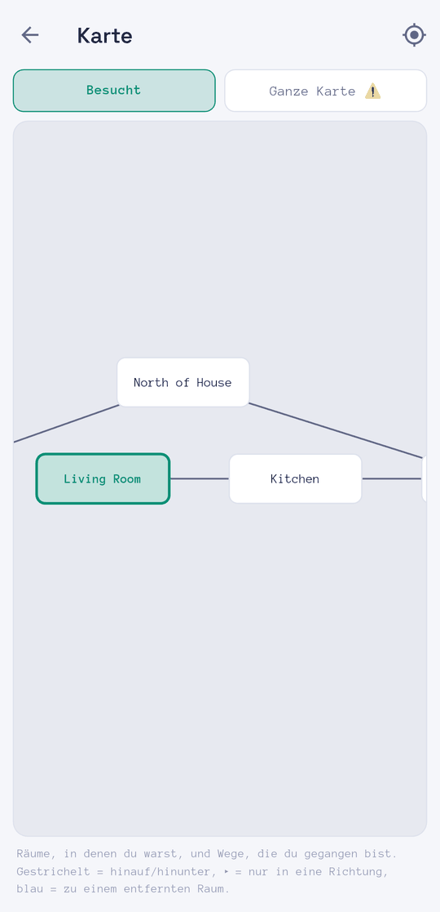

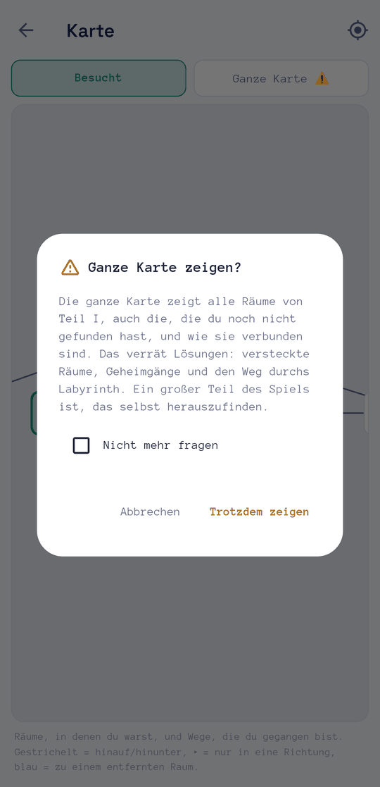

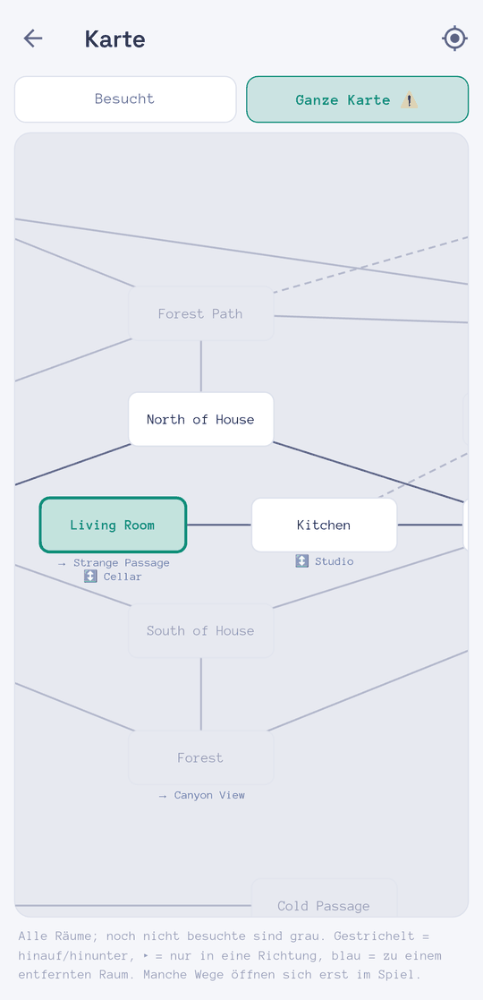
:::

**Befehlsübersicht (?).** Das **?** in der Kopfzeile öffnet eine Liste der
wichtigsten Befehle und unter **Abspielen** die Knöpfe oben; ganz unten
steht unter **Worum es geht** kurz die
Geschichte und das Ziel des aktuellen Teils, wie Punkte und Züge gezählt
werden und was beim Tod passiert. Die Kurzformen gelten in allen drei Teilen:

| Befehl | Bedeutung |
|---|---|
| `N S E W`, `NE NW SE SW`, `U D`, `IN OUT` | Gehen |
| `L` | LOOK: Raum nochmal beschreiben (kostet einen Zug) |
| `I` | INVENTORY: was du trägst |
| `Z` | WAIT: einen Zug warten |
| `G` | AGAIN: letzten Befehl wiederholen |
| `OOPS wort` | Ersetzt ein Wort, das das Spiel nicht kannte |
| `TAKE`, `DROP`, `EXAMINE`, `READ`, `OPEN` … | Mit Dingen umgehen (`X` für EXAMINE gibt es in Zork nicht) |
| `SCORE`, `SAVE`, `RESTORE`, `RESTART`, `QUIT` | Spiel-Befehle |
| `<AR>`, `K`, `<ERR>`, `?` | Nur in dieser App: abschicken, abschicken (als eigenes Wort, je nach Einstellung), letztes Wort löschen, Nochmal |

Das Spiel liest nur die ersten **6 Buchstaben** eines Worts (`EXAMIN`
reicht). Mehrere Befehle in einer Zeile trennst du mit einem Punkt:
`TAKE LAMP. N`.

::: {.shots .one}
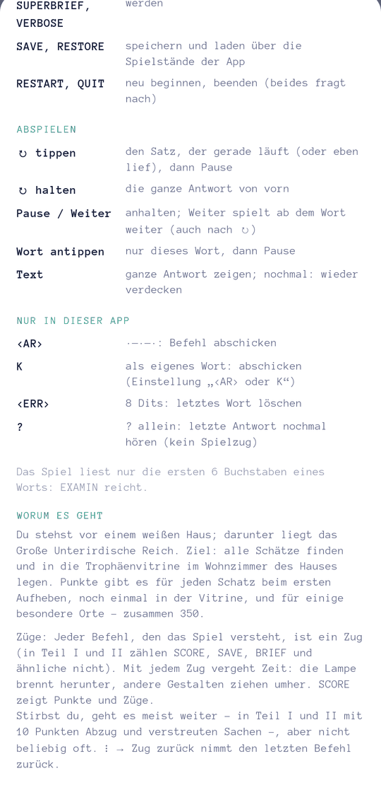
:::

**Einstellungen** (⋮ → Einstellungen; gelten für alle drei Teile):

| Einstellung | Bedeutung | Werte |
|---|---|---|
| Hören | Tempo der CW-Ausgabe | 10–60 WPM |
| Geben | Tempo des Keyers bei deiner Eingabe | **wie Hören**, 10–60 WPM |
| Zeichenabstand | Pause zwischen Zeichen beim Abspielen; beim Geben Teil des Wortendes | 3–45 Dits |
| Wortabstand | Pause zwischen Wörtern; nie kleiner als der Zeichenabstand; beim Geben Teil des Wortendes | 6–105 Dits |
| Eingabe | Touch-Paddles oder Bildschirmtastatur | **Paddle**, Tastatur |
| Abschicken mit | Womit ein gegebener Befehl abgeschickt wird (der Knopf Senden geht immer) | **`<AR>`**, `<AR>` oder K, Nur Knopf |
| CW-Umfang | Was gemorst wird, der Rest steht nur als Text da (kursiv) | **Alles**, Erster Satz, Raum / Meldung |
| Text zeigen | Wann die neue Antwort lesbar wird | Immer, **Nach Abspielen**, Nur auf Tippen |
| Raumbeschreibungen | Wie ausführlich Räume beschrieben werden | **Kurz**, Sehr kurz, Immer lang |
| Karte: Warnung vor der ganzen Karte | Fragt vor **Ganze Karte ⚠** nach | **Ein**, Aus |

- Tempo und Abstände übernimmt das Adventure beim ersten Öffnen aus deinem
  **Hören**-Profil; danach sind sie eigene Werte. Sie lassen sich auch über
  die Tempo-Leiste ändern und wirken sofort, auch mitten im Abspielen.
- **Erster Satz:** bis zum ersten Satzende; ein Raumname davor gehört dazu.
  **Raum / Meldung:** Betrittst du einen Raum, nur sein Name, sonst der erste
  Satz der Antwort.
- **Nach Abspielen:** Jedes Wort erscheint, sobald es gemorst wurde.
  **Nur auf Tippen:** Die neue Antwort bleibt verdeckt, bis du auf **Text**
  oder die Fläche tippst.
- **Kurz** = BRIEF (die lange Beschreibung nur beim ersten Besuch),
  **Sehr kurz** = SUPERBRIEF (nur der Raumname), **Immer lang** = VERBOSE.

::: {.shots}
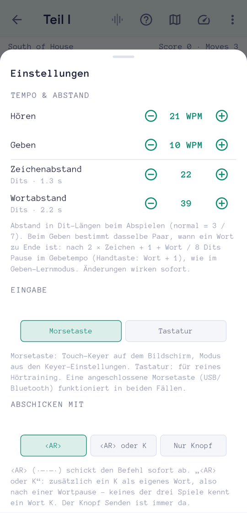

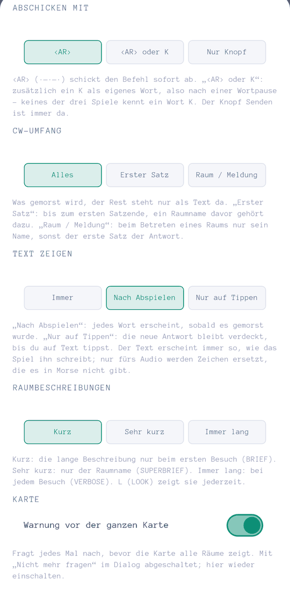
:::

**Satzzeichen im Audio.** Auf dem Bildschirm steht der Text immer so, wie
das Spiel ihn schreibt. Nur für das Abspielen werden Zeichen ersetzt, die es
in Morse nicht gibt:

| Im Text | Gemorst als |
|---|---|
| `'` `"` `( )` `[ ]` `*` `#` und andere | weggelassen |
| `!` | `.` |
| `;` | `,` |
| `&` | `AND` |
| Absatz | doppelte Wortpause |

**Spielstände.**

- **Automatisch:** Nach jedem Befehl und beim Verlassen wird gespeichert, je
  Teil ein Platz. Beim nächsten Öffnen geht es genau dort weiter.
- **Eigene Spielstände:** beliebig viele je Teil, über ⋮ → **Speichern** oder
  den Spielbefehl `SAVE`. Der Name wird vorgeschlagen (Raum · Punkte).
- **Laden:** über ⋮ → **Laden**, **Spielstände** in der Auswahl oder den
  Spielbefehl `RESTORE`. Tippen lädt; der aktuelle Stand wird vorher
  automatisch gesichert. Lang drücken benennt um oder löscht.
- **Neu starten:** ⋮ → **Neu starten** (die App fragt nach und bietet an,
  vorher zu speichern) oder der Spielbefehl `RESTART` (das Spiel fragt nach).
- **Zug zurück (↶):** bis zu 20 Befehle, solange der Spielbildschirm offen ist.
  Das Original kennt das nicht; es hilft vor allem bei Tippfehlern.
- **Spielende:** Nach `QUIT` bietet die App an, einen Spielstand zu laden,
  den Zug zurückzunehmen oder neu zu starten.

::: {.shots .one}
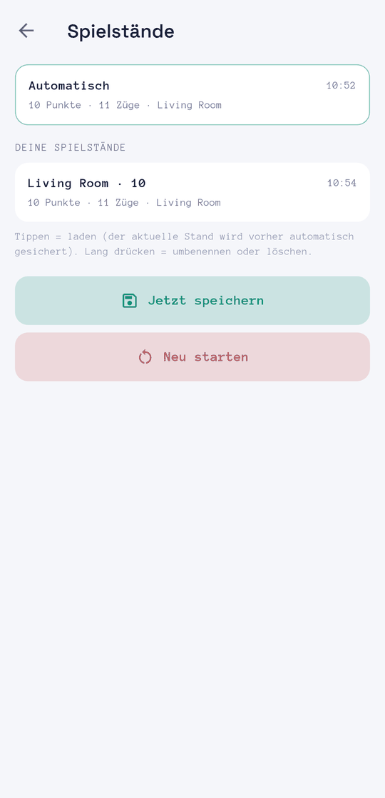
:::

# Paddle und Morsetaste

## Touch-Paddles

In allen Modi, in denen du tastest, erscheinen unten zwei Flächen: **DIT**
(links) und **DAH** (rechts). Im Keyer-Modus **Straight** ist es eine einzige
Fläche **KEY**, die so lange Ton gibt, wie du sie drückst.

## Echtes Paddle oder Handtaste

Ein Handy hat keinen Paddle-Eingang. Du brauchst einen kleinen USB-Adapter,
der die Paddle-Kontakte in **Tastendrücke** übersetzt:

- **vband** ([hamradio.solutions/vband](https://hamradio.solutions/vband/)) –
  ein fertiger, weit verbreiteter USB-Adapter genau dafür.
- **Selbstgebaut:** Jedes kleine USB-HID-Gerät, das Dit- und Dah-Kontakt als
  zwei verschiedene Tasten meldet. Ein fertiges Beispiel zum Nachbauen ist
  [xiao-vband-adapter](https://github.com/ckonecny/xiao-vband-adapter): ein
  Seeed XIAO SAMD21 mit 3,5-mm-Buchse, der dieselben Tasten sendet wie der
  vband-Adapter. Er wird mit einem USB-C-Kabel direkt ans Handy gesteckt.

Ältere Handys mit Micro-USB brauchen einen USB-OTG-Adapter.

### Paddle-Tasten anlernen

Damit die App weiß, welche Taste dein Adapter für Dit und welche für Dah
sendet:

1. Adapter einstecken.
2. **Einstellungen → vband Paddle → Paddle-Tasten anlernen**.
3. Wenn „Dit-Taste drücken …“ erscheint, das **Dit-Paddle** drücken; bei
   „Dah-Taste drücken …“ das **Dah-Paddle**.
4. „Gespeichert“ bestätigt das. Die erkannten Tasten stehen unter **Dit** und
   **Dah**.

Es gibt also keine Liste unterstützter Adapter. Die App lernt die Tasten, die
dein Adapter sendet.

### Key-Events analysieren

Reagiert ein Adapter nicht wie erwartet, hilft **Einstellungen → Key-Events
analysieren**: **Analyse starten**, dann die Paddles drücken. Die App listet
jedes Tastenereignis auf, das sie empfängt. So siehst du, ob und was der
Adapter überhaupt sendet. **Analyse stoppen** beendet die Anzeige.

# Einstellungen

Die globalen Einstellungen öffnest du mit dem Zahnrad rechts oben auf der
Startseite. Sie gelten für die ganze App. Alles, was nur ein Training betrifft,
steht im ⚙-Blatt des jeweiligen Trainings.

::: {.shots .three}
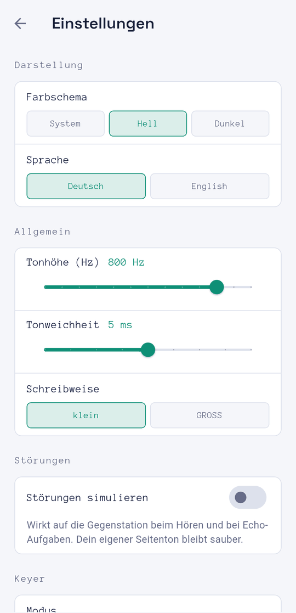

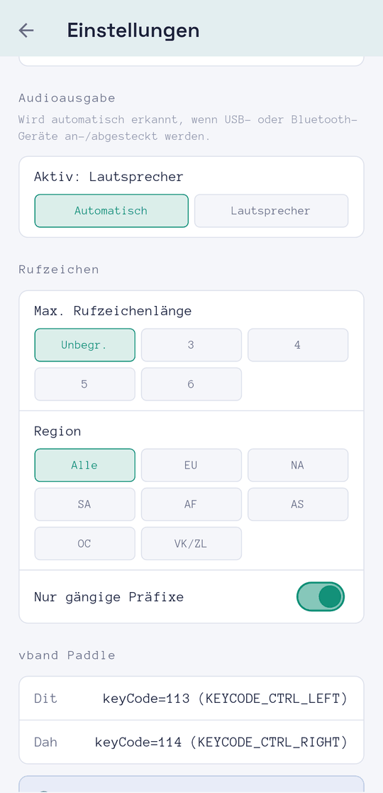

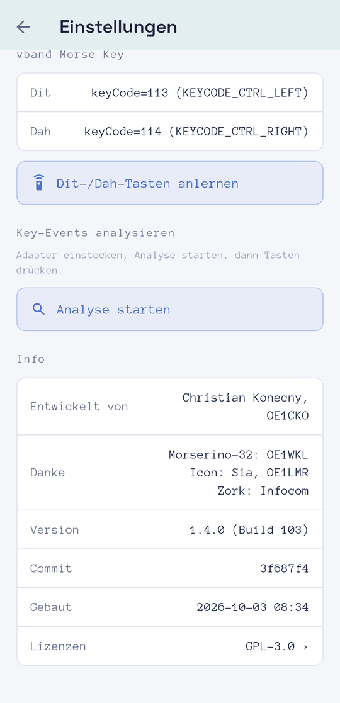
:::

## Darstellung

| Einstellung | Bedeutung | Werte |
|---|---|---|
| Farbschema | Helles oder dunkles Erscheinungsbild | **System** / Hell / Dunkel |
| Sprache | Sprache der App | **Deutsch** / English |

## Allgemein

| Einstellung | Bedeutung | Werte |
|---|---|---|
| Tonhöhe (Hz) | Frequenz des Mithörtons und der gespielten Zeichen | 300–900 Hz in 50-Hz-Schritten (**600 Hz**) |
| Tonweichheit | Anstiegs- und Abfallzeit des Tons. Größere Werte klingen weicher und klicken weniger, besonders bei kurzen Dits | 1–9 ms (**5 ms**) |
| Schreibweise | Zeichen in Klein- oder Großbuchstaben anzeigen. Betrifft nur die Anzeige | **klein** / GROSS |

## Keyer

Diese Einstellungen gelten überall, wo du tastest.

| Einstellung | Bedeutung | Werte |
|---|---|---|
| Modus | Wie der Keyer die Paddles auswertet (siehe unten) | **Iambic A** / Iambic B / Ultimatic / Non-Squeeze / Straight |
| CurtisB Dit-Timing | Nur Iambic B und Ultimatic: ab wie viel Prozent eines Dits ein Druck auf das andere Paddle schon gespeichert wird | 0–100 % in 5er-Schritten (**75 %**) |
| CurtisB Dah-Timing | Dasselbe für Dahs | 0–100 % in 5er-Schritten (**45 %**) |
| Auto-Zeichenabstand | Erzwingt eine Mindestpause zwischen Zeichen, damit sie nicht zusammenlaufen | **Aus** / 2 / 3 / 4 Dits |

**Die Keyer-Modi**

- **Iambic A** – Hältst du beide Paddles gedrückt („squeeze“), wechseln sich
  Dits und Dahs ab. Lässt du los, hört der Keyer nach dem aktuellen Element
  auf.
- **Iambic B** – wie A, aber der Keyer merkt sich einen Druck auf das andere
  Paddle, der während eines Elements kommt, und hängt dieses Element noch an
  (Curtis-B-Verhalten). Ab wann das gilt, steuern die CurtisB-Einstellungen:
  0 % heißt während des ganzen Elements, 100 % heißt praktisch wie Iambic A.
- **Ultimatic** – Beim Drücken beider Paddles gewinnt das **zuletzt**
  gedrückte und wiederholt sich, solange es gehalten wird.
- **Non-Squeeze** – Für Einhebel-Paddles bzw. Umsteiger: Das Zusammendrücken
  beider Paddles erzeugt keine Wechselfolge.
- **Straight** – Handtaste: Der Ton ist an, solange die Taste gedrückt ist.
  Mit Touch erscheint dann eine einzelne Taste **TASTE**, mit einem Adapter
  wirkt der Dit-Kontakt als Taste.

## Audioausgabe

| Einstellung | Bedeutung | Werte |
|---|---|---|
| Aktiv | Zeigt, wohin der Ton gerade geht | – |
| Ausgabe | **Automatisch** folgt dem, was gerade angesteckt oder verbunden ist. Die anderen Optionen legen die Ausgabe fest. Es werden nur Ausgaben angeboten, die gerade verfügbar sind | **Automatisch** / Lautsprecher / Kabel/USB / Bluetooth |

## Rufzeichen

Einstellungen für zufällige Rufzeichen im Inhalt **Rufzeichen** (bei Alle
Zeichen).

| Einstellung | Bedeutung | Werte |
|---|---|---|
| Max. Rufzeichenlänge | Maximale Länge der Rufzeichen | **Unbegr.** / 3 / 4 / 5 / 6 |
| Region | Nur Rufzeichen aus dieser Region | **Alle** / EU / NA / SA / AF / AS / OC / VK/ZL |
| Nur gängige Präfixe | Nur häufig gehörte Präfixe statt aller möglichen | Aus / **Ein** |

Die Rufzeichen folgen einer gewichteten Präfix-Tabelle wie beim Morserino.
Häufig gehörte Länder kommen öfter vor.

## vband Paddle und Key-Events analysieren

Siehe [Paddle-Tasten anlernen](#paddle-tasten-anlernen) und
[Key-Events analysieren](#key-events-analysieren).

## Info: Version und Build

| Zeile | Bedeutung |
|---|---|
| Entwickelt von | Christian Konecny, OE1CKO |
| Danke | Morserino-32 (OE1WKL), App-Icon (Sia, OE1LMR), Zork (Infocom) |
| Version | Versionsnummer und Build-Nummer, z. B. „1.0.0 (Build 42)“ |
| Commit | Der genaue Quellcode-Stand, aus dem die App gebaut wurde |
| Gebaut | Datum und Uhrzeit des Builds |
| Lizenzen | Tippen öffnet die Lizenztexte (siehe unten) |

Wenn du einen Fehler meldest, gib bitte Version, Commit und Build-Zeit mit an.

**Lizenzen:** Die App ist freie Software unter der GNU General Public License
v3.0 (oder später). Sie übernimmt Algorithmen und Daten (Wortlisten,
Abkürzungen, Rufzeichen-Präfixe, QSO-Texte) aus der Morserino-32-Firmware von
Willi Kraml, OE1WKL, die ebenfalls unter der GPL-3.0 steht. Den Quellcode
findest du auf [GitHub](https://github.com/ckonecny/next_cw_trainer). Die
Lizenzseite zeigt außerdem die MIT-Lizenz von Zork I–III, die SIL Open Font
License der Schriften Anonymous Pro und Space Grotesk, die zlib-Lizenz der
Audio-Engine SoLoud und die Lizenzen der verwendeten Flutter-Pakete. Zork ist eine Marke der jeweiligen Rechteinhaber;
die App ist mit ihnen, Infocom, Activision oder Microsoft nicht verbunden.

## Koch-Reihenfolge {#koch-reihenfolge}

Die Koch-Reihenfolge stellst du im ⚙-Blatt von **Hören** oder **Geben** ein,
wenn dort der Zeichenvorrat **Koch-Lektion** gewählt ist. Sie gilt aber für
**alle** Trainings und Spiele.

| Reihenfolge | Beschreibung |
|---|---|
| **M32** | Die Reihenfolge des Morserino-32 (45 Zeichen): `m k r s u a p t l o w i . n j e f 0 y v , g 5 / q 9 z h 3 8 b ? 4 2 7 c 1 d 6 x - = + @ :` |
| LCWO | Die Reihenfolge von lcwo.net |
| CW Academy | Die Reihenfolge der CW Academy (CWops) |
| LICW | Die Reihenfolge der Long Island CW Club mit **Einstiegspunkt** (siehe unten) |
| Eigene | Deine eigene Reihenfolge |

**LICW-Einstiegspunkt** (0–13): Beim LICW-Kurs steigen Teilnehmer an
verschiedenen Stellen eines „Karussells“ ein. Der Einstiegspunkt dreht die
Reihenfolge so, dass sie an dieser Stelle beginnt.

**Eigene:** Trage die Zeichen in der Reihenfolge ein, in der du sie lernen
willst. Doppelte Zeichen werden ignoriert, die App zeigt die Zahl der
erkannten Zeichen an. Voreingestellt ist `esno0tqr5ucd9al8ix1myj7h4gvkfz3b.6/w2p?`,
die Reihenfolge des YouTube-Morsekurses von „Heinz – just me“
([Playlist](https://www.youtube.com/watch?v=WhjCvgC0iHg&list=PLZjVloEmSdLgGGT_exNDoXzmnV-q0zmET)).

Prosigns sind in der App nicht Teil der Koch-Reihenfolgen.

## Morserino-Begriffe

Die App übersetzt die Menünamen des Morserino-32. Wenn du vom Morserino
kommst oder dessen Handbuch liest, hilft diese Tabelle:

| Morserino-Menü | In der App |
|---|---|
| Interchar Spc | Zeichenabstand |
| InterWord Spc | Wortabstand |
| Random Groups | Zeichen für Gruppen |
| Length Rnd Gr | Gruppenlänge |
| Length Words | Max. Wortlänge |
| Length Abbrev | Max. Abkürzungslänge |
| Length Calls | Max. Rufzeichenlänge |
| Calls Region | Region (unter Rufzeichen) |
| Max # of Words | Gruppen pro Block / Wörter pro Block |
| Stop&lt;Next&gt;Rep | Nach jeder Gruppe anhalten / Nach jedem Wort anhalten |
| Koch Sequence | Koch-Reihenfolge |
| Practice Set | Übungsset |
| Boost Practice | Übungsset bevorzugen |
| Echo Prompt | Vorgabe |
| Echo Repeats | Wiederholungen |
| Echo Speed Max | Gebetempo (max.) |
| Tone Shift | Tonversatz |
| Confrm. Tone | Bestätigungston |
| AutoChar Spc | Auto-Zeichenabstand |
| Output Case | Schreibweise |
| Keyer Mode | Modus (unter Keyer) |
| CurtisB DitT% / DahT% | CurtisB Dit-Timing / Dah-Timing |

Die Namen der Keyer-Modi (Iambic A, Ultimatic …) und der Koch-Reihenfolgen
(M32, LCWO …) sind in der App gleich wie am Morserino.

# Was die App (noch) nicht kann

Einige Funktionen des Morserino-32 gibt es in der App nicht, weil ein Handy
die Hardware nicht hat oder Android das selbst erledigt: Drehknopf und
Tasten, das Display, LoRa, ESP-NOW (und damit die Mehrspieler-Teile der
Spiele), iCW/Ext Trx und das Tasten eines echten Senders, Firmware-Updates
und die WLAN-Einrichtungsseite. Statt der Practice Stats der Firmware hat die
App ihre eigene, ausführlichere [Zeichenstatistik](#zeichenstatistik).

Noch nicht umgesetzt, aber geplant: die Spiele Trailblazer, Fox Hunt, Radio
Cave und Fight the Pileup, der File Player (eigene Texte als Übungsinhalt),
gespeicherte Einstellungs-Profile und CW Memories.

# Hilfe bei Problemen

**Die App tastet nicht, wenn ich mein Paddle drücke.**
Lerne die Paddle-Tasten an (siehe
[Paddle-Tasten anlernen](#paddle-tasten-anlernen)). Kommt dabei nichts an,
prüfe mit **Key-Events analysieren**, ob der Adapter überhaupt etwas sendet.

**Der Ton kommt aus dem falschen Gerät.**
Stelle unter **Einstellungen → Audioausgabe** die gewünschte Ausgabe fest ein.

**Beim Geben höre ich meinen Ton verzögert.**
Das liegt fast immer an Bluetooth-Kopfhörern. Nimm einen Kabelkopfhörer oder
den Lautsprecher.

**Das nächste Koch-Zeichen kommt nicht.**
Öffne die 📊-Statistik von Hören. Die Zeichen ohne Häkchen halten die
Freischaltung auf – meist ein Zeichen, das noch zu wenige Versuche hat oder
zuletzt Fehler hatte. Siehe
[Wann das nächste Koch-Zeichen kommt](#wann-das-nächste-koch-zeichen-kommt).

**Die Pausen werden nie kürzer.**
Das ist Absicht, solange du die Koch-Reihenfolge durcharbeitest (siehe
[Pausen und Tempo](#pausen-und-tempo)). Mit **Abstand anpassen** kannst du sie
jederzeit selbst verkürzen.

**Der Decoder schreibt nur Unsinn.**
Tonhöhe, Bandbreite und Schwelle prüfen (siehe
[Einstellungen des Decoders](#einstellungen-des-decoders)). Nur mit Kopfhörer
den Mithörton einschalten.
