# Introduction

**Next CW Trainer** is an Android app for learning and practicing Morse code
(CW): copy training with the Koch method, sending practice with the Echo
Trainer, a CW Keyer, a CW Decoder using the microphone, CW over the internet
(WiFi Trx), a QSO Bot and several games. An **adaptive block flow** tracks
your mistakes character by character and suggests when you are ready for a
new character, more speed or shorter pauses.

## Where the app comes from {-}

Next CW Trainer is an independent hobby project by Christian Konecny,
OE1CKO. Many ideas and much of the training logic come from the open-source
firmware of the [Morserino-32](https://github.com/oe1wkl/Morserino-32) by
Willi Kraml, OE1WKL. Its training concept, with the Koch sequences, the Echo
Trainer, the QSO Bot and much more, is the result of years of careful work by
Willi and his team. Many thanks for that!

The logic was read out of the firmware source and rewritten for Android; the
app contains no original firmware code. Beyond that there is **no
connection** to Willi Kraml or the Morserino-32 team, and the app is not a
product of the Morserino project.

The app was based on firmware version 9.0.0. Later firmware changes are not
carried over automatically.

## About this manual {-}

This manual describes the app version printed on the title page. You can see
which version you have installed under **Settings → Info** (see
[Info: version and build](#info-version-and-build)).

Settings that also exist on the Morserino have plain names in the app (for
example **Character spacing** instead of "Interchar Spc"). The table
[Morserino terms](#morserino-terms) lists which Morserino menu item belongs to
which setting.

# Getting started

## Installation

The app is currently handed out as an APK file, not through the Play Store.
It needs Android 8.0 or newer and a 64-bit device (practically every phone
since about 2017); it cannot be installed on 32-bit-only devices.

1. Copy the APK file to your phone, for example by messenger, e-mail or USB
   cable.
2. Tap the file in your file manager. The first time, Android asks whether
   the app you install from may **install unknown apps**. That might be your
   file manager or browser. Allow it for that app.
3. Confirm the installation.

Updates work the same way: install the new APK over the old one, and your
settings and statistics are kept. This only works if both APKs are signed
with the same key. If Android reports a conflict, you first have to uninstall
the old version, and that deletes your settings and statistics.

## The home screen

The home screen has four groups:

| Group | Tile | What for |
|---|---|---|
| **Practice** | **Listen** | Practice copying: CW Generator and Koch Trainer in the block flow |
| | **Send** | Practice sending: Echo Trainer. A word is played and you key it back |
| **Free** | **Free modes** | Opens five tiles: **CW Keyer** (key freely, with the text decoded on screen), **CW Decoder** (copy CW through the microphone), **WiFi Trx** (CW over the internet with other Morserinos and apps) **QSO Bot** (a simulated QSO partner) and **Own texts** (hear your own texts from the clipboard as Morse, see [Own texts](#own-texts)) |
| **Play** | **Games** | Morse Invaders, text adventure, Morsel, Memory Chain, Trailblazer, Fox Hunt, Fight the Pileup, Radio Cave |
| **Learn** | **Learning resources** | Interactive Morse tree, character chart, links to courses and practice sites |

At the very top sits the **daily goal card**: a ring with your active
practice minutes today, your streak, and the week Monday to Sunday as dots.
Tap it to open the [Achievements page](#daily-goal).

The **Listen** and **Send** tiles show your current Koch lesson and speed.
**Send** also shows the trend of your last blocks (see [Trend](#trend)).

The gear icon at the top right opens the **global settings** (chapter
[Settings](#settings)). Anything that concerns only one training is set up
directly inside that training.

::: {.shots}
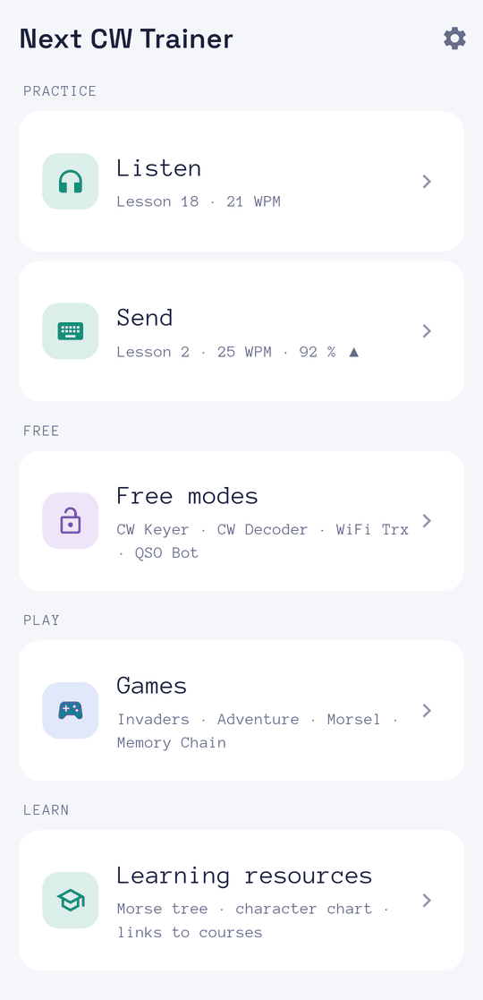

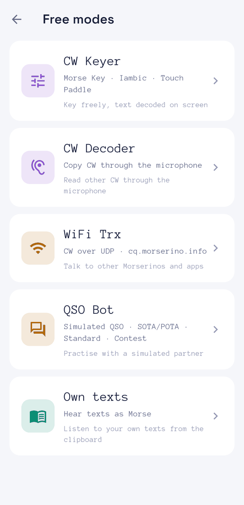
:::

## Controls inside the trainings

Each training has these icons at the top right:

- **⚙ Training settings** opens a sheet that slides up from the bottom. Every
  change takes effect immediately and is saved.
- **📊 Statistics** (only in **Listen** and **Send**) shows your progress per
  character (see [Character statistics](#character-statistics)).

While a block is running, these icons and the selection at the top are hidden
to keep the screen calm. The **back button** then only ends the running block
and returns you to the training's start view. A second back leaves the
training.

The screen stays on while you practice.

**Text size:** you can **pinch** text areas that show decoded text or results
to make the text larger or smaller. This works in the CW Keyer, in Send and on
the result page, among others. Each area remembers its own size.

## Light, dark, language

Under **Settings → Appearance** you choose the **Theme** (System, Light or
Dark) and the app **Language** (Deutsch or English). Both take effect
immediately.

The app follows the Android **font size** setting, but only up to **1.3×**
the default size (step 4 of 7 on a Pixel). Larger steps look the same as
that one in the app; otherwise the training screens would no longer fit. The
on-screen keyboard for typing along and the Koch character row always keep
their size. The Android **Display size** setting ("Make everything bigger or
smaller") has no effect in the app; it always uses the device's default
size. When a page is longer than the screen, a scrollbar at the edge
shows that there is more.

## Sound and volume

Set the volume with the phone's volume keys. You set the **pitch** and the
**tone softness** in the settings. When headphones, a USB audio device or a
Bluetooth device is connected or disconnected, the app switches to it
automatically. If you don't want that, you can fix the output (see
[Audio output](#audio-output)). How to practice with noise, fading and a
neighbouring station is described under [Interference](#interference).

Bluetooth headphones usually add noticeable latency. That doesn't matter for
listening, but it does for sending: you hear your sidetone noticeably later
than you key. For sending, use wired headphones or the speaker.

# Basics

## Speed in WPM

Speed is given in **WPM** (words per minute), based on the standard word
"PARIS". At *w* WPM a dit lasts exactly 1200 / *w* milliseconds, so 60 ms at
20 WPM.

## Spacing in dits: character spacing and word spacing

As on the Morserino, the pauses are set **in dit lengths**:

- **Character spacing** is the pause between two characters of a word. Normal
  Morse is 3 dits. You can set 3 to 45.
- **Word spacing** is the pause between two words or groups. Normal Morse is
  7 dits. You can set 6 to 105.

The pause between the elements (dits and dahs) *inside* a character is always
1 dit. So the characters themselves always come at the set speed, and only
the pauses between them get longer. This is the **Farnsworth method**. You
learn the sound of a character at full speed and still have time to think.

Next to each spacing slider the app also shows the pause **in seconds** at
the current speed, for example "28 dits · 1.68 s @ 20 WPM".

The **Listen** and **Send** trainings start with generous pauses of
**28 / 40 dits**. The CW Keyer, WiFi Trx and the QSO Bot use the normal
7 dits as word spacing.

## Effective speed

Because the pauses are longer, whole words arrive more slowly. The app shows
this as **eff.** (effective WPM):

  eff. WPM = 50 × WPM / (31 + 4 × character spacing + word spacing)

Example: 20 WPM with 28/40 dits gives 50 × 20 / (31 + 112 + 40) ≈ 5 WPM.
The characters sound like 20 WPM, but you have as much time as at 5 WPM. With
3/7 dits the two values are the same.

## The Koch method

With the Koch method you start with **two characters** at full speed. Once
you recognise them reliably, the next character is added, then the next, until
you know them all. Each step is called a **lesson**. The lesson number is the
number of active characters.

The order of the characters is set by the **Koch sequence** (see
[Koch sequence](#koch-sequence)).

When drawing random characters, the app weights them like the Morserino. Two
out of three characters are drawn evenly from **all** active characters. Every
third one is drawn only from the **last third**, where the most recently
learned characters are. New characters therefore come up more often, without
the old ones disappearing.

## Prosigns

Prosigns (procedural signals) are sent as run-together letters. The app
writes them in angle brackets:

| Prosign | Meaning |
|---|---|
| `<ka>` | Start of message |
| `<ar>` | End of message (+) |
| `<kn>` | Only the station called should answer |
| `<sk>` | End of contact |
| `<as>` | Wait |
| `<ve>` | Understood |
| `<bk>` | Break, over to the other station |
| `<err>` | Error: eight dits (`........`) |

In Listen (block flow), prosigns from **Group characters** are shown and graded
as two separate letters: `<ka>` appears as "K A". When copying on the
on-screen keyboard you type them as two letters as well.

# Listen: practice copying

**Listen** is the app's CW Generator and Koch Trainer. The app plays a
**block** of groups or words, and you copy it, in one of two ways:

- **Paper**: you copy on paper. Nothing is shown on screen while it plays.
  Afterwards the app reveals the text and you tap what you got wrong.
- **Type**: for on the go. The app plays one word after another and you type
  it on the app's own on-screen keyboard (see
  [Copying on the on-screen keyboard](#copying-on-the-on-screen-keyboard)).

Either way you get the same result with suggestions for the next block at the
end, and both count towards the same Listen statistics.

## Choosing the character set and content

At the top of the start view you choose two things.

The **character set** decides which characters are practiced:

| Character set | Meaning |
|---|---|
| **Koch lesson** | Only the characters up to your current lesson |
| **All characters** | All letters, digits, punctuation and prosigns |
| **Practice set** | Only the characters you enter yourself |

The **content** decides what is played:

| Content | Meaning | Available with |
|---|---|---|
| **Random** | Groups of random characters | all |
| **Words** | Common English words | Koch, All |
| **Abbreviations** | Common CW abbreviations | Koch, All |
| **Call signs** | Random, realistic call signs | All |
| **Mixed** | Words, abbreviations and groups mixed | Koch, All |

With the Koch lesson, only words and abbreviations made **entirely** of
characters you have already learned are used. In the first lessons there are
very few of them.

::: {.shots .one}
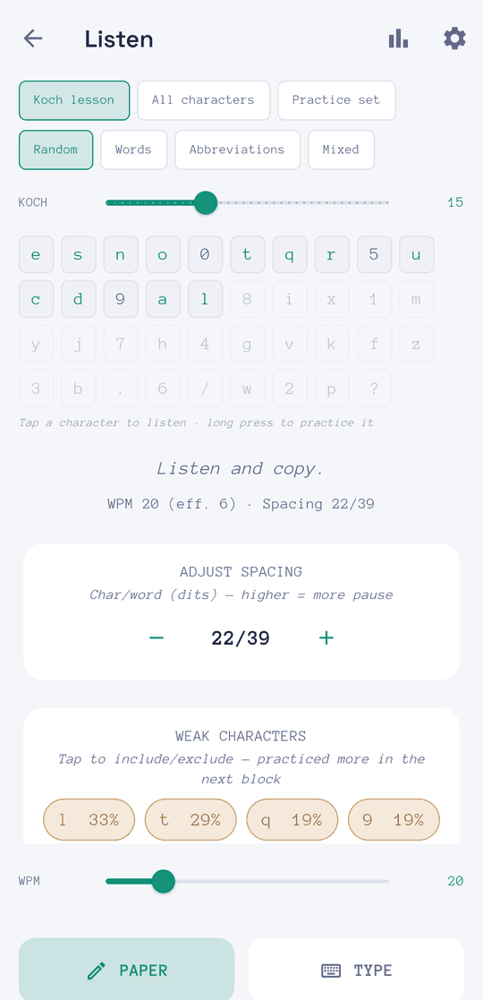
:::

### Setting the Koch lesson

The **KOCH** slider sets the lesson. Below it you see every character of the
Koch sequence. The characters active in this lesson are highlighted, and
their color shows the kind of character: letters, digits and
punctuation/prosigns are colored differently. Characters not yet unlocked by
the lesson are dimmed.

To get to know a character (this works for the dimmed ones too, so you can
listen ahead to later lessons):

- **Tap** it to play it three times at the current speed. A tile with the
  character and its Morse code appears in the middle of the screen, and the
  rest of the screen is dimmed. The dits and dahs start out gray and light up
  exactly while they sound. Each repetition starts from gray again. After the
  third repetition the tile closes by itself. A tap anywhere on the screen
  (or the back button) stops playback at once.
- **Long press** it to open the practice page for that character: listen and,
  if you like, key it back (see
  [Practicing a single character](#practicing-a-single-character)).

::: {.shots .one}
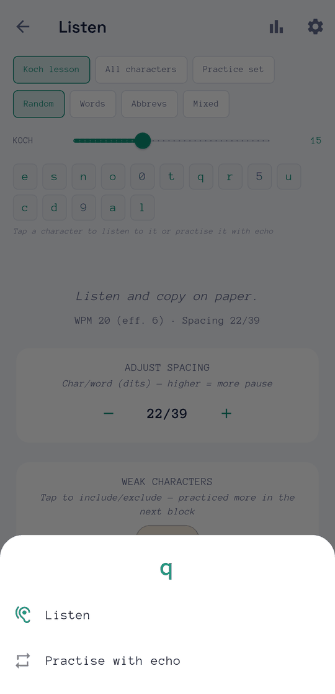
:::

Usually you don't need to raise the lesson by hand. The block flow suggests
the next character once you are ready (see
[When the next Koch character comes](#when-the-next-koch-character-comes)).

### Practice set

With the **Practice set** character set, an input field appears right on the
start view. Enter the characters you want to practice, for example `QXZJ`.
Upper/lower case and spaces don't matter, and duplicate characters are
ignored. The app shows how many distinct characters it found. The practice set
only offers the **Random** content.

## Speed

The **WPM** slider below the practice area sets the character speed (10 to 60
WPM). You set the pauses in the ⚙ sheet under **Spacing**, or directly on the
start and result pages with **Adjust spacing**.

## How a block runs

At the bottom of the start view are two start buttons: **Paper** and
**Type**. The one you used last is highlighted. This section describes
**Paper**; **Type** follows further down.

1. Press **Paper**. After one second of "Get ready …" the block begins.
2. The app plays the groups one after another, with the set word spacing in
   between. Only "Group *n* of *N*" (for words "Word *n* of *N*") and the speed are
   shown, not the text.
   Copy on paper.
   - **Pause** stops after the current group, and **Resume** continues.
   - **Reveal** ends the block early and shows only the groups played so
     far.
3. After the last group, **Sent** appears, with each group as its own tile.
   Compare it with what you copied.
4. **Marking errors:** tap a group where you made a mistake. It opens large,
   one character at a time. Tap every character you got wrong or missed, then
   **Back**. Tapping a character again removes the mark. The marked
   characters show in red in the overview.
5. **Done · *n* errors** finishes the evaluation. The results are saved now,
   and the result page appears.

::: {.shots .three}
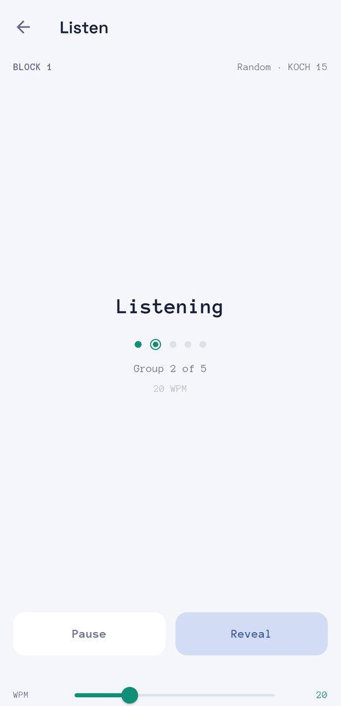

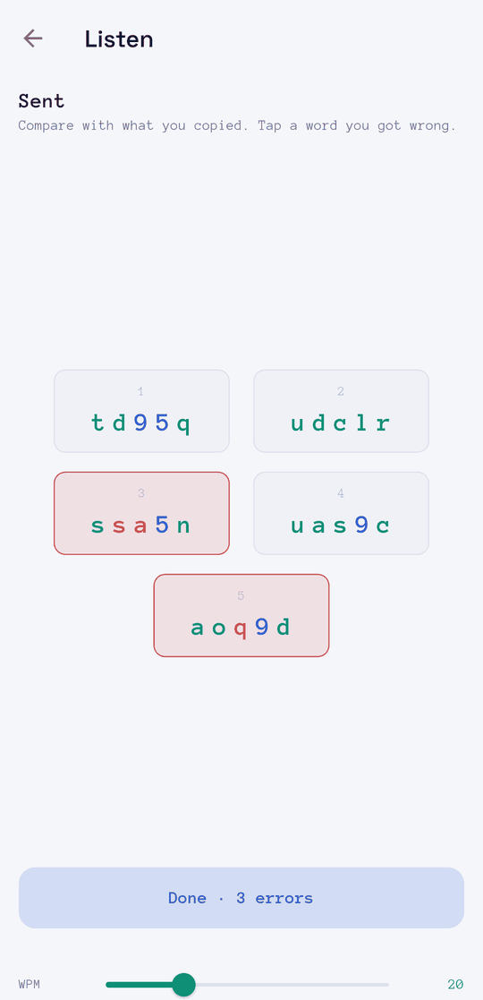

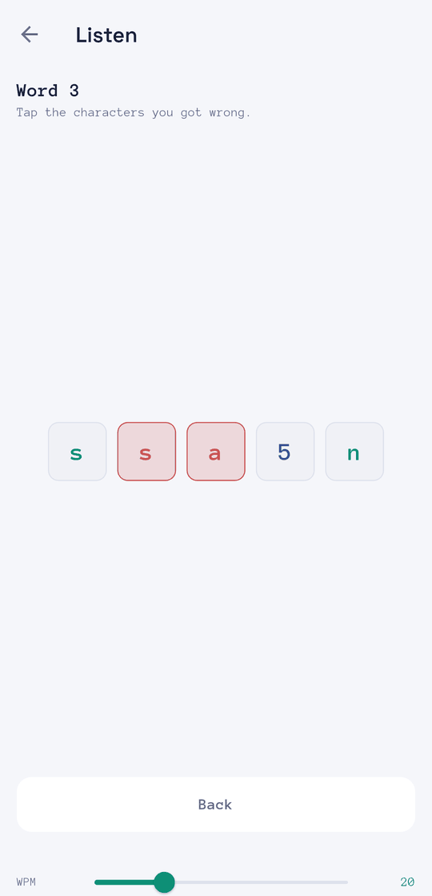
:::

You set how many groups a block has in the ⚙ sheet under **Word selection →
Groups per block** (with words, the setting is called **Words per block**).
During the block and on the result page the app says **groups** for Random
and **words** for all other contents.

### Stop after each group

With **Flow → Stop after each group** (in the ⚙ sheet; with words it is
called **Stop after each word**), the app waits after every group or word:

- **Dit** (left key) or the **REPEAT** button plays the same group again.
- **Dah** (right key) or **NEXT** plays the next group.

This matches "Stop&lt;Next&gt;Rep" on the Morserino. It's handy at the start,
when you want to hear a group several times. The setting only applies to
**Paper**; when typing, the app waits after every word anyway.

## Copying on the on-screen keyboard

With **Type** you copy on the app's own keyboard on the display instead of on
paper, meant for on the go. It is not the phone's system keyboard.

**The keyboard** is a QWERTY keyboard with a digit row above it. Every key is
always in the same place. Only the characters the chosen character set can
contain are active (bright, tappable); the others are only outlined and do
nothing. If the character set contains punctuation (`. , : - / = ? @ +`), it
gets a row of its own. While you press a key, a bubble above it shows the
character large. **⌫** deletes the last character. **Pass** is at the bottom
left, **⏎ Check** at the bottom right. While the block runs, the WPM slider
is hidden to make room for the keyboard.

**How a word runs:**

1. Press **Type**. After one second of "Get ready …" the app plays the first
   group (or word). "playing …" is shown below the answer line.
2. You can type along while it plays or wait until it has finished; both
   work. There is no time limit.
3. **Checking:** as soon as you have typed as many characters as the word has,
   the app checks automatically (after the word has ended plus a short
   0.4 s, during which you can still correct with ⌫). **⏎ Check** hands in
   earlier, for example when you missed a character. If you press ⏎ while
   the word is still playing, the app checks right after the word ends.
4. **✓ Correct**: the next word comes after about one second. Whatever you
   type during that second counts for the next word.
5. **✗ Wrong**: the word is played again at once, with an empty field. Your
   previous attempt is shown small and struck through above it, without a
   hint where the error was. "Attempt *n* of *max*" shows which attempt this
   is.
6. **Pass**: at any time, also while the word plays. After the last wrong
   attempt or a pass, the app shows the solution for 2 seconds (the
   characters wrong in the first attempt in red) with your attempts below
   it, then moves on.

::: {.shots}
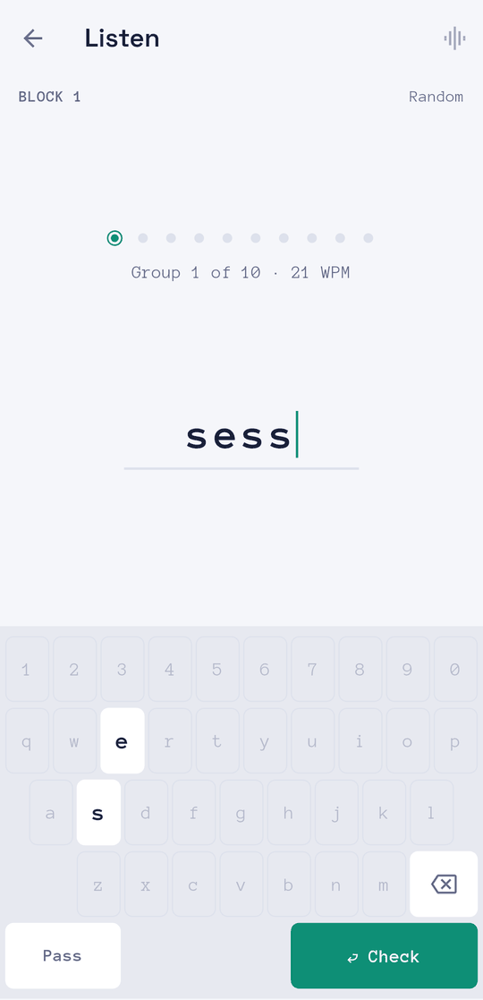

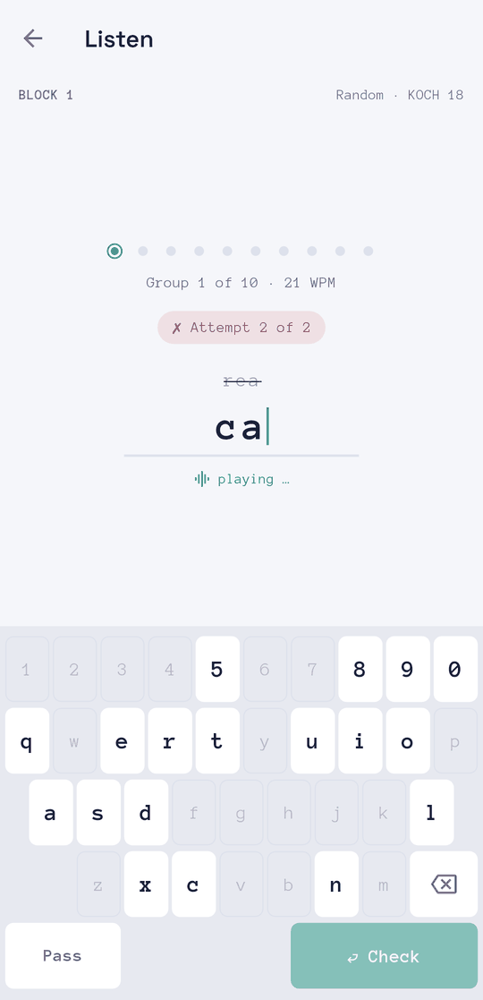
:::

The confirmation tone (high = correct, low = wrong) follows the
**Confirmation tone** setting in the ⚙ sheet of **Send**. How many attempts
you get per word and whether the keys vibrate is set in the ⚙ sheet under
**Flow** (see [below](#flow)).

**After the block**, **Sent** appears as with Paper. The errors of your
**first** attempt are already marked red, and under each group is what you
typed ("— passed" for a pass). You can tap a group and change marks, for
example when you only mistyped. **Done · *n* errors** saves and shows the
usual result page.

::: {.shots .one}
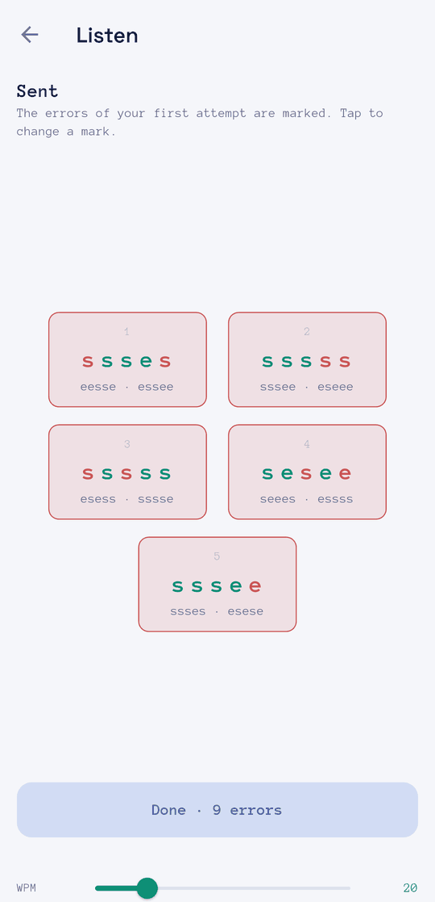
:::

**How it is counted:**

- Only the **first** attempt of each word counts; the second is easier
  because you hear the word a second time.
- The app compares character by character, but not rigidly position by
  position: if you left out a character, only that character is wrong, not
  every one after it. Example: played `tqr5u`, typed `tq5u` → only `r` is
  wrong. A character heard wrong is wrong (`cd9al` as `cb9al` → `d` wrong).
  An extra typed character does not make any played character wrong.
- **Pass** in the first attempt means every character of that word is wrong,
  like a blank on paper.
- When typing, the pauses between words don't matter. The app therefore only
  suggests changes to the **character spacing** (see
  [Pauses and speed](#pauses-and-speed)).

The arrow at the top left cancels the block; nothing is saved then. The
keyboard is portrait-only for now.

## The result page

From top to bottom, the result page shows:

- **Accuracy** in percent, meaning the share of characters copied correctly,
  plus "*x* of *y* correct". It is green from 90 %, yellow from 70 % and red
  below that.
- The **status line**: speed, effective speed, spacing and, from the sixth
  block on, the [trend](#trend). These values already apply to the **next**
  block, including the ticked suggestions.
- **Adjust spacing:** − and + change character spacing and word spacing together
  by 1 dit each. This takes effect immediately and doesn't depend on the
  suggestions.
- **Weak characters:** the characters that cause you the most errors over
  time, with their error rate (see [Weak characters](#weak-characters)).
- **On the way to "X"** (Koch lesson only): what you still need before the
  next character (see
  [Progress card](#progress-card-on-the-way-to-x)).
- **Suggestions:** what the app recommends for the next block (see
  [Accepting, rejecting, adjusting suggestions](#accepting-rejecting-adjusting-suggestions)).

At the bottom there are two buttons:

- **Next block** applies the ticked suggestions and starts the next block
  right away.
- **Finish** also applies the ticked suggestions but doesn't start a new
  block.

How the app arrives at its suggestions is explained in the chapter
[Adaptive mode](#adaptive-mode).

::: {.shots}
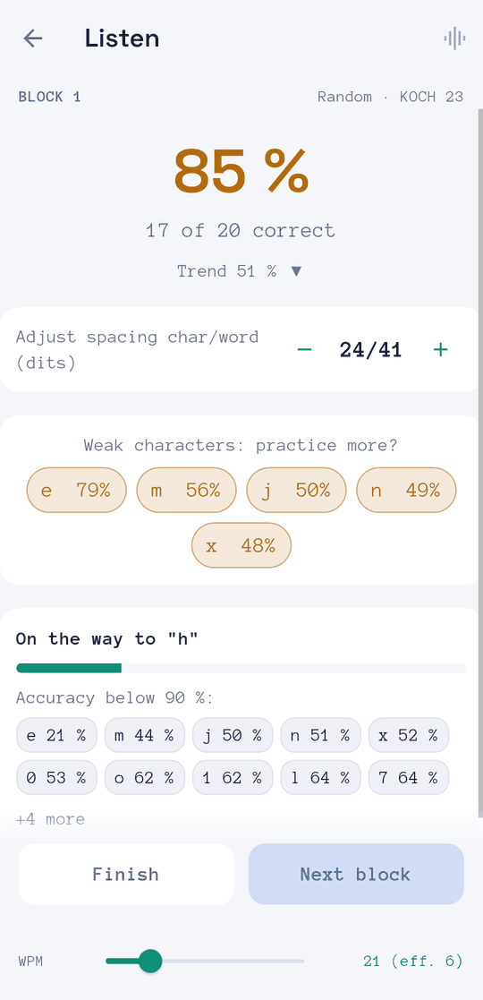

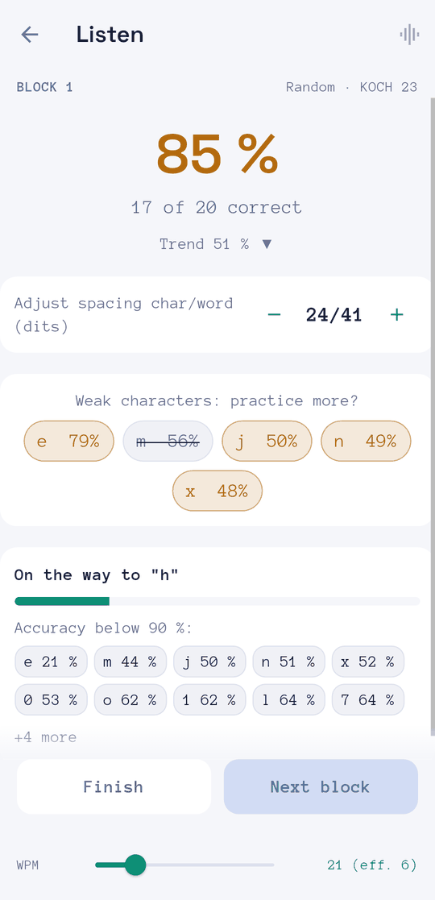
:::

## Settings in the ⚙ sheet (Listen) {#settings-listen}

The ⚙ sheet of **Listen** has the following sections. Values in **bold** are
the defaults.

::: {.shots}
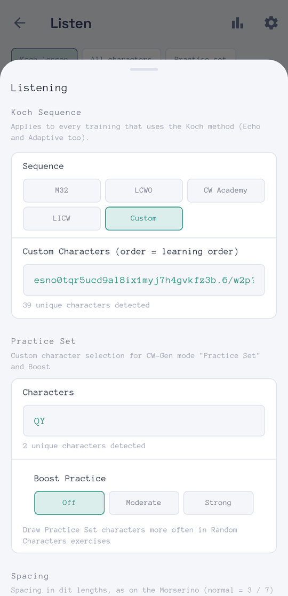

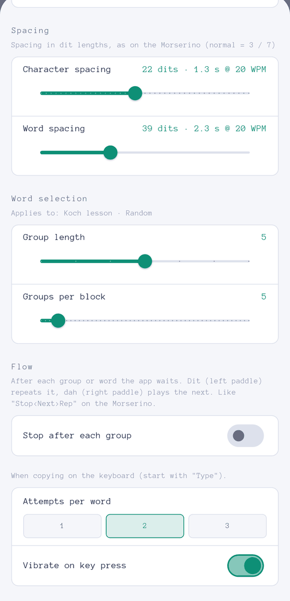
:::

### Koch sequence {#koch-sequence-sheet}

Only shown when the **Koch lesson** character set is selected. This setting
applies to **all** trainings and games that use the Koch method. For a
description see [Koch sequence](#koch-sequence).

### Practice set {#practice-set-settings}

| Setting | Meaning | Values |
|---|---|---|
| Characters | The practice set characters. This is the same field as on the start view with the **Practice set** character set | any characters |
| Boost practice set | Draws practice set characters more often in random groups (see below) | **Off** / Moderate / Strong |

This is how **Boost practice set** works. For each character of a random group,
the app draws up to 3 times (Moderate) or 8 times (Strong) until it gets a
character from the practice set. If that doesn't happen, the last character
drawn stays. The practice set characters come up more often, but the others
don't disappear.

**Boost practice set** works in **Listen** (Koch lesson or All characters ·
Random) and in **Send** (All characters · Random). In **Listen** the practice
set is combined with the [weak characters](#weak-characters): the characters
from both lists are boosted, at the higher of the two levels. The more
characters come together, the less each single one stands out.

### Spacing

| Setting | Meaning | Values |
|---|---|---|
| Character spacing | Pause between characters, in dits | 3–45 (**28**) |
| Word spacing | Pause between groups/words, in dits | 6–105 (**40**) |

Word spacing can never be smaller than character spacing. If you move
character spacing past it, word spacing is pulled along.

### Word selection

Only the settings that fit the chosen content are shown. The line "Applies
to: …" tells you which combination you are setting up.

| Setting | Meaning | Values |
|---|---|---|
| Group characters | Only with **All characters · Random**: which character classes are drawn from | **All** / Letters / Digits / Punctuation / Prosigns / Letters+Digits / Digits+Punct. / Punct.+Prosigns / Letters+Digits+Punct. / Digits+Punct.+Prosigns |
| Group length | Characters per random group (only with **Random**) | 2–8 (**5**) |
| Max word length | Only words up to this length (with **Words** and **Mixed**) | **all**, 1–8 |
| Max abbreviation length | Only abbreviations up to this length (with **Abbreviations** and **Mixed**) | **all**, 2–6 |
| Groups per block / Words per block | Number of groups (with **Random**) or words in a block | 1–50 (**10**) |

### Flow

| Setting | Meaning | Values |
|---|---|---|
| Stop after each group / Stop after each word | **Paper** only: wait after each one, dit = repeat, dah = next | **Off** / On |
| Attempts per word | **Type** only: how often you may try a word; 1 = no second attempt | 1 / **2** / 3 |
| Vibrate on key press | **Type** only: short vibration on every active key | Off / **On** |

### Adaptive mode

These are the thresholds the app bases its suggestions on. They apply to
**Listen and Send** together and are described in detail in
[Adaptive mode settings](#adaptive-mode-settings).

::: {.shots .one}
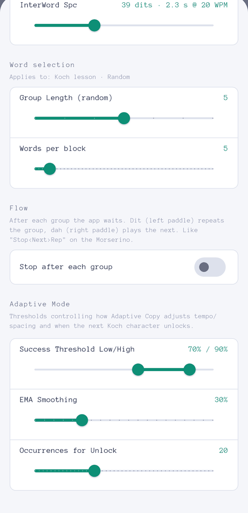
:::

# Send: Echo Trainer

**Send** is the Echo Trainer. The app plays a word or group, and you key it
back with the Morse key. That can be the touch keyer or a real Morse key (see
[Morse key](#morse-key)). If you get it right, the next
word comes. If not, it is repeated.

Send has its **own profile**, independent of Listen. It keeps its own Koch
lesson, speed, spacing, practice set and character statistics. What you mix
up when listening isn't necessarily what you get wrong when sending.

## Start view

At the top you choose the **character set** and **content** as in Listen (see
[Choosing the character set and content](#choosing-the-character-set-and-content)).
With the Koch lesson you also choose the lesson. Tapping a character works as
in Listen.

Below that, two sliders set the speeds:

- **Listen** is the speed at which the word is played to you (10 to 60 WPM).
- **Send** is the highest speed at which your answer is expected (see
  [Sending speed](#sending-speed)). "same as prompt" means the same speed.

At the bottom are the dit/dah keys or the straight key, and **Start**.

::: {.shots}
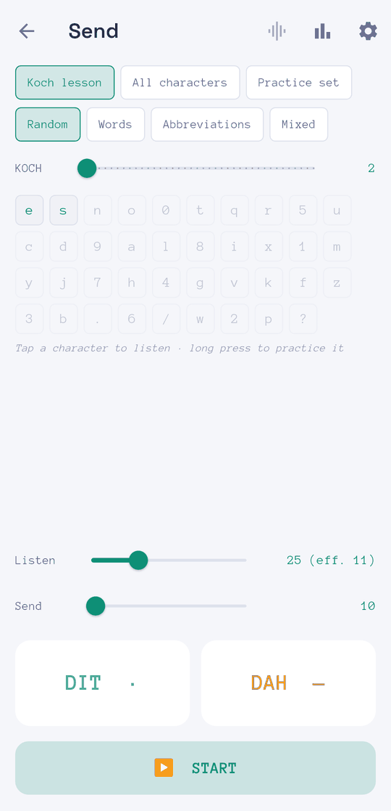

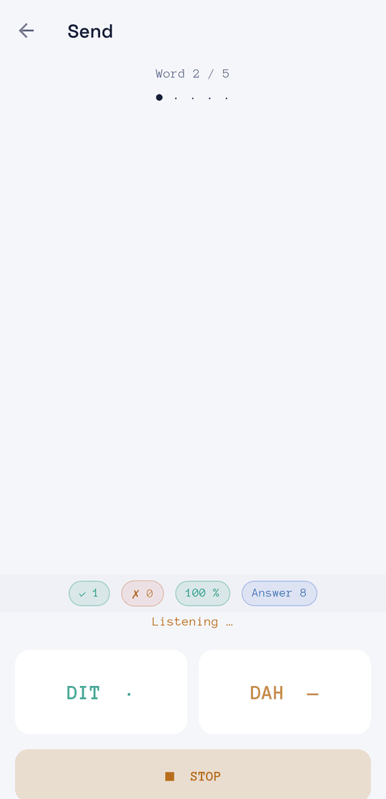
:::

## How a word runs

1. After **Start** the app waits 2 seconds, then plays the first word.
2. **Your answer:** key the word back. Your sidetone is shifted by half a
   tone so you can tell prompt and answer apart. This is the **Tone shift**
   setting.
3. **When you have to start:** from the end of the prompt you have about
   1.4 seconds, plus one character pause, plus a third of the word pause, plus
   the **Think time** (default 8 s) to **begin** your answer. If nothing
   comes by then, the word counts as wrong.
4. **When the answer ends:** once you have started, the think time no longer
   applies. The answer is complete as soon as you leave a 7-dit word pause, at
   sending speed.
5. **Correcting:** key `<err>` (eight dits) or four `e` in a row to clear
   your answer so far and start again. The exception is when the word itself
   continues with another `e` at that point. Then the `e` counts as a normal
   character.
6. **Grading:**
   - **✓ Correct**, optionally with a confirmation tone. The next word comes
     after a little more than a second.
   - **✗ Wrong**: the word is played again. "Attempt *n* of *max*" shows
     which attempt this is. Once all **Repeats** are used up, the app shows
     the correct word for two seconds and moves on.

Whether the prompt is played, shown or both is set with **Prompt** (see
below).

## Sending speed

On the Morserino this setting is called "Echo Speed Max". It limits the speed
at which **your answer** is expected. The prompt still plays at the listening
speed.

Example: Listen at 25 WPM and Send at 18 WPM means you hear fast but may
answer more slowly. The sending speed sets how fast the keyer produces your
dits and dahs and how long a word pause has to be. At the far left ("same as
prompt"), the listening speed applies to the answer too. The lowest sending
speed is 10 WPM.

With the **straight key** (keyer mode Straight) there is no set sending speed:
the app measures it from your keying
([see below](#straight-key-automatic-speed)). The **Send** row is then
disabled and shows the measured speed.

## The result page

After the last word of a block the result page appears:

- **Accuracy** is the share of words correct on the **first attempt**. The
  colours are the same as in Listen.
- Next to it is the breakdown:
  - **● right**: correct on the first attempt.
  - **◐ after repeat**: correct only after a repeat.
  - **○ wrong**: not made even after all repeats.
- The **status line** shows listening speed, sending speed (if capped), lesson
  and the [trend](#trend).
- **Mix-ups** lists which characters you confused in this block, as "target
  → given", for example `p → w`. A `–` means nothing came at that position.
- The **Listen** and **Send** speed controls. A change here replaces the
  matching suggestion.
- **Suggestions** and **Weak characters** (see
  [Adaptive mode](#adaptive-mode)).
- The list of all words in the block. The target word is shown in bold, with
  your **first** attempt below it and the first wrong character highlighted
  in red. A `_` means nothing came at that position.

**Next block** applies the ticked suggestions, boosts the ticked weak
characters in the next block, and starts it. **Finish** applies the ticked
suggestions without a boost and returns to the start view.

::: {.shots}
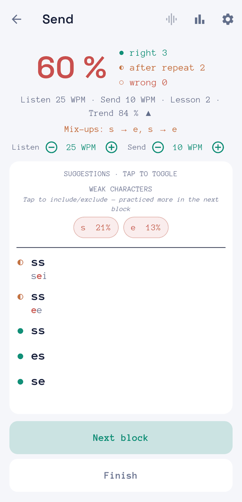

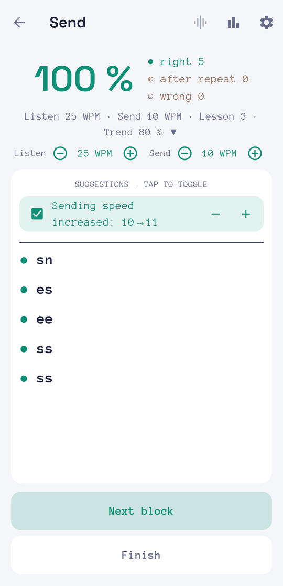
:::

## Settings in the ⚙ sheet (Send) {#settings-send}

The **Koch sequence**, **Practice set**, **Spacing** and **Word selection**
sections are the same as in Listen (see
[Settings in the ⚙ sheet (Listen)](#settings-listen)), but they
apply to the Send profile. There are two differences:

- **Spacing** applies to the word played to you **and to your answer**, as
  on the Morserino. Your answer counts as finished once you pause this long
  after a character:

  ```
  2 × character spacing + 1 + word spacing / 8   (dits at the answer speed)
  ```

  With a straight key it is word spacing + 1 dits, measured at your own speed
  (up to 30 WPM; above that the shorter straight-key gaps apply). Example: character
  spacing 28, word spacing 40, answer speed 18 WPM gives 62 dits, about 4 s.
  That is how long you may pause between the characters of a group, and how
  long the app waits after the last character before it scores. If that is
  too lenient or too slow for you, lower the character spacing; the normal
  3 / 7 gives 8 dits. When the adaptive feature shortens the spacing, the
  answer gets stricter too. Longer spacing also gives you more time to begin
  your answer.
- **Word selection** also uses the call sign settings from the global
  settings (see [Call signs](#call-signs)).

In addition there is the **Echo Trainer** section:

| Setting | Meaning | Values |
|---|---|---|
| Think time | Extra time to **begin** your answer | 1–20 s (**8 s**) |
| Repeats | How often a wrongly answered word is played again before the app reveals it. "Forever" repeats until you get it right | 0–6 (**3**), Forever |
| Prompt | How the prompt is given. **Sound** means you only hear it. **Display** means you only read it, with no audio. **Both** means you hear it and then read it once it has played | **Sound** / Display / Both |
| Sending speed (max) | Highest speed for your answer, see [Sending speed](#sending-speed) | **same as prompt**, 10–50 WPM |
| Tone shift | Your sidetone while answering is half a tone above or below the prompt | No shift / **Up ½** / Down ½ |
| Confirmation tone | Short tone after grading: high for right, low for wrong | Off / **On** |

**Prompt = Display** is a good way to get from written text to sending,
for example to drill new characters.

::: {.shots .one}
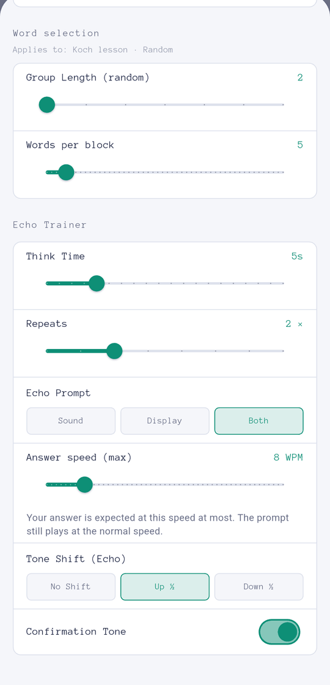
:::

## Practicing a single character

In Listen or Send, long press a Koch character (locked ones too) to open
**Practice: X**. In the middle is the same tile as for a tap: the character
and its Morse code, whose dits and dahs light up while it plays. The
character plays over and over.

After each play you **can** key the character back, with the touch keyer at
the bottom or a connected key, but you don't have to. Your dits and dahs
appear below the line in the tile as you key them. Once the character is
complete they turn green (**✓ Correct**) or red (**✗ You keyed:** with the
character you keyed), and shortly after the character plays again. If you
key nothing, it repeats after a pause. That is no error, and nothing is
counted or added to any statistics. **Back** leaves the page.

::: {.shots .one}
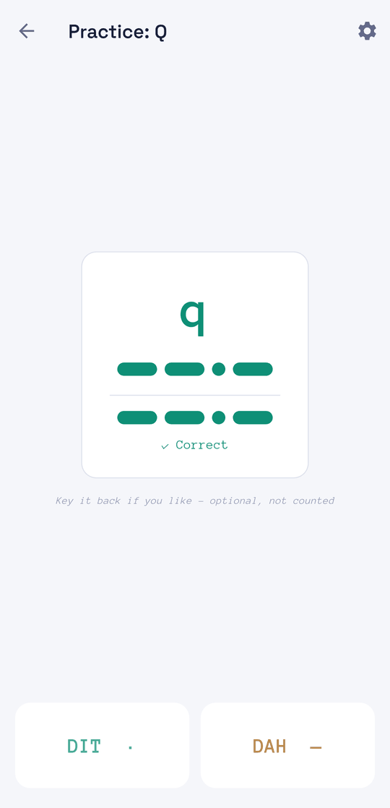
:::

Set the length of the pause with the **gear** icon at the top right:
**Pause before repeating**, 1–20 s (default **4 s**). It applies only to this
practice page, not to Send.

This corresponds to "Learn New Chr" or "Preview Char" on the Morserino.

# Adaptive mode

Listen and Send always run in **blocks**. After each block the app evaluates
how it went and gives you **suggestions**. It may suggest unlocking the next
Koch character, making the pauses shorter or longer, or raising the speed.
**None of this happens behind your back.** Every suggestion appears on the
result page, and you decide whether to accept it.

This chapter explains exactly how the app calculates. You don't need it to
practice, but it helps you understand the suggestions and set the thresholds
deliberately.

## What the app tracks

### Per character

The app keeps statistics for every character, separately for **Listen** and
**Send**:

- **attempts**: how often the character was graded,
- **errors**: how many of those were wrong,
- **moving error rate**: the basis for all decisions.

The **moving error rate** is an exponential moving average (EMA). On every
attempt:

  new rate = 0.2 × (1 on error, else 0) + 0.8 × old rate

Each new attempt counts 20 % and the past counts 80 %. Recent results weigh
more than old ones, but a single slip doesn't upset everything. For example, a
character at 0 % error rate that gets one error is at 20 %. It then takes 3
correct attempts to get back below 12 %, and 8 correct attempts to get below
5 %.

A character's **accuracy** is 100 % minus its moving error rate.

**What counts as an attempt?**

- **Listen:** every character played in a block. It is correct unless you
  marked it as an error. When copying on the on-screen keyboard, the app marks
  the errors of the **first** attempt of each word itself (see
  [Copying on the on-screen keyboard](#copying-on-the-on-screen-keyboard)).
- **Send:** only the **first** attempt of each word. The characters before
  the first error count as correct, and the first wrong character counts as
  an error. The characters after it aren't counted, because it's unclear
  whether you heard them correctly. Repeats of the same word don't count.

### Per block

Every block has a **block rate**:

- **Listen:** characters copied correctly / all characters.
- **Send:** words correct on the first attempt / all words.

From the block rates the app forms another moving average, the **block
EMA**:

  block EMA = α × block rate + (1 − α) × previous block EMA

α is the **EMA smoothing** setting (default 30 %). The block EMA starts at
100 %. It is kept across sessions, separately for Listen and Send.

## The two thresholds

With **Success threshold low/high** (default **70 % / 90 %**) the app divides
the block EMA into three ranges:

| Block EMA | Meaning | Suggestion |
|---|---|---|
| **90 % and above** (high) | Going well | After **2 blocks in a row** in this range: shorten the pauses, or raise the speed if the pauses are already normal |
| **70 % to below 90 %** | About right | Change nothing |
| **below 70 %** (low) | Too hard | Immediately: lengthen the pauses |

The high threshold is also the accuracy every character has to reach before
the next Koch character unlocks.

## When the next Koch character comes

The next Koch character is suggested when **every** character of the current
lesson meets two conditions. That means all of them, not just the most recently
learned one:

1. at least **20 attempts** (the **Occurrences for unlock** setting), and
2. an **accuracy of at least 90 %** (the high success threshold).

Two points matter here:

- The condition applies to each character individually. A single weak or
  rarely practiced character holds up the unlock. The
  [progress card](#progress-card-on-the-way-to-x) and the
  [character statistics](#character-statistics) show you which one it is.
- Because accuracy is a moving value, it isn't enough to have got a
  character right 20 times at some point. Your **recent** attempts have to be
  good.

The unlock appears as a highlighted suggestion with a star: **New character
unlocked: "X"**. The 🔊 icon next to it plays the new character three
times, without leaving the result page. It shows the same tile as tapping a
Koch character: the character with its code below, each element lighting up
as it sounds. A tap closes it early. If you untick it, you stay in the current
lesson.

## Pauses and speed

The app always changes the **pauses** first, and only then the speed:

- **Shorten:** character spacing and word spacing each get 1 dit shorter, down to
  the normal 3 / 7 dits.
- **Raise the speed:** only once the pauses are already at 3 / 7 dits does
  the app suggest **+1 WPM**.
- **Lengthen:** character spacing and word spacing each get 1 dit longer, but
  never longer than at the start of the session. In Listen that is when you
  opened the training. In Send it is the value from the ⚙ sheet.

When copying on the **on-screen keyboard**, the app only changes the
**character spacing**; the word spacing stays, because the app waits for you
after every word there anyway. The pauses then count as normal as soon as the
character spacing is at 3 dits.

**While you are still working through the Koch sequence, the app neither
shortens the pauses nor raises the speed.** You should be able to concentrate
on new characters without everything getting faster at the same time.
Lengthening is always possible. Shortening and raising the speed only start
once one of these is true:

- all characters of the Koch sequence are unlocked, or
- you practice with **All characters** or a **Practice set**.

The block in which a new character is added also never shortens the pauses or
raises the speed.

You can step in yourself at any time, independently of these rules. In Listen
use **Adjust spacing**, and in Send use the speed controls.

### Sending speed in Send

Send has one extra suggestion: **Sending speed increased** (+1 WPM). It only
appears if you have set a sending speed **below** the listening speed and the
block reached at least the high threshold. It starts **unticked**, because the
sending speed is a deliberate choice. With the straight key this suggestion
is dropped, and so are the tighter/wider spacing suggestions; listening
speed and new characters are still suggested.

## Accepting, rejecting, adjusting suggestions

Each suggestion is a row on the result page:

- The **checkbox** on the left accepts or rejects it. Most suggestions start
  ticked.
- **−** and **+** adjust the size. The speed goes up to at most 5 WPM above
  the current one. The pauses can be anywhere between 3 / 7 dits and the value
  at the start of the session.
- The status line immediately shows the values for the next block.

Nothing is applied until you leave the result page with **Next block** or
**Finish**.

## Weak characters

A character counts as **weak** if both of these are true:

- it has at least **8 attempts**, and
- its moving error rate is at least **12 %**.

At most the **5** weakest are shown, worst first, with their error rate.
Because the rate is tracked over time, a character stays weak until you get it
right reliably again. This can take several blocks and sessions.

**Tap a weak character** to exclude it from the boost (it appears struck
through), or to include it again.

- **Listen:** the weak characters already appear on the start view and on
  every result page. In the next block they are boosted at the *Moderate*
  level, with up to 3 draws per character (see [Practice set](#practice-set-settings)).
  This only applies to random groups (Koch lesson or All characters ·
  Random), not to words. If you have your own practice set characters and
  **Boost practice set** switched on, they are added, and the higher level applies
  (so Strong for all of them if you chose Strong).
- **Send:** the weak characters appear on the result page when you practice
  **Koch lesson · Random**. With **Next block**, the ticked characters come up
  twice as often in the next block. The boost lasts exactly one block.

### Weighting in Send

In **Send · Koch lesson · Random** the app also draws the characters by
weight. On the Morserino this is called "Adaptive Random". Every character has
a weight between 1 and 20, and the higher it is, the more often the character
comes up. After the first attempt of each word:

- **Word fully correct:** each character of the word gets −1.
- **Error:** the first wrong character gets +4, and its neighbours in the
  word get +2 each (if they are different characters).

Characters you get wrong come up more often quickly. They only become rarer
again once you key them correctly several times. That isn't always pleasant,
but it's very effective.

## Progress card "On the way to X"

On the **Listen** result page with the Koch lesson, a card shows what is still
missing before the next character:

- The **bar** shows how many of the required attempts you have made, added up
  over all characters that still lack attempts. If no attempts are missing any
  more and only accuracy is, it shows the weakest character's accuracy
  relative to the threshold.
- **Still to practice (repetitions)** lists characters that still lack
  attempts, each as a small chip with the number missing, for example `q 7`.
  Those missing the most come first.
- **Accuracy below 90 %** lists characters with enough attempts but too low
  an accuracy, for example `y 84 %`. The weakest come first.

Each list shows at most 10 characters; the rest appear as "+N more".

## Trend

From the **sixth** block on, the status line shows a trend, for example
"Trend 87 % ▲":

- The number is the average block rate of the **last 5 blocks**.
- The arrow compares it with the average of the 5 blocks before. **▲** means
  at least 3 percentage points better, **▼** means at least 3 points worse,
  and **►** means the same.

The trend is kept across sessions, separately for Listen and Send. The app
stores the last 20 blocks for it.

## Adaptive mode settings

These are in the ⚙ sheet of **Listen** under **Adaptive mode**. They apply to
Listen and Send together.

| Setting | Meaning | Values |
|---|---|---|
| Success threshold low/high | Below *low* the pauses are lengthened. At *high* (2 blocks in a row) they are shortened or the speed is raised. *High* is also the accuracy each character needs for the Koch unlock | 30–99 %, at least 5 points apart (**70 % / 90 %**) |
| EMA smoothing | How strongly the last block counts in the block EMA. Higher reacts faster, but is also jumpier | 5–100 % (**30 %**) |
| Occurrences for unlock | Minimum attempts per character before the next Koch character can come | 5–50 (**20**) |

Some notes:

- The high threshold can't be set to 100 %. The moving error rate of a
  character that ever had an error never quite returns to 0. At 100 % that
  character would block the unlock forever.
- **EMA smoothing 100 %** means only the last block counts.
- If unlocking goes too fast for you, raise **Occurrences for unlock** or the
  high threshold. If it's too slow, lower them.

# Daily goal and streak {#daily-goal}

Short, regular practice beats long, rare sessions. The app therefore counts
your **active practice time** and shows it on the home screen.

**What counts.** Time in the trainings (Listen, Send, games, adventure, QSO
Bot, Own texts, Morse key) while you are active: you touched the screen or
keyed within the last 20 seconds, or a block is playing (copying on paper).
The CW Decoder, WiFi Trx and the reference screens (chart, tree) do not count.
A day runs from 04:00 to 04:00, so practice after midnight still counts for
the evening before.

**The card.** The ring fills up towards your daily goal and shows a check mark
once it is reached. Next to it: the streak (days in a row on which you met the
goal) and the week as dots: filled = goal met, ring = open or missed, a ring
with a dash = free day. On a small screen or with a large system font the card
shrinks to one line, so all tiles stay visible.

**Free day.** One missed day per week (Monday to Sunday) does not break the
streak. It is not counted as a practice day, it only bridges the gap. A second
miss in the same week ends the streak. You can switch this off.

**Achievements page.** Tap the card. It shows today and this week in minutes
and below them the **awards** (see below).
The gear icon opens its settings:

| Setting | Meaning | Values |
|---|---|---|
| Daily goal | Minutes of active practice per day | 5 / **10** / 15 / 20 / 30 / 60 min |
| One free day per week | Bridges one missed day per week | **On** / Off |
| Spread over sessions | The daily goal only counts once the time is spread over 3 or 5 separate sessions (see below) | **Off** / 3× / 5× |
| Reminder | A notification at the chosen time, only if your goal is still open then. The app asks for the notification permission when you switch it on | **Off** / On, time (**19:00**) |
| Show daily goal and achievements | Hides the card and stops recording. The data is kept; switch it on again here or under **Settings → General** | **On** / Off |

::: {.shots}
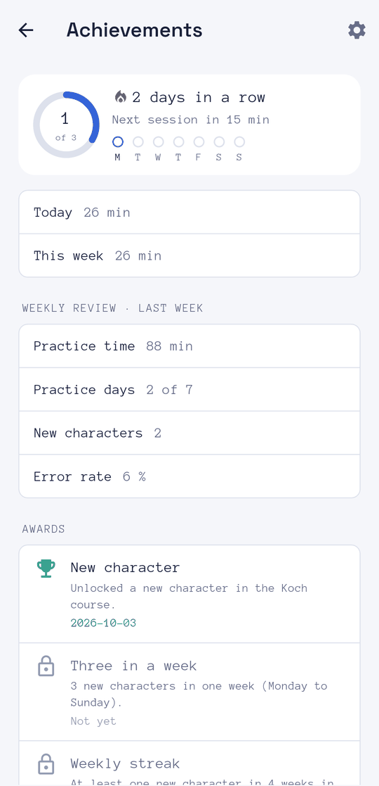

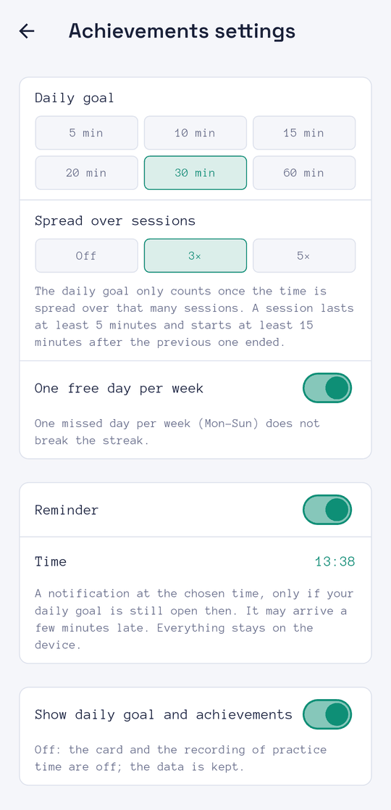
:::

**Weekly review.** Below Today and This week a short card sums up one week:
practice time, practice days, new characters and error rate, each with the
week before in brackets. On Sunday it shows the running week, on every other
day the last finished one (Monday to Sunday). The error rate appears from 3
blocks in the week. With no practice that week the card is not shown. No
ranking, nothing leaves the device.

**Awards.** Ten of them, no pop-ups while you practise, only on this page. An
earned award shows the day you first reached it; open ones are grey with a
lock. Everything stays on the device.

| Award | Condition |
|---|---|
| New character | Unlocked a new character in the Koch course |
| Three in a week | 3 new characters in one week (Monday to Sunday) |
| Weekly streak | At least one new character in 4 weeks in a row |
| Spread out | 3 sessions in one day (at least 5 min each, 15 min apart), also without the "Spread over sessions" setting |
| Spreading as a habit | Practised that way on 5 different days |
| Better than last week | Fewer errors than the week before, at least 3 blocks each |
| Clean run | 3 blocks in a row with under 5 % errors |
| Despite interference | A block with interference switched on and under 10 % errors |
| New speed | A new speed record in Listen or Send |
| Welcome back | Practised again after a break of at least 7 days |

Tap an award: you see what it means, when you first and last reached it, and
how often (open ones show only the explanation). What "how often" counts
differs per award and is stated in the text there, e.g. new characters, weeks,
days or blocks.

Error rates count Listen and Send together. Block awards only work with
blocks played after this update.

**Spread over sessions.** Learning in small chunks works better than one long
block. With 3× or 5× the daily goal only counts once the practice time is
reached **and** you have practised at least that many sessions. A session
counts if it lasts at least 5 minutes and starts at least 15 minutes after the
previous counted session ended. A session that starts too early still adds
practice time but does not count as a session. The ring then shows the
sessions (e.g. "1 of 3"), and below it says when the next session counts. Off
by default, not everybody has time for several sessions a day.

**Reminder.** Optional and off by default. At the chosen time you get a
friendly notification, but only if your goal for that day is still open. The
app plans the next days in advance and re-plans whenever you finish a training
or leave the app. Android may deliver it a few minutes late. It is scheduled on
the phone itself, nothing is sent anywhere. If you refuse the notification
permission, the reminder stays off.

# Character statistics

The **📊 icon** in Listen and Send opens that training's statistics. Listen
and Send have separate statistics.

- **Listen** shows every active Koch character with its attempts (for example
  "14 attempts") and its **current** accuracy. A tick marks characters that
  meet the unlock condition, and an hourglass marks those that aren't there
  yet. Those also say what is missing ("6 more needed", "below 90 %"). The
  top shows "*x* of *y* characters ready". The characters that aren't ready
  come first, which helps when the unlock seems stuck.
- **Send** shows the same (attempts, current accuracy, tick or hourglass,
  "*x* of *y* ready"), but the characters are sorted by errors, the least
  reliable at the top. The unlock applies here too, for Koch with random
  characters. Mix-ups are not listed in the overview; you find them per
  character in the detail view.

**The percentage is a moving average, not an overall rate.** Newer attempts
count more than older ones: each attempt goes into the value with 20 %. A
miss therefore lowers it at once (100 % becomes 80 % at most), and correct
answers rebuild it slowly. A character can drop below the threshold after a
single miss even if it was flawless before. The tick needs both: enough
attempts (default 20) **and** a current accuracy above the threshold (default
90 %). The bar shows only the attempts, not the accuracy.

**Tap a character** (a hint on the list says so) to open its detail view as a page of its own, with a back arrow at the top left. It shows:

- **Overall** – accuracy over all attempts, with errors and attempts.
- **Current (moving)** – the value from the list, with an arrow: ▲ better,
  ▼ worse or ► same as the overall rate (from 3 percentage points apart, and
  only from 5 attempts). It shows whether a dip was a slip.
- **Last 30 attempts** – a strip of green (right) and red (wrong) bars,
  newest on the right. It fills up as you practise; older data has no
  history.
- **Hit rate per week** – a curve of the last 12 weeks for this character
  (tab *Hits*; dashed: the unlock threshold) or the number of attempts per
  week (tab *Attempts*). Weeks without practice are left out.
- **Last practised** – today, yesterday or *n* days ago (also only from the
  next practice on).
- **Practice weight** – from 1 to 20. The higher, the more often the
  character comes up in adaptive exercises.
- **Unlock** – what is still missing: how many attempts and how
  many right answers in a row until the rate is back above the threshold.
- **Mix-ups** (Send only) – what you sent instead. In Listen you only mark
  what was wrong, so what you heard is not recorded there.
- **Listen** – plays the character three times, at this training's speed.

::: {.shots}
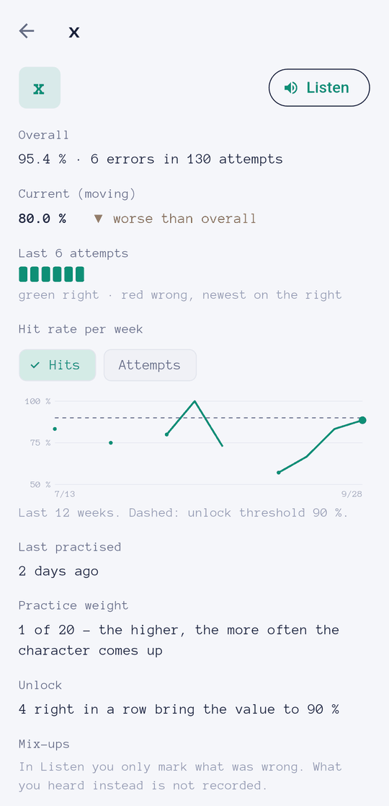

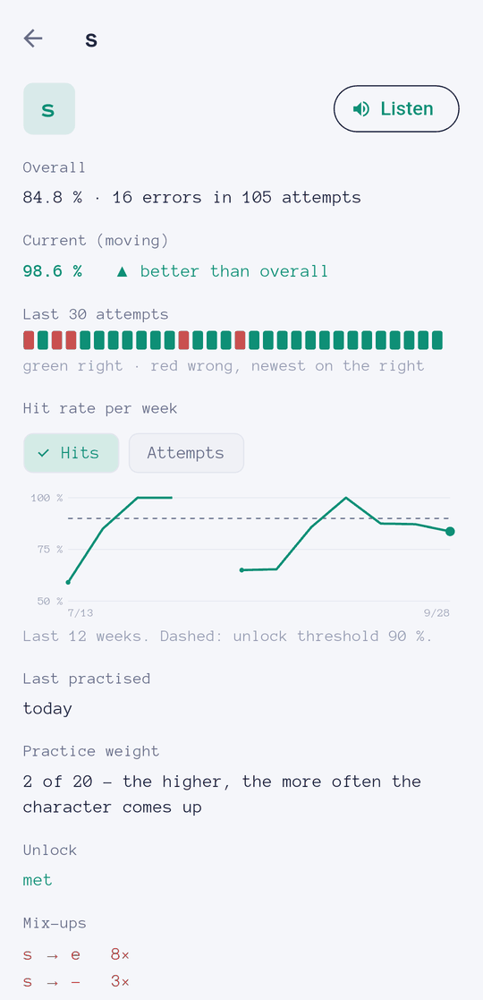
:::

**Progress tab.** At the top, switch between *Characters* (the list above)
and *Progress*. Progress shows how practice develops over time, separately for
each training. It fills up from the day this feature was added; earlier
practice is not included. Choose **4 weeks**, **12 weeks** or **All**:

- **Hit rate, WPM and days practised** at the top. Hit rate and WPM are those
  of the latest day (4 weeks), week (12 weeks) or month (All, from about half
  a year on) with practice, weighted by attempts, with an arrow against the
  period before. "Days practised" reads like *42/88*.
- **Hit rate per day / week / month** and **speed (WPM)** as curves. Periods
  without practice are gaps, not zero.
- **Days practised**: one box per day (4 weeks), otherwise a bar per week or
  month.
- **All characters, week by week**: a heatmap, characters down, weeks across,
  from red (below 60 %) to green (from 90 %). A cell with fewer than 5
  attempts stays empty. If the weeks don't fit the width (All), the cells scroll
  and start at the newest week; the characters and week headings stay in place. **Weakest first** sorts by the latest hit rate. Tap
  a character to open its detail view.

::: {.shots .three}
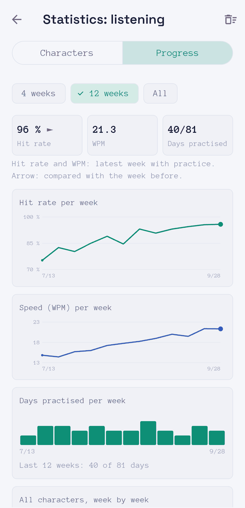

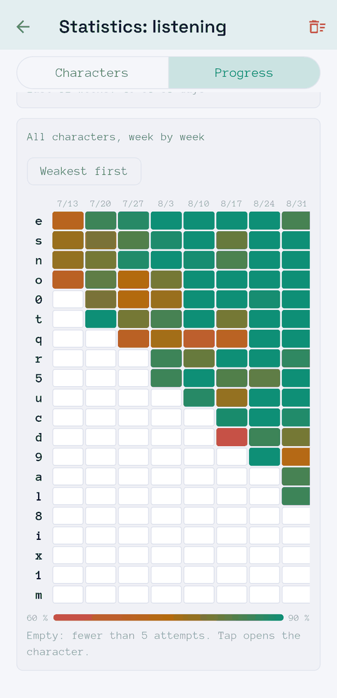

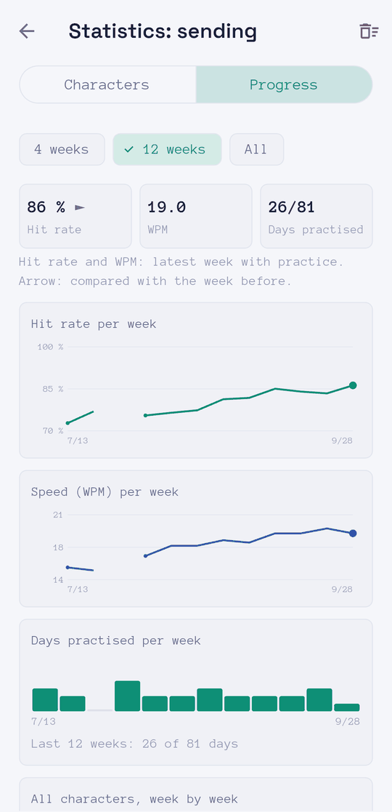
:::

The **reset** icon deletes all of this training's statistics after a
confirmation: error rates, weights, mix-ups and the progress. The other training's
statistics are kept. This cannot be undone.

::: {.shots}
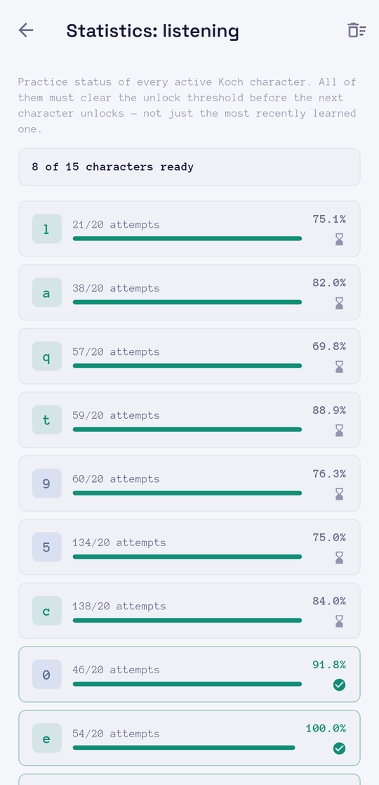

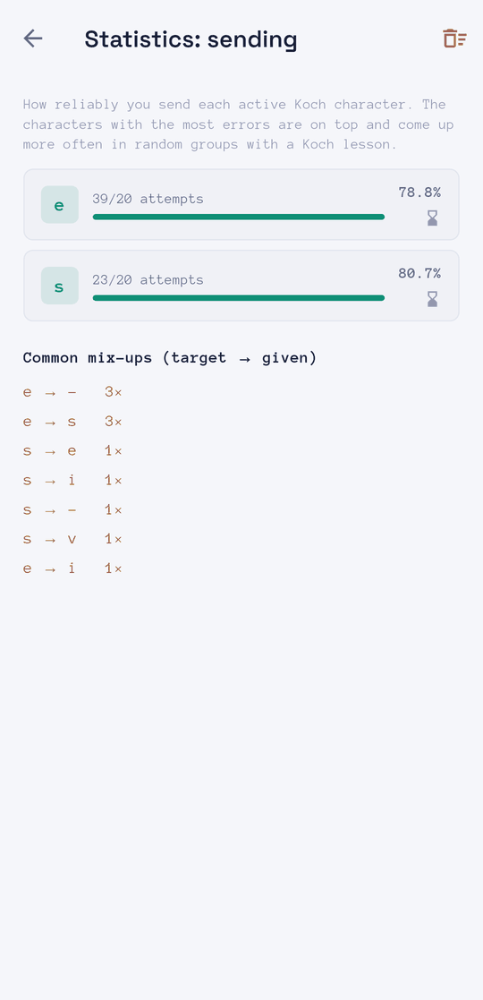
:::

# CW Keyer

For free keying. What you key is heard and shown as decoded text.

- Use the **keys** at the bottom (DIT on the left, DAH on the right), or a
  real Morse key through an adapter (see
  [Morse key](#morse-key)). In **Straight** mode a
  single **KEY** area appears instead.
- **WPM** sets the keyer speed, 5 to 60 WPM.
- The text runs from the bottom upwards. You can scroll back to older lines,
  and you change the text size with two fingers.
- The ⚙ sheet at the top right holds the **word spacing** (word spacing,
  default 7 dits). It sets the pause after which a space is inserted.
  Character spacing has no effect when keying, as on the Morserino.

You set the keyer mode and its details in the global settings under
**Keyer** (see [Keyer](#keyer)). They apply everywhere you key: CW Keyer,
Send, WiFi Trx, QSO Bot and the games.

::: {.shots .one}
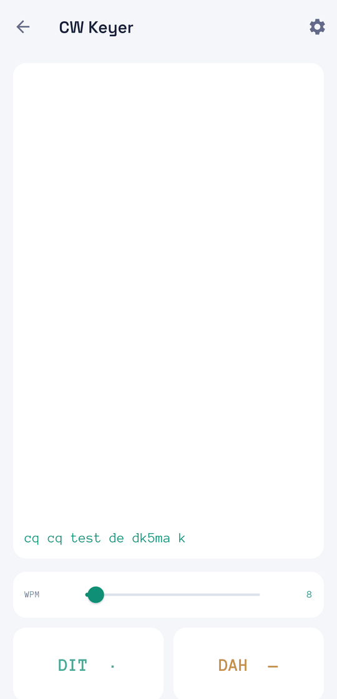
:::

# CW Decoder

The CW Decoder listens through the **microphone** and writes down what it
recognises as Morse code. The signal might come from a radio, a practice
program or another Morserino.

On first start Android asks for microphone permission. Without it the decoder
can't work. If you declined, allow the microphone in the Android settings
under **Apps → Next CW Trainer → Permissions**.

## Operation

- **Start / Stop** switches copying on and off.
- The **status line** shows the set pitch, the bandwidth and the detected
  speed in WPM.
- The **level meter** shows the loudness of the tone at the set pitch. A grey
  mark shows the noise level during pauses.
- The icons at the top right clear the text and, with the sliders icon, open
  the decoder settings.

The decoder adapts to the speed automatically, so there's nothing to set.
It comes from the firmware. A Goertzel filter detects the tone, and timing
logic tells dits, dahs and pauses apart. It keeps learning the current dit and
dah length as it goes.

::: {.shots}
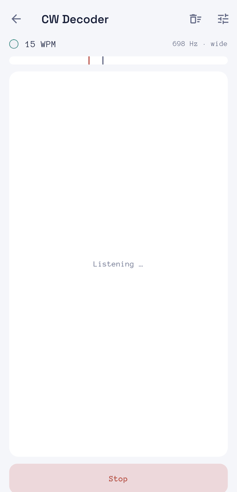

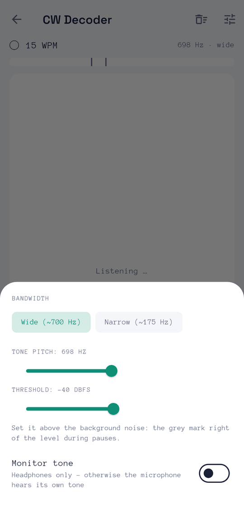
:::

## Decoder settings

| Setting | Meaning | Values |
|---|---|---|
| Bandwidth | **Wide** is more tolerant of a pitch that doesn't quite match. **Narrow** filters interference better, but the pitch must be exact | **Wide (~700 Hz)** / Narrow (~175 Hz) |
| Tone pitch | The frequency of the CW tone the decoder listens for | 300–1200 Hz (**698 Hz**) |
| Threshold | Minimum loudness for a tone to count. Set it just **above** the grey noise mark | −65 to −10 dBFS (**−40 dBFS**) |
| Monitor tone | Plays back the detected tone cleanly at the set pitch | **Off** / On |

**Tips**

- If you don't know the signal's pitch, start with **Wide** and turn the
  pitch until the level jumps clearly on the characters. Then switch to
  **Narrow**.
- Random `e` and `t` appearing in the pauses mean the **threshold** is too
  low.
- Only use the **monitor tone** with headphones. Otherwise the microphone
  hears the tone itself and confuses the decoder.

# WiFi Trx

With WiFi Trx you send Morse over the internet or your local network with
other Morserinos, apps and servers. The app uses the same protocol as the
Morserino ("Morse over Packet", MOPP, UDP port 7373). One example is the chat
server **cq.morserino.info**.

The app uses the phone's existing WiFi or mobile data connection, so there
are no WiFi credentials to enter.

## Services

At the top you choose the **service** to connect to. The default is
`cq.morserino.info`.

- **+** adds a new service, and the **pencil** edits or deletes the selected
  one. Each service has a **Name** and a **Server** (host name or IP address).
- An **empty server** means broadcast to the local network. This lets you
  exchange Morse with Morserinos on the same WiFi.
- You can only do this while not connected.

**Connect** connects and **Disconnect** disconnects. The line below shows the
status. If the server ends the connection (`:bye`), the app disconnects too.

## Sending and receiving

- **Send** with the touch keyer or the adapter. Each word is sent as a packet after
  the word pause. You can also type text into **Send text…** and send it. It
  goes out at the set speed.
- **WPM** sets your sending speed.
- **Receiving:** received words are played one after another at the
  **sender's** speed and shown in the log.
- The **log** tells received (RX) from sent (TX) text and is kept per service.
  **Long-press the log** to clear it after a confirmation.
- In the ⚙ sheet you set the **word spacing**, as in the CW Keyer. It decides
  after which pause your word is sent.

WiFi Trx only works while the app is in the foreground.

::: {.shots .one}
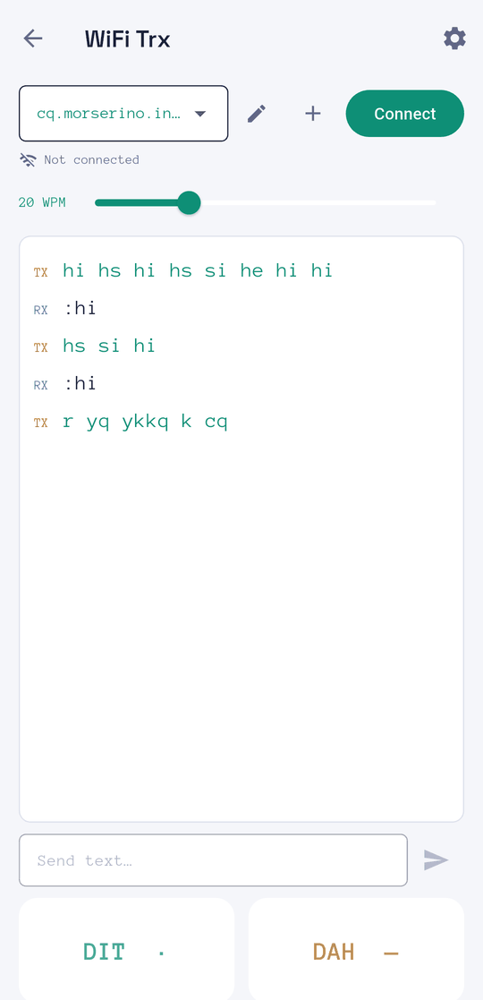
:::

If your partner is behind a different router, UDP packets on port 7373 must be
able to get through. With a public server such as cq.morserino.info this is
normally no problem.

# QSO Bot

The QSO Bot is a simulated partner for complete, realistic radio contacts,
without going on the air. The bot sends in CW, understands what you key and
reacts to it. It only sounds through the app's speaker and never sends
anything to the network.

## Starting

1. Choose the **QSO type**: **SOTA/POTA**, **Standard** or **Contest**.
2. Press **Start**. The bot listens for 5 seconds:
   - **If you call CQ** (for example `cq cq de oe1abc k`), it answers you.
   - **If you stay silent**, it calls CQ itself and you answer.

Each contact uses a new, realistic call sign for the bot.

::: {.shots .one}
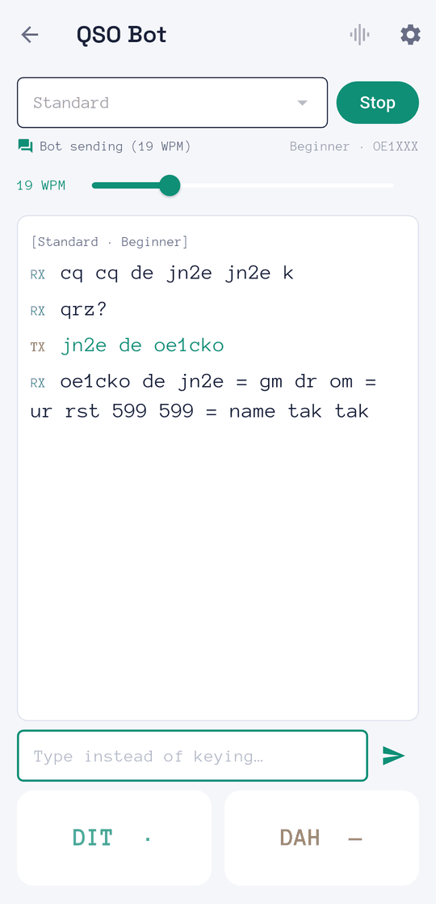
:::

## QSO types

- **SOTA/POTA** is a summit or park activation with report and reference. If
  the bot calls CQ, it is the activator and you are the chaser. If you call CQ,
  it's the other way round. A session is a single contact.
- **Standard** is the classic QSO in three rounds. First come report, name and
  QTH. Then station details follow (rig, ant, wx, age), and finally the
  sign-off. The bot finds your details by the keywords `name`, `qth`, `rig`,
  `ant`, `wx` and `age`, and it remembers your name.
- **Contest** is many very short contacts in a row. The exchange depends on
  the **Contest type**: **CQ WW** (report + CQ zone) or **WPX** (report +
  serial number). The session ends by itself after a longer silence.

## Talking to the bot

- **End each over** with `k`, `bk`, `<ar>`, `<sk>` or `73`, or simply pause.
  The bot won't talk over you.
- **Repeat:** `agn`, `rpt` or `?` repeats the bot's last over. `rpt rst`,
  `rpt call`, `rpt qth` or `rpt name` repeats just that item.
- **Bot speed:** `qrs` makes it slower and `qrq` faster. Your own speed
  doesn't change.
- **Correcting:** `<err>` (eight dits) or `eeee` discards your last word.
- You can send reports in cut numbers: `5nn` for 599, `t` for 0, `a` for 1,
  `n` for 9.
- Filler words like `de`, `r` and `ur` don't matter, because the bot picks
  out the information.
- Instead of keying, you can type text into the input field. It is treated as
  if keyed, but not played aloud.

## QSO Bot settings

These are behind the ⚙ icon in the QSO Bot:

| Setting | Meaning | Values |
|---|---|---|
| Your call sign | Your call sign for the bot. If you call CQ yourself, the call you key is used | empty = OE1XXX |
| Difficulty | **Beginner**: more patience, 599 instead of 5nn, and the bot sends at your speed. **Intermediate** and **Advanced**: the bot sometimes calls at a slightly different speed, as practice for qrs/qrq. Advanced also keeps a tighter rhythm | Beginner / **Intermediate** / Advanced |
| Contest type | Exchange in a contest | **CQ WW** / WPX |
| Word spacing | After which pause your word counts as finished. It is shared with the CW Keyer | 6–105 dits (**7**) |

**WPM** sets your speed. **Long-press the log** to clear it after a
confirmation.

::: {.shots .one}
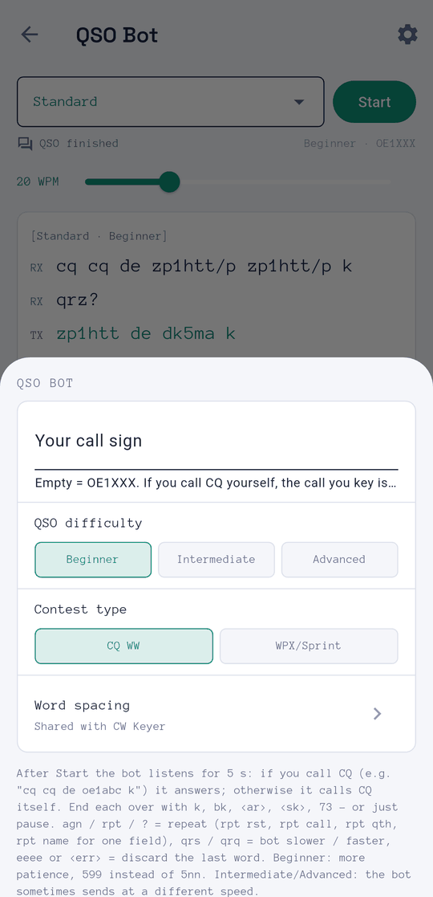
:::

# Own texts {#own-texts}

**Own texts** lets you listen to any text as Morse code – a weather report, a
newspaper article, a book chapter or a list of call signs. You find it under
**Free modes**.

## Adding texts

1. In any app, copy a text to the clipboard.
2. In **Own texts**, tap **Paste from clipboard**.
3. Give the text a title (the first words are suggested) and tap **Add**.

Even quicker: select the text in any app (browser, mail, notes, e-reader), tap
**Share** and choose **Next CW Trainer**. The app opens **Own texts** with the
same dialog for the title. The same size limit and character handling apply as
for pasting.

You can add as many texts as you like. A text can be at most 20,000 characters
long. The ⋮ menu next to a text renames or deletes it (after asking). You can't
edit a text in the app: to change one, paste the corrected version. The texts
stay on your device.

## What is sent

The text is always shown as you pasted it. Only the audio replaces characters
Morse doesn't have:

- Umlauts and ß: Ä → AE, Ö → OE, Ü → UE, ß → SS. Other accents are dropped
  (é → E).
- `!` becomes `.`, `;` becomes `,`, `&` becomes AND, dashes become `-`. A dash
  standing alone between spaces is skipped.
- Quotation marks, brackets and other special characters are not sent.
- Write **prosigns** in angle or square brackets, e.g. `<KA>` or `[SK]`; they
  are sent as one character. A pair of letters without brackets is always two
  letters.

A paragraph break in the text is sent as a double word gap.

## Playing

Tap a text, then ▶. At the top you set the **speed** (WPM) with the slider or
⊖/⊕ – also **while** the text plays; the change applies at once.

| Button | Effect |
|---|---|
| ▶ / ⏸ | Play; pause (then it goes on from the start of the current word) |
| **Word** | Repeat the current word, then pause |
| **Sentence** | Repeat the current sentence, then pause |
| **Start** | The whole text from the beginning |
| ⏮ / ⏭ | To the start of the previous / next sentence |
| ‹ / › | One word back / forward |

Tap any word in the text to listen from there. Pinch with two fingers to make
the text larger or smaller. At the end the text starts again from the
beginning.

Progress is saved automatically. When you open a text you have started, the app
asks: **Continue** or **Start over**. The list shows how much of each text you
have heard.

::: {.shots}
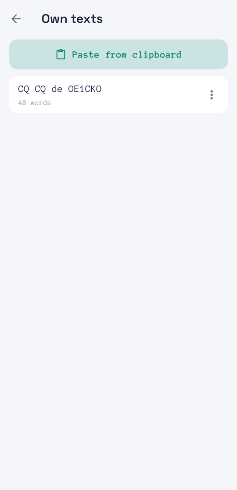

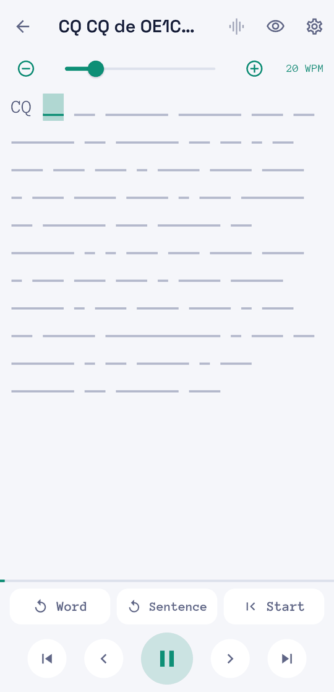
:::

## Settings (⚙)

- **Character spacing** and **word spacing** in dits, as in the trainings.
  They also apply while playing.
- **Show text**: **Always**; **After playing** (each word appears once it has
  been sent – the default); **Only on tap** (the text stays hidden until you
  show it with the eye icon at the top).

Speed, spacing and display apply to all texts. Pitch and tone softness come
from the general [settings](#settings). The display stays on while you are in
a text.

::: {.shots .one}
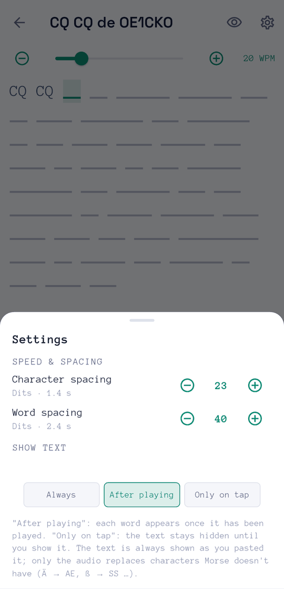
:::

# Games

Under **Play → Games** there are eight games. You play Morsel, Morse Invaders,
Memory Chain, Trailblazer, Fox Hunt, Fight the Pileup and Radio Cave with the
touch keyer or the adapter. They use the keyer settings. Morsel, Morse
Invaders, Memory Chain, Trailblazer and Fox Hunt take the Koch lesson from
**Send**, and Morsel, Memory Chain, Trailblazer and Fox Hunt also let you
change it for the game only. Each of these seven shows short rules before you
start. The [text adventure](#text-adventure) has its
own speed and input settings; it also takes the keyer mode from the keyer
settings.

::: {.shots .one}
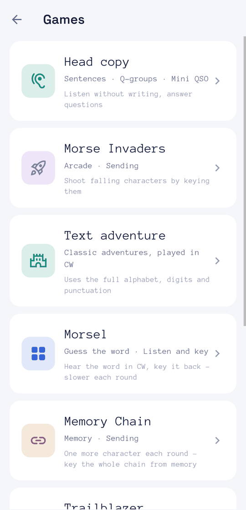
:::

## Morsel

A word puzzle like Wordle, but in CW.

- A game has **ten words**. One letter is revealed, and the word is played
  once in CW.
- Key the **whole word** back. A word pause submits it. `<err>` (eight dits)
  deletes the last character.
- Colours: **green** means right, **red** means wrong, and **grey** means the
  revealed letter was keyed wrong.
- After each miss the word is repeated **5 WPM slower**, down to 18 WPM. After
  12 seconds without input it is played again. **Skip** gives up on a word.
- **Score:** your time + 5 seconds per guess. A skipped word costs 60 seconds.
  Lower is better.

| Setting | Meaning | Values |
|---|---|---|
| Koch lesson | For this game only. It starts at your Send lesson | 2 to the end of the sequence |
| Word length | Exactly 3/4/5/6 letters, or at most 4/5/6 | 3, 4, max 4, 5, max 5, 6, max 6 |
| Clue start speed | Speed of the first play | 10–48 WPM (**48**, as on the Morserino) |

Longer words need a higher Koch lesson. If too few words are available, the
app tells you which lesson you need.

::: {.shots .one}
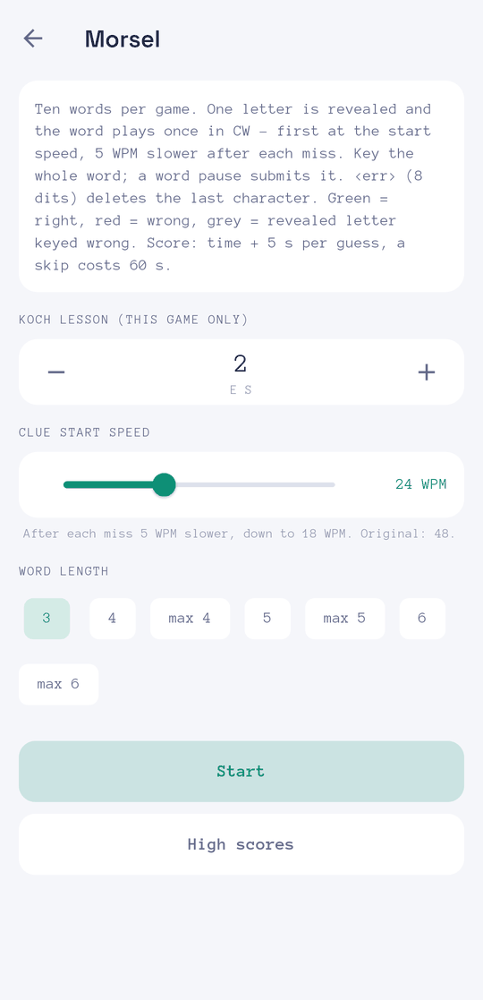
:::

## Morse Invaders

An arcade game. Characters from your Koch lesson fall down four lanes. **Key a
character** to shoot the lowest invader showing it.

- A character that reaches the bottom costs a **life**. You start with 3
  lives, can have at most 5, and gain one every 1000 points.
- After **ten hits** comes the next level. Each level is faster and busier.
- **Points:** 10 × WPM/10 per hit, doubled in the bottom third. Streaks add
  a multiplier: ×1.5 from 5, ×2 from 10 and ×3 from 20 hits in a row.
- **Pause** (the icon at the top right) stops the game. From there you can
  resume or go back to the menu. You can also change the speed with − and +
  during the game.

| Setting | Meaning |
|---|---|
| Koch lesson | The lesson from **Send** (change it there) |
| Start level | The level you begin with |
| Sending speed | Keyer speed, counts towards the score |

Results go into a high score list.

::: {.shots}
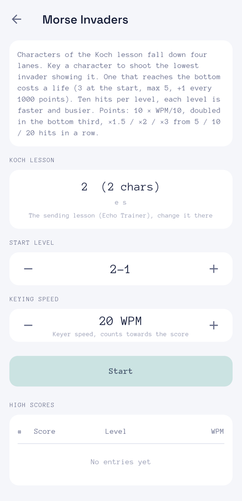

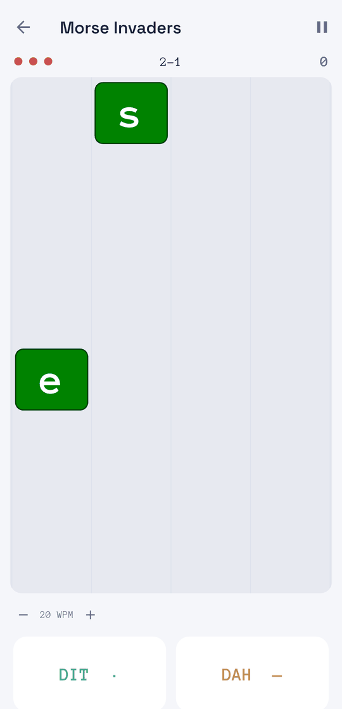
:::

## Memory Chain

A memory game. Each round adds **one character**, and you key the **whole
chain** from the start, from memory. There is no time limit.

- **Characters mode:** random characters from your Koch lesson. One error per
  round is allowed, and the second ends the game.
- **Call signs mode:** a call sign is built up letter by letter, then the next
  one. Any error ends the game.
- **Prompt:** the new character is **shown** or **played** in CW (Sound).
- Colours: **green** means right, a **yellow frame** marks the next character,
  and **red** marks an error (with the right character).
- You set the **Koch lesson** for this game only before you start. It begins
  at your Send lesson. You can also change the speed with − and + during the
  game.

The high score list is kept per mode.

::: {.shots .one}
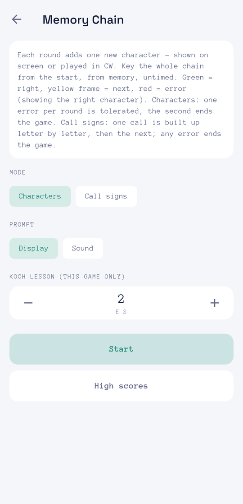
:::

## Trailblazer and Fox Hunt

Two maze games on the same grid: **12 × 4 cells** filled with characters of
your Koch lesson. A **path from left to right** is hidden in it. Only the
part you have already walked is drawn, never the path ahead. The token (grey
circle) moves one cell with every right answer; the game is solved at the
right edge.

- **Trailblazer (sending):** The next path cell is **highlighted yellow**.
  Key its character.
- **Fox Hunt (listening):** You **hear** the character of the next path cell
  and key the **direction** to it, not the character itself. Example: you hear
  S, and the S cell is to the right of your token: you key **E**. The legend below the grid assigns a letter
  to each direction (↑ ↓ ← →): **N, S, W, E**, as far as your lesson has
  learned them. Otherwise the legend takes the first free letter of your
  lesson (**yellow frame**). The tone has the half-tone shift of the Send
  trainer. After 5.5 s without input it repeats; **Replay letter** plays it
  again at once.
- A wrong character (in Fox Hunt: the wrong direction, or a letter that is not
  in the legend) gives an error tone and costs **5 s**; a right one gives a
  confirmation tone.
- **Score:** characters per minute (**CPM**) = steps over the time including
  the penalty. Each game has its own high score list with seven places.
- You set the **Koch lesson** for this game only before you start. It begins
  at your Send lesson. You can also change the speed with − and + during the
  game. Fox Hunt plays the character at your keyer speed.

::: {.shots .one}
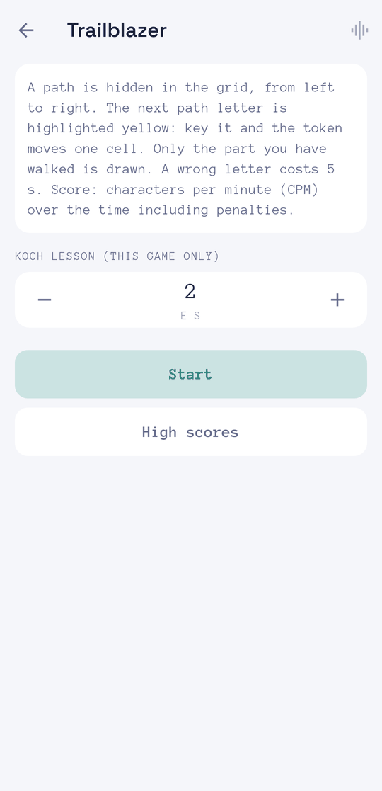
:::

## Fight the Pileup

A pileup of stations calls you, and you have to copy them quickly. Call signs
line up in a queue and the first one plays in CW, a little **lower** than your
sidetone and at your keying speed. The call sign repeats until you answer.
Key it back, and it is sent after a word pause, or at once with **Send**.

- **Reveal:** the text of the call sign appears only after a few repeats (3 on
  Easy and Normal, 2 on Hard, 1 on Expert). Until then you copy by ear.
- **Score:** a correct call gives 100 points plus 10 per streak step (x2, x3,
  and so on). A wrong answer ends the streak, and you try again.
- **Attack:** after each correct call the pileup **pauses**, and a call sign
  is shown on screen. Key it for 50 extra points; then the pileup goes on. In
  the firmware this attack goes to other players; the app has no multiplayer,
  so it only scores.
- **Lost callers:** if the time for the active caller runs out, you lose 25
  points and the streak. A caller who waits too long in the queue leaves too.
  Several lost callers cost one life, and you have three lives.
- **Difficulty:** Easy, Normal, Hard and Expert change the time per caller
  (45 to 12 s), how fast new callers arrive, how many wait at the start and
  how many lost callers cost a life (5 to 2). Faster keying speeds up your
  own answers: you can change the speed with − and + during the game.

The call signs come from the same generator as in the other modes and follow
your call sign settings (region, common prefixes only). There is no high score
list, as in the firmware. When the game ends, you see score, defended and
dropped callers, accuracy and best streak.

::: {.shots .one}
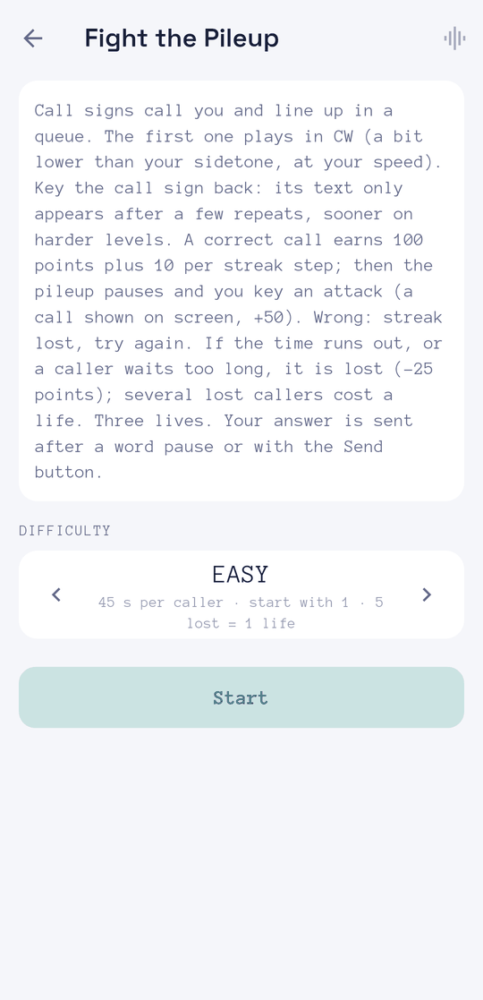
:::

## Radio Cave

A text adventure in an abandoned Cold War radio station: explore twelve
rooms, find six items, repair the equipment and finish with a QSO with the
remote station IR7. **Every command is keyed**; the game text is English.

- The screen shows a small map of the cave (the current room is yellow), the
  room name, the text, the command line and below it the exits (N E S W), the
  items you carry (at most two) and the number of steps.
- **S, E, W, I** and **H** act at once. Everything else is sent after a short
  pause of silence (two and a half word spaces). **N** therefore waits, so
  that it can still become **NEW**.
- Commands: **N/S/E/W** go, **L** (+ object) look, **I** inventory, **T**
  (TAKE) and **D** (DROP) + item, **U** (USE) + item or thing, **U TX** / **U
  RX**, **F** (FIX) + item, **R** (READ) **MANUAL** or **LOG**, **K** (KEY) +
  word, **QRS**, **NEW**. **H** lists them. Items and things can be
  abbreviated (**T F** takes the fuel canister).
- **Clues come as CW:** the scribbles on the wall, the logbook, the manual
  and the calls from IR7. **QRS** replays the last clue at half speed. While a
  clue plays, keying is muted.
- Four **E** in a row or the error sign clear the input. After a prosign AS,
  KA, KN, VE or BK the game sees the letter S, A, N, E or B, as on the
  Morserino; SK counts as K.
- Handle **high voltage** with care: some actions are fatal. Then the
  game-over page offers a restart.
- The game is **saved after every command**. Next time you can continue or
  start a new game. Winning or dying deletes the save.
- Pitch, keyer mode and speed of your keying come from the settings; with − and
  + you change the speed during the game. The clues play at their own speed and
  at a fixed pitch of 696 Hz.

::: {.shots .one}
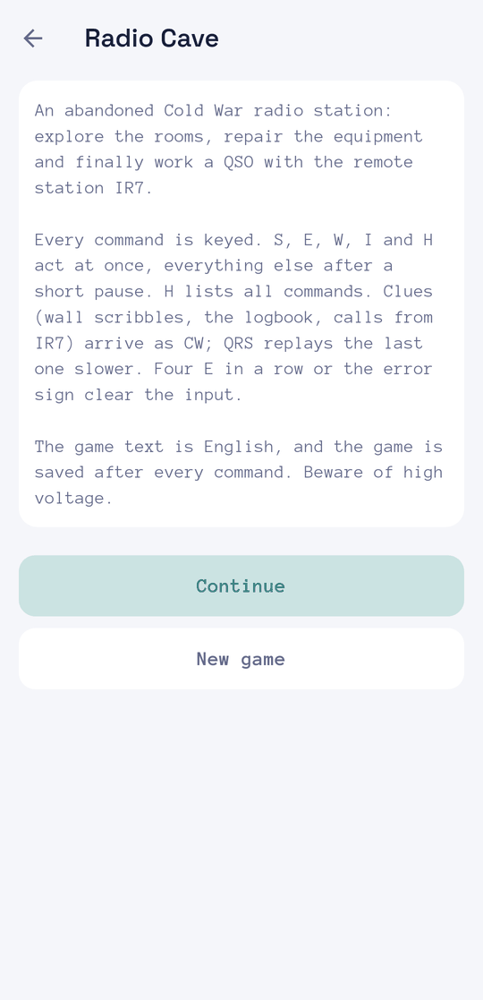
:::

## Text adventure {#text-adventure}

The three classic Infocom adventures **Zork I, II and III** (1980–82), played
in CW: the game answers in Morse, and you enter your commands. Microsoft
released the source code under the MIT License in 2025; the app plays the
original story files with its own interpreter. The game text is in
**English** only, and it uses the **full alphabet, digits and punctuation**,
whatever your Koch lesson. Zork is a trademark of its owners; the app is not
affiliated with them.

**Selection.** Each part shows its score, moves and last room. **Start** or
**Continue** picks up where you left off. **Saved games** opens your saves.
**New** starts over (after asking; your own saved games are kept).

::: {.shots .one}
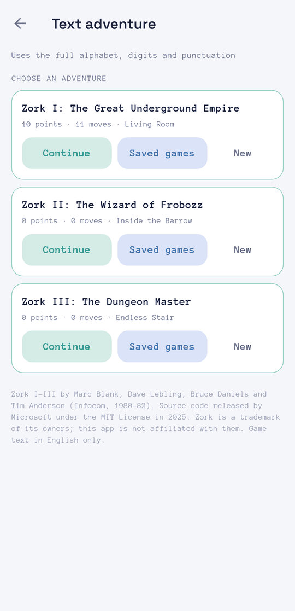
:::

**The game screen.** At the top the status line with room, score and moves,
below it the transcript. The newest answer is played in CW, and the word that
is sounding is highlighted. Below that:

| Control | What it does |
|---|---|
| Speed bar | Listening and keying speed, character and word spacing; tap it for **Speed & spacing** |
| **↻ Again** | The sentence that is playing (in the gap right after a word: that word's sentence; after the end: the last one), then paused |
| Long press **↻ Again** | The whole answer from the start (like sending `?`) |
| Tap a word | Only that word, then paused |
| **Pause** / **Resume** | Pauses playing; **Resume** goes on from the word where it paused – after **↻ Again** from the next word |
| **Text** (eye) | Shows the whole answer at once; tap again to hide it, then the words reappear as they are played (e.g. with **Again**) |
| **↶ Move** | Takes back the last command (up to 20) |

::: {.shots .one}
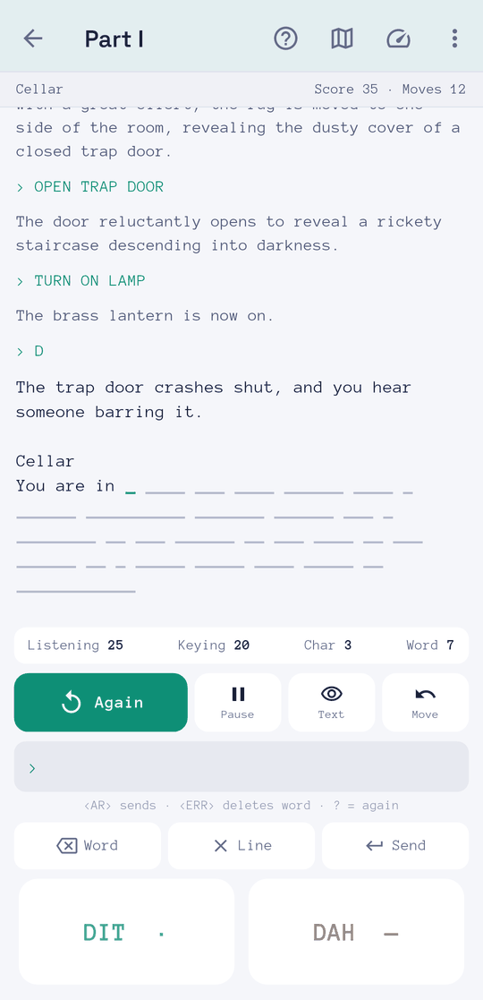
:::

**Keying commands.** With the touch keyer at the bottom (keyer mode
Straight: the key) or a connected Morse key (see
[Morse key](#morse-key)). The decoder writes into the
input line; the character being keyed is shown in orange as · and — after
it. As soon as you start keying, the CW output stops.

- **End of a word:** a pause separates words. As in the sending learn mode, a
  word counts as finished after a pause of 2 × character spacing + 1 + word
  spacing / 8 dits at keying speed (straight key: word spacing + 1 dits after
  key-up).
- **Sending:** **`<AR>`** (·—·—·) sends the command at once. With the setting
  **"<AR> or K"**, a **K** as its own word also sends, i.e. after a word gap –
  none of the three games has a word K. The **Send** button always works.
- **Correcting:** **`<ERR>`** (8 dits; 7 or more count) deletes the last
  word, as does the **⌫ Word** button. **✕ Line** clears the whole input.
- A **?** on its own (then send) repeats the last answer and takes no move.
- Other prosigns are ignored; a character that isn't recognised shows as `*`.

With the setting **Input → Keyboard**, the on-screen keyboard replaces the
dit/dah keys (for listening practice only): **␣** separates words, **⌫** deletes a
character, **⏎** sends. A connected Morse key works then too.

**Map (🗺).** The map icon in the title bar opens a map of the current
part. It starts at the current room (orange outline); pinch to
zoom, drag to move, ⌖ goes back to the current room. Rooms carry their names
from the game (English). Their positions are set by hand, because Zork isn't
drawn to scale; the connections come from the story file.

- **Visited** (default): only rooms you have been in and paths you have
  walked – the map players used to draw on paper. No cheating. The paths are
  saved with the game and taken back by **↶ Move**.
- **Whole map ⚠**: every room of the part, including the ones you haven't
  found yet (grey). That gives away solutions (hidden rooms, secret passages,
  the way through the maze), so the app asks every time. **Don't ask again**
  in the dialog turns the question off; turn it back on under ⋮ → Settings
  → **Map**.
- Dashed = up/down, ▸ = one way only. Distant connections (e.g. trap door,
  chimney) show as a blue note under the room ("→ Cellar") instead of a long
  line. Some paths only open during the game.
- In Part III the museum rooms appear three times side by side, labelled
  with the year (948 = the present, 776, 777): they are the same rooms at
  different times.

::: {.shots .three}
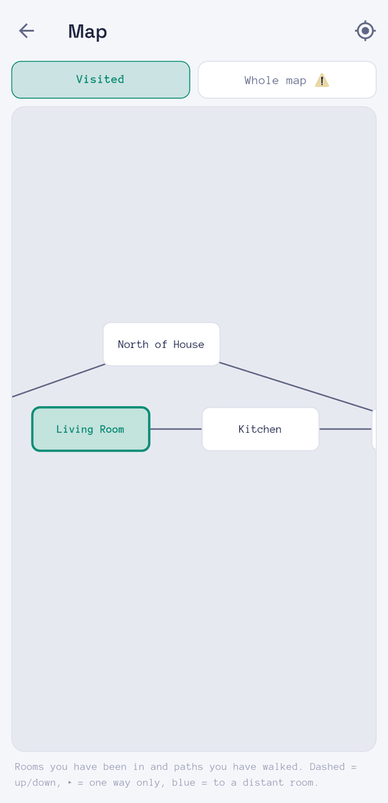

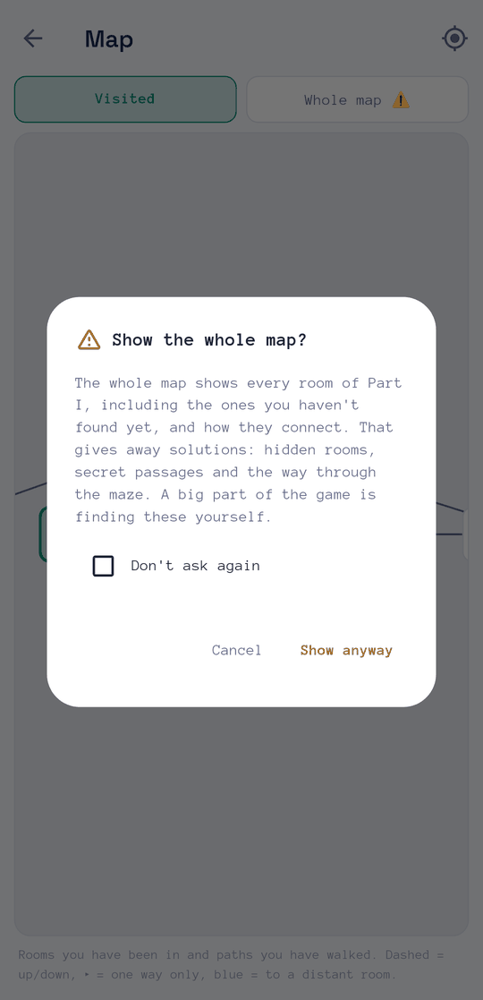

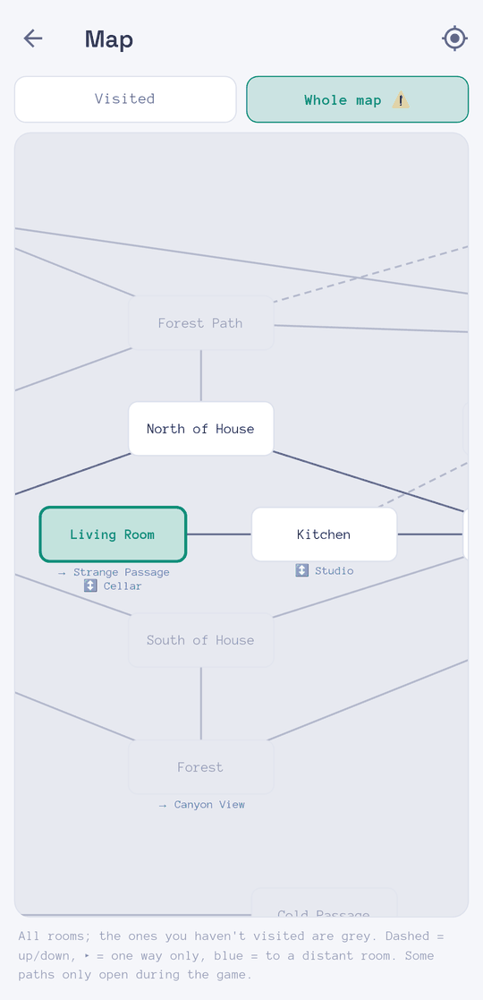
:::

**Command overview (?).** The **?** in the title bar opens a list of the most
important commands and, under **Playback**, the buttons above; at the
bottom, **What it's about** briefly gives the
story and goal of the current part, how points and moves are counted and
what happens when you die. The short forms work in all three parts:

| Command | Meaning |
|---|---|
| `N S E W`, `NE NW SE SW`, `U D`, `IN OUT` | Moving |
| `L` | LOOK: describe the room again (takes a move) |
| `I` | INVENTORY: what you carry |
| `Z` | WAIT: wait one move |
| `G` | AGAIN: repeat the last command |
| `OOPS word` | Replaces a word the game did not know |
| `TAKE`, `DROP`, `EXAMINE`, `READ`, `OPEN` … | Handling things (Zork has no `X` for EXAMINE) |
| `SCORE`, `SAVE`, `RESTORE`, `RESTART`, `QUIT` | Game commands |
| `<AR>`, `K`, `<ERR>`, `?` | Only in this app: send, send (as its own word, depending on the setting), delete the last word, again |

The game reads only the first **6 letters** of a word (`EXAMIN` is enough).
Separate several commands in one line with a full stop: `TAKE LAMP. N`.

::: {.shots .one}
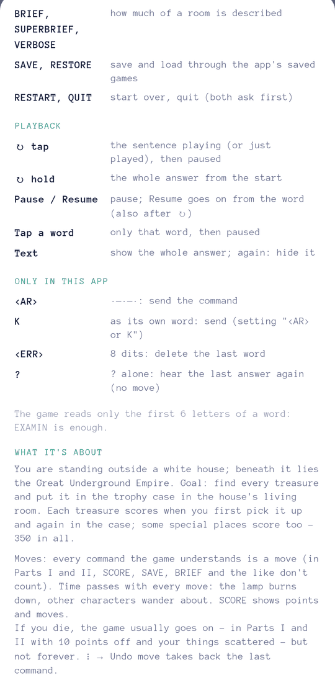
:::

**Settings** (⋮ → Settings; shared by all three parts):

| Setting | Meaning | Values |
|---|---|---|
| Listening | Speed of the CW output | 10–60 WPM |
| Keying | Keyer speed for your input | **as listening**, 10–60 WPM |
| Character spacing | Pause between characters when playing; part of the word end when keying | 3–45 dits |
| Word spacing | Pause between words; never below the character spacing; part of the word end when keying | 6–105 dits |
| Input | Touch keyer or on-screen keyboard | **Morse key**, Keyboard |
| Send with | What sends a keyed command (the Send button always works) | **`<AR>`**, `<AR>` or K, Button only |
| Played in CW | What is played; the rest is only shown as text (italics) | **Everything**, First sentence, Room / message |
| Show text | When the new answer becomes readable | Always, **After playing**, Only on tap |
| Room descriptions | How much of a room is described | **Brief**, Superbrief, Verbose |
| Map: warn before the whole map | Asks before **Whole map ⚠** | **On**, Off |

- The adventure takes speed and spacing from your **Listen** profile the
  first time you open it; after that they are its own values. You can also
  change them from the speed bar, and they apply at once, even while playing.
- **First sentence:** up to the first full stop, including a room name before
  it. **Room / message:** only the name when you enter a room, otherwise the
  first sentence of the answer.
- **After playing:** each word appears once it has been played. **Only on
  tap:** the new answer stays hidden until you tap **Text** or the box.
- **Brief** = BRIEF (the long description on the first visit only),
  **Superbrief** = SUPERBRIEF (the room name only), **Verbose** = VERBOSE.

::: {.shots}
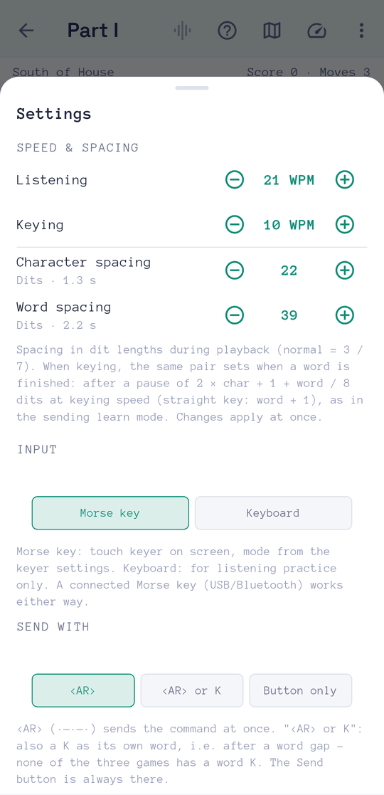

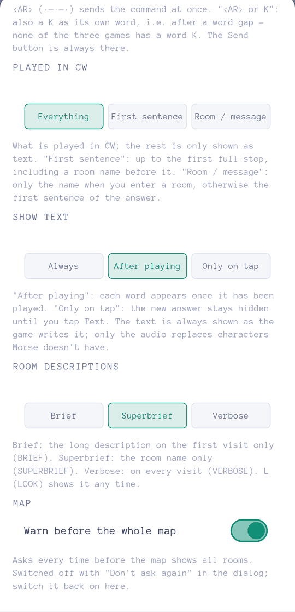
:::

**Punctuation in the audio.** The screen always shows the text as the game
writes it. Only for playing, characters that Morse doesn't have are replaced:

| In the text | Played as |
|---|---|
| `'` `"` `( )` `[ ]` `*` `#` and others | left out |
| `!` | `.` |
| `;` | `,` |
| `&` | `AND` |
| Paragraph | double word gap |

**Saved games.**

- **Automatic:** saved after every command and when you leave, one slot per
  part. Next time you continue exactly there.
- **Your own saves:** as many as you like per part, via ⋮ → **Save** or the
  game command `SAVE`. The name is suggested (room · score).
- **Loading:** via ⋮ → **Load**, **Saved games** in the selection, or the
  game command `RESTORE`. Tap to load; the current state is saved
  automatically first. Long press to rename or delete.
- **Restart:** ⋮ → **Restart** (the app asks first and offers to save
  before) or the game command `RESTART` (the game asks).
- **Undo (↶):** up to 20 commands while the game screen is open. The original
  doesn't have this; it mainly helps with typing mistakes.
- **End of the game:** after `QUIT` the app offers to load a saved game, take
  back the move, or restart.

::: {.shots .one}
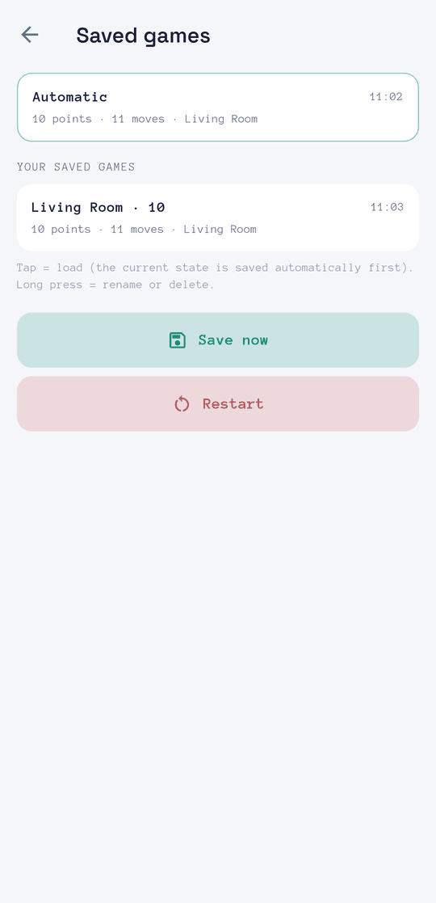
:::

# Learning resources

Under **Learn → Learning resources** you find help for learning CW that is
not a training of its own.

::: {.shots .one}
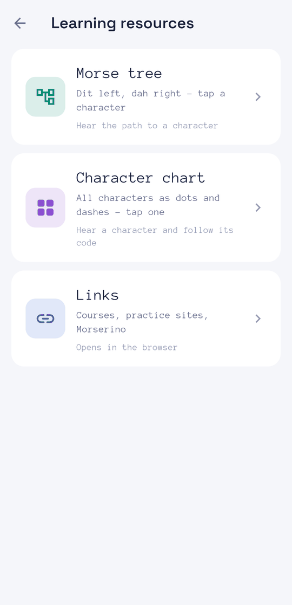
:::

## Morse tree

The Morse tree shows all codes in one picture: from the dot at the top, a
**dit goes left and a dah goes right**. The lines show it too: a dit is a
dotted line, a dah a thick solid one. A character sits where its code ends,
so you can read every code by following the path down to it. Letters are on
the first four levels. **Digits and signs** adds the fifth level with digits
and signs; the tree then scrolls sideways.

Tap a character to hear it. It sounds at your **pitch** (Settings → General) and at the speed shown below the tree. That speed starts at your
**Listen** speed and can be changed here with **–** and **+** (10–60 WPM); the
change applies only to this screen. While the character sounds, the path from
the top lights up element by element: dit or dah is highlighted exactly when
you hear it. Below the tree the code is shown once more as dits and dahs.

::: {.shots}
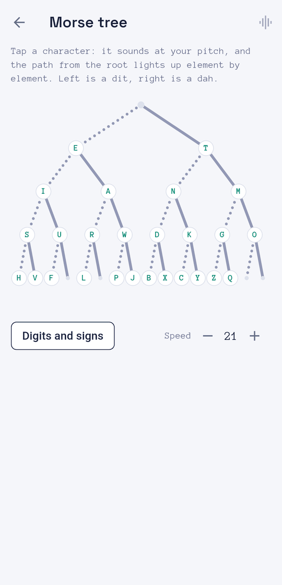

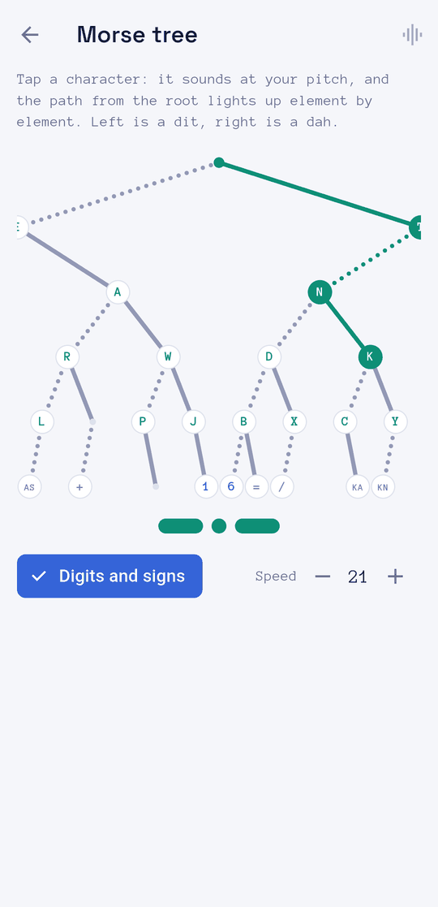
:::

**Turn the phone sideways** for a bigger tree: the tree screen is the only
one in the app that also works in landscape. There the controls sit in one
row above the tree, and with **Digits and signs** the whole tree fits on the
screen without scrolling. The rest of the app stays in portrait.

::: {.shots .wide}
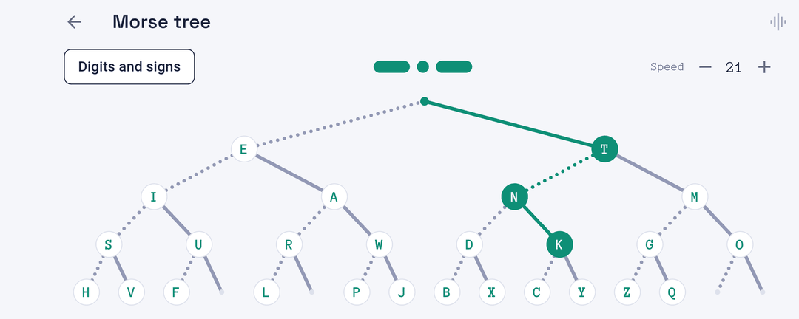

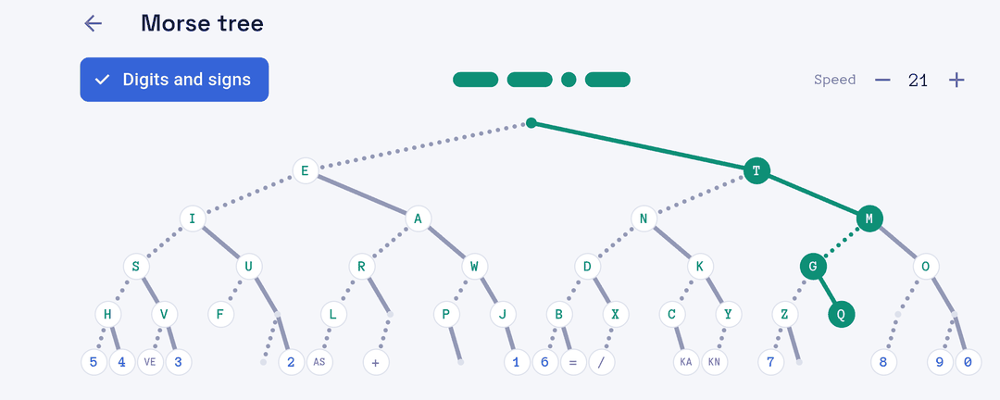
:::

The tree is drawn by the app from the same code table it uses for playing and
decoding, so it always matches what you hear.

## Character chart

The character chart lists every character of the app with its code, grouped
into **Letters**, **Digits**, **Punctuation** and **Prosigns** (SK, KN, KA, AS,
VE, BK). Each code is drawn as dots and dashes.

Tap a character: it sounds at your pitch, and its dots and dashes light up as
they sound. The speed starts at the value from the Listen training; **−** and
**+** change it for this view only. Set the pitch under Settings → General.

::: {.shots .one}
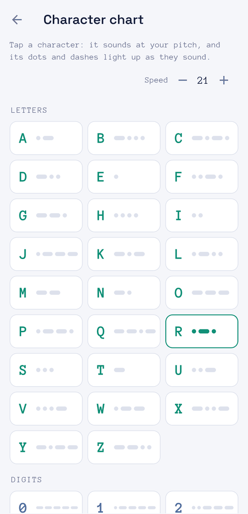
:::

## Links

A list of external sites for learning CW: the video course by Heinz ("just me")
on YouTube, LCWO, VBand and the Morserino-32 homepage. A tap opens the site in
your browser. These are independent offers that are not affiliated with this
app; the app only links to them and shows nothing of their content.

::: {.shots .one}
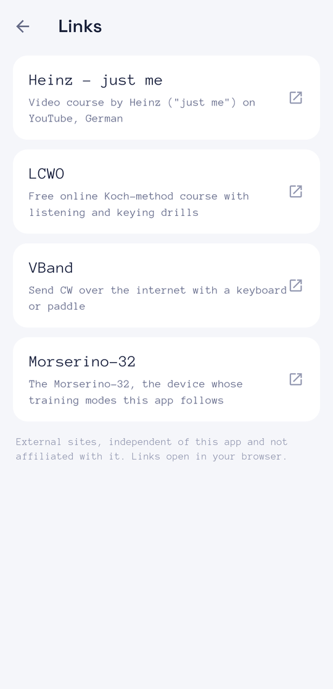
:::

# Morse key

## Touch keyer

Every mode where you key shows two areas at the bottom: **DIT** (left) and
**DAH** (right). In the **Straight** keyer mode there is a single **KEY** area
that sounds for as long as you press it.

## A real Morse key or straight key

A phone has no Morse key input. You need a small USB adapter that turns the
key contacts into **key presses**:

- **vband** ([hamradio.solutions/vband](https://hamradio.solutions/vband/)) is
  a widely used, ready-made USB adapter built exactly for this.
- **Homemade:** any small USB HID device that reports the dit and dah
  contacts as two different keys works. A ready-to-build example is
  [xiao-vband-adapter](https://github.com/ckonecny/xiao-vband-adapter). It is a
  Seeed XIAO SAMD21 with a 3.5 mm jack that sends the same keys as the vband
  adapter. It plugs straight into the phone with a USB-C cable.

Older phones with micro-USB need a USB OTG adapter.

### Learning the dit and dah keys

This tells the app which key your adapter sends for dit and which for dah:

1. Plug in the adapter.
2. Go to **Settings → vband Morse Key → Learn dit/dah keys**.
3. When "Press Dit key …" appears, press the **dit key**. When "Press Dah
   key …" appears, press the **dah key**.
4. "Saved" confirms it. The detected keys are listed under **Dit** and
   **Dah**.

So there's no list of supported adapters. The app learns whatever keys your
adapter sends.

### Analyze key events

If an adapter doesn't behave as expected, use **Settings → Analyze Key
Events**. Press **Start analyzer**, then press the keys. The app lists
every key event it receives, so you can see whether the adapter sends anything
and what it sends. **Stop analyzer** ends the display.

# Settings

Open the global settings with the gear at the top right of the home screen.
They apply to the whole app. Anything that concerns only one training is in
that training's ⚙ sheet.

::: {.shots .three}
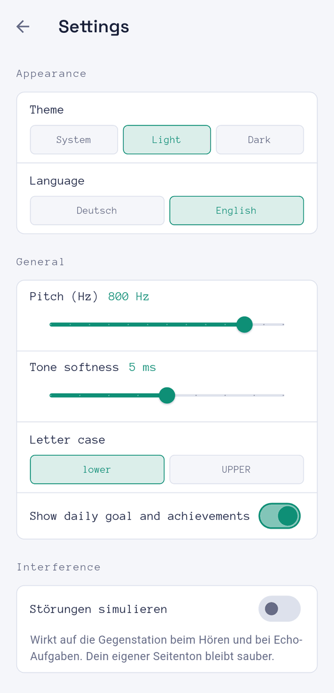

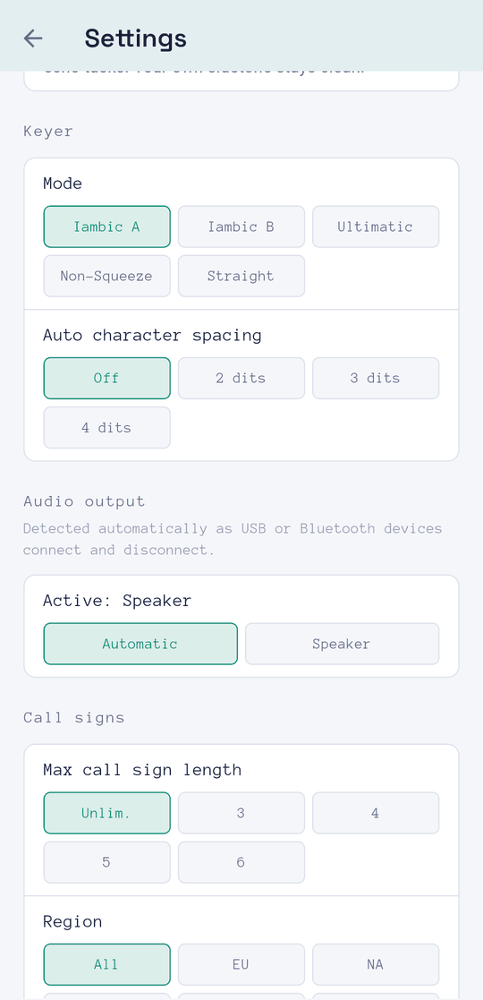

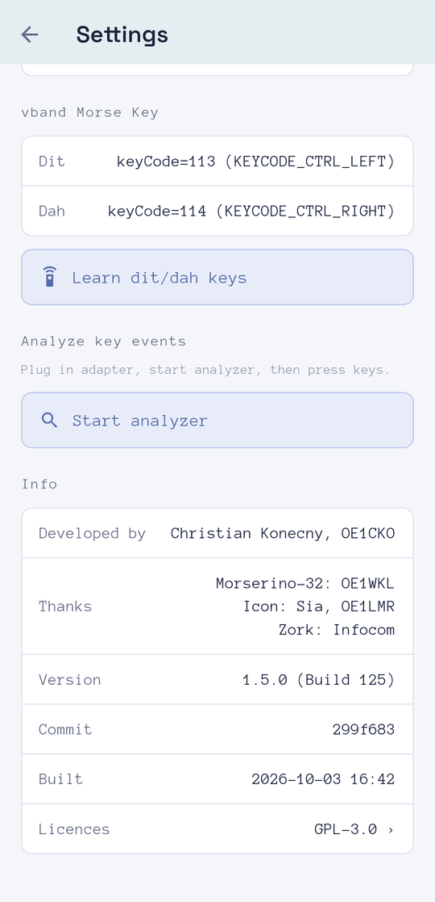
:::

## Appearance

| Setting | Meaning | Values |
|---|---|---|
| Theme | Light or dark look | **System** / Light / Dark |
| Language | App language | **Deutsch** / English |

## General

| Setting | Meaning | Values |
|---|---|---|
| Pitch (Hz) | Frequency of the sidetone and of the played characters | 300–900 Hz in 50 Hz steps (**600 Hz**) |
| Tone softness | Rise and fall time of the tone. Larger values sound softer and click less, especially on short dits | 1–9 ms (**5 ms**) |
| Letter case | Show characters in lower or UPPER case. Display only | **lower** / UPPER |
| Show daily goal and achievements | Shows or hides the card on the home screen, and switches the recording of practice time on or off. Stored data is kept | **On** / Off |

## Interference {#interference}

With **Settings → Interference** the other station sounds as if it came over
a real band: with noise, static crackle, fading, a neighbouring station,
drifting pitch and a "bad fist". That trains you to read a signal under poor
conditions.

The interference only affects what the **other station** plays: the text when
listening, the word when sending, Own texts, QSO Bot, WiFi Trx, Text Adventure, Morsel, Memory Chain, Trailblazer and Fox Hunt. Practicing a single character, the Morse
chart and the Morse tree also play with interference while the switch is on,
and show the wave icon as well.
Your own sidetone while keying always stays clean. The statistics do not
record whether you practiced with or without interference.

**Quick switch:** screens with another station show a wave icon in the app
bar (next to statistics and the gear). Grey means off, coloured means on. A
**short tap** switches the interference on or off, a **long press** opens
these settings.

| Setting | Meaning | Values |
|---|---|---|
| Simulate interference | Main switch | **Off** / On |
| Constant noise | Noise and QRM stay on for as long as an exercise, block or game is running, also between characters and under your own keying (your sidetone stays clean). When listening and sending this means a whole block, until the result appears; in Morsel, Memory Chain, Trailblazer, Fox Hunt and Fight the Pileup a game; in QSO Bot and WiFi Trx the session or connection; in Own texts only during playback. More realistic, but more tiring. Off: the interference is only heard while the other station is sending | **Off** / On |
| Preset | Ready-made mixes. As soon as you move a slider it reads "Custom" | Custom / Light / HF evening / Pile-up |
| Noise (SNR) | Signal-to-noise ratio, measured in a fixed 2.4 kHz bandwidth. The noise swells and ebbs slowly and contains occasional crackle | 0 % (no noise) to 100 % (SNR −10 dB), shown in dB |
| Noise colour | How bright the noise sounds | 0 % dull (treble cut from about 800 Hz) to 100 % bright (about 3.2 kHz) |
| Receiver filter | Narrow CW filter around your pitch. The narrower it is, the more noise and neighbouring station it removes. At a very narrow setting the remaining noise sounds like a wavering tone | 0 % wide to 100 % very narrow (Q 1.5 to 20) |
| QRM (other station) | A second station sends random Morse in runs of 3 to 12 characters (12 to 28 WPM), 100 to 350 Hz above or below your tone, then pauses. 100 % is as loud as your signal | 0–100 % |
| QSB (fading) | The level varies slowly (periods of about 30 to 125 s) by up to about 8 dB | 0–100 % |
| Pitch (drift) | The pitch wanders slowly, up to about ±30 Hz at 100 %. With a narrow filter the tone can drift out of the passband | 0–100 % |
| Timing (bad fist) | Dits, dahs and gaps are uneven, the station sometimes hesitates | 0–100 % |

The presets set (noise / QRM / QSB / pitch / timing / receiver filter, noise
colour always 50 %):

| Preset | Values |
|---|---|
| Light | 15 / 0 / 10 / 0 / 0 / 30 % |
| HF evening | 35 / 20 / 45 / 10 / 15 / 50 % |
| Pile-up | 55 / 60 / 35 / 15 / 30 / 60 % |

**Try it** plays four random groups of five with the speed and spacing of
your Listen training, so you get an impression of how it sounds in the
training. A known text like "CQ CQ DE …" would be much easier to read through
noise than random groups.

## Keyer

These settings apply wherever you key.

| Setting | Meaning | Values |
|---|---|---|
| Mode | How the keyer reads the keys (see below) | **Iambic A** / Iambic B / Ultimatic / Non-Squeeze / Straight |
| CurtisB dit timing | Iambic B and Ultimatic only: from what percentage of a dit a press on the other key is already stored | 0–100 % in steps of 5 (**75 %**) |
| CurtisB dah timing | The same for dahs | 0–100 % in steps of 5 (**45 %**) |
| Auto character spacing | Enforces a minimum pause between characters so they don't run together. Not available for Straight | **Off** / 2 / 3 / 4 dits |
| Straight key start speed | Straight only (replaces Auto character spacing): first estimate for the speed measurement, see [Straight key](#straight-key-automatic-speed) | 5–40 WPM (**15**) |

**The keyer modes**

- **Iambic A**: if you hold both keys ("squeeze"), dits and dahs
  alternate. When you let go, the keyer stops after the current element.
- **Iambic B**: like A, but the keyer remembers a press on the other key
  that comes during an element, and adds that element (Curtis B behaviour).
  The CurtisB settings control from when this applies. 0 % means during the
  whole element, and 100 % means practically like Iambic A.
- **Ultimatic**: when both keys are pressed, the **last** one pressed wins
  and repeats for as long as it is held.
- **Non-Squeeze**: for single-lever keys or those switching over. Squeezing
  both keys produces no alternating sequence.
- **Straight**: a straight key. The tone is on for as long as the key is
  pressed. With touch, a single **KEY** area appears. With an adapter, the
  dit contact acts as the key. The speed is measured, see below.

### Straight key: automatic speed

With the straight key you don't set a speed. The app measures it from your
keying, like the Morserino: from the length of your dits and dahs (a running
average) it derives the speed, the dit/dah threshold and the character and
word gaps. If you key more slowly, longer pauses are allowed automatically.

- The first estimate is the **Straight key start speed** (Settings → Keyer).
  If you key much more slowly, set it to your speed, otherwise a slow S can be
  read as three E at first.
- After about two to four characters the measurement has settled. The very
  first character can still be misread.
- The measurement restarts every time you enter a screen.
- The **WPM slider** is disabled and moves by itself to your measured speed
  (Keyer, WiFi Trx, Echo Trainer, QSO Bot and others). It is not saved and
  does not change the keyer speed.
- WiFi Trx sends the measured speed along. The Echo Trainer statistics store
  it as your sending speed.

## Audio output

| Setting | Meaning | Values |
|---|---|---|
| Active | Shows where the sound is going right now | – |
| Output | **Automatic** follows whatever is currently plugged in or connected. The other options fix the output. Only outputs that are currently available are offered | **Automatic** / Speaker / Wired/USB / Bluetooth |

## Call signs

These are the settings for random call signs in the **Call signs** content
(with All characters).

| Setting | Meaning | Values |
|---|---|---|
| Max call sign length | Maximum call sign length | **Unlim.** / 3 / 4 / 5 / 6 |
| Region | Only call signs from this region | **All** / EU / NA / SA / AF / AS / OC / VK/ZL |
| Common prefixes only | Only frequently heard prefixes instead of all possible ones | Off / **On** |

Call signs follow a weighted prefix table, as on the Morserino. Frequently
heard countries come up more often.

## vband Morse Key and Analyze key events

See [Learning the dit and dah keys](#learning-the-dit-and-dah-keys) and
[Analyze key events](#analyze-key-events).

## Info: version and build

| Row | Meaning |
|---|---|
| Developed by | Christian Konecny, OE1CKO |
| Thanks | Morserino-32 (OE1WKL), app icon (Sia, OE1LMR), Zork (Infocom) |
| Version | Version number and build number, for example "1.0.0 (Build 42)" |
| Commit | The exact source code state the app was built from |
| Built | Date and time of the build |
| Licences | Tap to open the licence texts (see below) |

When you report a problem, please include the version, commit and build time.

**Licences:** The app is free software under the GNU General Public License
v3.0 (or later). It takes algorithms and data (word lists, abbreviations, call
sign prefixes, QSO texts) from the Morserino-32 firmware by Willi Kraml,
OE1WKL, which is also under the GPL-3.0. The source code is on
[GitHub](https://github.com/ckonecny/next_cw_trainer). The licence page also
shows the MIT License of Zork I–III, the SIL Open Font License of the fonts
Anonymous Pro and Space Grotesk, the zlib licence of the SoLoud audio engine,
and the licences of the Flutter packages the app uses. Zork is a trademark of its owners; the app is not affiliated with
them, nor with Infocom, Activision or Microsoft.

## Koch sequence {#koch-sequence}

You set the Koch sequence in the ⚙ sheet of **Listen** or **Send** when the
**Koch lesson** character set is selected there. It applies to **all**
trainings and games, though.

| Sequence | Description |
|---|---|
| **M32** | The Morserino-32 order (45 characters): `m k r s u a p t l o w i . n j e f 0 y v , g 5 / q 9 z h 3 8 b ? 4 2 7 c 1 d 6 x - = + @ :` |
| LCWO | The lcwo.net order |
| CW Academy | The CW Academy (CWops) order |
| LICW | The Long Island CW Club order with an **entry point** (see below) |
| Custom | Your own order |

**LICW entry point** (0–13): in the LICW course, students join a "carousel"
at different points. The entry point rotates the sequence so that it starts
there.

**Custom:** enter the characters in the order you want to learn them.
Duplicates are ignored, and the app shows how many characters it found. The
default is `esno0tqr5ucd9al8ix1myj7h4gvkfz3b.6/w2p?`, the order of the YouTube
Morse course by "Heinz – just me"
([playlist](https://www.youtube.com/watch?v=WhjCvgC0iHg&list=PLZjVloEmSdLgGGT_exNDoXzmnV-q0zmET)).

Prosigns are not part of the Koch sequences in the app.

## Morserino terms

The app gives the Morserino-32 menu items plain names. If you come from the
Morserino or read its manual, this table helps:

| Morserino menu | In the app |
|---|---|
| Interchar Spc | Character spacing |
| InterWord Spc | Word spacing |
| Random Groups | Group characters |
| Length Rnd Gr | Group length |
| Length Words | Max word length |
| Length Abbrev | Max abbreviation length |
| Length Calls | Max call sign length |
| Calls Region | Region (under Call signs) |
| Max # of Words | Groups per block / Words per block |
| Stop&lt;Next&gt;Rep | Stop after each group / Stop after each word |
| Koch Sequence | Koch sequence |
| Practice Set | Practice set |
| Boost Practice | Boost practice set |
| Echo Prompt | Prompt |
| Echo Repeats | Repeats |
| Echo Speed Max | Sending speed (max) |
| Tone Shift | Tone shift |
| Confrm. Tone | Confirmation tone |
| AutoChar Spc | Auto character spacing |
| Output Case | Letter case |
| Keyer Mode | Mode (under Keyer) |
| CurtisB DitT% / DahT% | CurtisB dit timing / dah timing |

The names of the keyer modes (Iambic A, Ultimatic …) and of the Koch
sequences (M32, LCWO …) are the same as on the Morserino.

# What the app does not do (yet)

Some Morserino-32 features are missing from the app, because a phone doesn't
have the hardware or Android handles it already. These are the rotary knob and
buttons, the display, LoRa, ESP-NOW (and with it the multiplayer parts of the
games), iCW/Ext Trx and keying a real transmitter, firmware updates and the
WiFi setup page. Instead of the firmware's Practice Stats, the app has its
own, more detailed [character statistics](#character-statistics).

Not done yet, but planned: the games Trailblazer, Fox Hunt, Radio Cave and
Fight the Pileup.

# Troubleshooting

**The app doesn't key when I press my Morse key.**
Learn the dit and dah keys (see
[Learning the dit and dah keys](#learning-the-dit-and-dah-keys)). If nothing arrives,
check with **Analyze key events** whether the adapter sends anything at all.

**Sound comes out of the wrong device.**
Fix the output under **Settings → Audio output**.

**When sending, I hear my tone late.**
This is almost always Bluetooth headphones. Use wired headphones or the
speaker.

**The next Koch character doesn't come.**
Open the 📊 statistics in Listen. The characters without a tick are holding
up the unlock. Usually it's a character with too few attempts or recent errors.
See [When the next Koch character comes](#when-the-next-koch-character-comes).

**The pauses never get shorter.**
That's intended while you work through the Koch sequence (see
[Pauses and speed](#pauses-and-speed)). You can shorten them yourself at any
time with **Adjust spacing**.

**The decoder only writes garbage.**
Check pitch, bandwidth and threshold (see
[Decoder settings](#decoder-settings)). Only turn on the monitor tone with
headphones.
